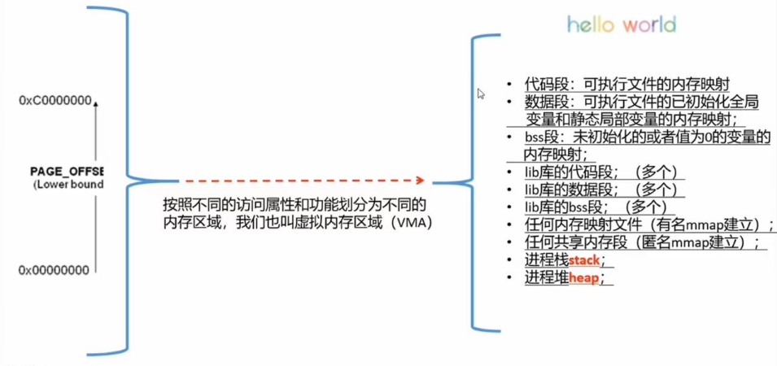
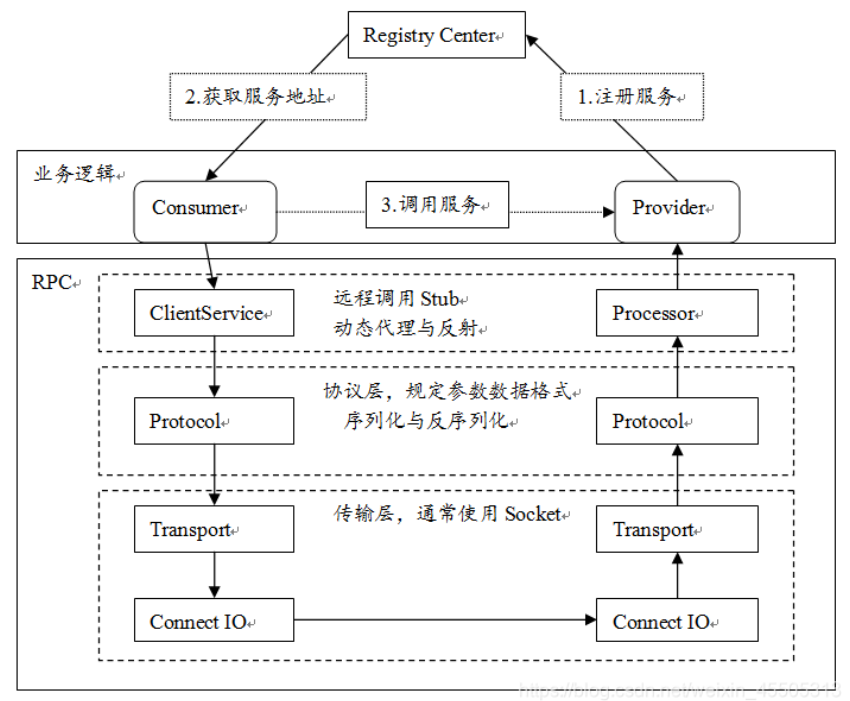

# C-Cpp-Linux
c-cpp-linux 学习内容

## 一. linux 系统调用(system call)

学习后面内容的辅助工具。

Linux系统调用（System Call）是Linux操作系统内核提供的一组功能接口，它允许用户空间的程序请求内核执行特定任务，如文件操作、进程管理、内存管理、设备控制等。系统调用位于用户空间和内核空间之间，为用户程序提供了一种安全有效的方式来访问系统资源和服务。

在Linux中，系统调用通过特定的机器指令（例如x86架构上的int 0x80或syscall指令）触发。在发出系统调用指令之前，程序需要设置寄存器以指示要执行的系统调用编号以及传递参数。内核会根据系统调用编号和参数执行相应的功能，并将结果返回给用户程序。

为了方便使用，Linux提供了C库（如glibc）中的封装函数，这些函数可以直接调用系统调用。程序员通常不需要直接处理底层的寄存器和指令，而是通过这些封装函数来使用系统调用。

下面记录了我写的一些关于Linux系统调用函数的基本使用介绍文章。

### 1. linux 常用系统调用函数

#### 1.1 文件 IO 相关

- [Linux系统调用函数open()、标准C库函数fopen()函数讲解以及它们之间的使用区别](https://blog.csdn.net/weixin_49503250/article/details/130699758?spm=1001.2014.3001.5501)

- [open，read，write，close函数（对文件进行打开，读，写，关闭操作）](https://blog.csdn.net/weixin_49503250/article/details/129041211)

- [lseek函数（重新定位读或写的文件偏移量）](https://blog.csdn.net/weixin_49503250/article/details/129049737)

- [stat，lstat函数（获取文件的状态 / 信息）](https://blog.csdn.net/weixin_49503250/article/details/129090311)

- [access（判断文件是否存在），chmod（修改文件的权限），chown（修改文件的所有者和所在组），truncate（修改文件大小）](https://blog.csdn.net/weixin_49503250/article/details/129284134)

- [mkdir（创建一个目录），rmdir（删除空目录），rename（修改文件的名称或路径），chdir（修改进程的工作目录），getcwd（获取当前的工作目录）操作目录函数](https://blog.csdn.net/weixin_49503250/article/details/129327828)

- [dup（复制文件描述符），dup2（重定向文件描述符）函数](https://blog.csdn.net/weixin_49503250/article/details/129392572)

- [fcntl函数（修改文件的各种属性）](https://blog.csdn.net/weixin_49503250/article/details/129428959)

- [access函数（检查调用进程是否具有访问指定文件的权限）](https://blog.csdn.net/weixin_49503250/article/details/129938212?csdn_share_tail=%7B%22type%22:%22blog%22,%22rType%22:%22article%22,%22rId%22:%22129938212%22,%22source%22:%22weixin_49503250%22%7D)

#### 1.2 进程相关

- [fork（创建子进程），getpid（获取当前进程的pid），getppid函数（获取父进程的进程id）](https://blog.csdn.net/weixin_49503250/article/details/129500813)

- [_exit()函数（退出当前进程）](https://blog.csdn.net/weixin_49503250/article/details/129600415)

- [wait，waitpid函数（等待子进程结束）](https://blog.csdn.net/weixin_49503250/article/details/129684186)

- [execve函数（切换进程）](https://blog.csdn.net/weixin_49503250/article/details/129593580)

- [kill函数（发送信号）](https://blog.csdn.net/weixin_49503250/article/details/130372832?csdn_share_tail=%7B%22type%22:%22blog%22,%22rType%22:%22article%22,%22rId%22:%22130372832%22,%22source%22:%22weixin_49503250%22%7D)

- [signal，sigaction函数（设置收到信号后的处理方式）](https://blog.csdn.net/weixin_49503250/article/details/130456522?spm=1001.2014.3001.5502)

- [alarm，setitimer函数（定时器，向当前进程发送一个信号、循环/间隔定时器，周期性的向当前进程发送信号）](https://blog.csdn.net/weixin_49503250/article/details/130456105?csdn_share_tail=%7B%22type%22:%22blog%22,%22rType%22:%22article%22,%22rId%22:%22130456105%22,%22source%22:%22weixin_49503250%22%7D)

#### 1.3 内存相关

- [mmap，munmap函数（内存映射函数）](https://blog.csdn.net/weixin_49503250/article/details/130019952?spm=1001.2014.3001.5502)

- [shmget、shmat函数，标准C库函数ftok（创建共享内存段，创建共享内存段的键，把共享内存段加入当前的进程的地址空间中）](https://blog.csdn.net/weixin_49503250/article/details/130589296?csdn_share_tail=%7B%22type%22:%22blog%22,%22rType%22:%22article%22,%22rId%22:%22130589296%22,%22source%22:%22weixin_49503250%22%7D)

#### 1.4 用户登录相关

1.getpwuid() 函数

作用：getpwuid() 是Linux系统调用函数。该函数返回一个指定用户ID号的用户登录信息，是根据etc/passwd文件中的内容获得信息的。

它的原型为：

```cpp
struct passwd *getpwuid(uid_t uid);
```

其中uid_t为无符号长整数类型，是应用程序提供的用户识别码，而后续返回一个指针，指向一个passwd结构变量，该结构存储了用于识别给定 UID 的用户的详细信息。

要使用 getpwuid() 函数，你需要在你的C程序中导入 `<sys/types.h>` 和 `<pwd.h>` 两个头文件。

2.getgrgid()函数

作用：getgrgid()函数属于Linux系统调用函数。它可以用来检索当前定义的用户组信息，该信息存储在/etc/group文件中。此外，它还可以用来检索特定用户组ID（GID）的用户组信息。

该函数的函数原型为：

```cpp
struct group *getgrgid(gid_t gid);
```

如果你想使用getgrgid()函数，则需要包含 `<grp.h>` 头文件。


#### 1.5 Linux系统调用与标准C库之间的关系

- 在Linux环境下，标准C库的很多功能实际上是通过Linux系统调用来实现的。也就是说，标准C库函数在内部调用了相应的系统调用函数，从而完成特定任务。标准C库为程序员提供了一个更高级别、更便捷的接口，使得程序员无需直接处理底层的系统调用细节。

- 以文件操作为例，标准C库提供了如fopen、fread、fwrite和fclose等函数，这些函数底层实际上是通过Linux系统调用（如open、read、write和close）来完成具体任务的。当你在C程序中使用这些标准库函数时，实际上是在间接地使用Linux系统调用。

这种关系带来了以下好处：

- **抽象层次**：标准C库函数提供了一个更高层次的抽象，使程序员无需关注底层的系统调用细节，降低了编程难度。

- **跨平台性**：由于标准C库遵循C语言标准，程序员可以在不同的操作系统和平台上使用这些函数。这意味着，使用标准C库函数编写的程序在其他操作系统上可能只需很少的修改甚至不需要修改就可以运行，提高了代码的可移植性。

- **错误处理**：标准C库函数通常提供了更友好的错误处理机制，程序员可以更容易地检查和处理错误情况。

### 2. 扩展内容

1. linux 进程管理思维导图：https://www.processon.com/view/link/64eb2c62f0d32449d634a28b 访问密码：linux 

2. linux 中的进程和线程(LWB)都是用的 struct task_struct 结构体，所以 linux 中的进程和线程是差不多的。

一个进程用 task_struct 结构进行描述，一个进程的虚拟地址空间用 mm_struct 结构进行描述；

task_struct 含有 mm_struct 结构成员，即一个进程对应一个虚拟地址空间；

mm_struct 由多个 vm_area_struct 虚拟内存区域组成；

mm_struct 中的 pgd 成员是用来指向一个全局页目录，是为了实现虚拟地址到物理地址的转换；

对于线程来说，多个线程共享一个地址空间，也就是多个 task_struct 使用同一个 mm_struct 结构，所以执行 fork 时只需要把父进程的 mm 赋值给子进程的 mm;

对于创建新的进程来说，就需要完整的重新复制一份 mm 内容；

3. 关于linux中的命令top，ps，pstree......可以区分进程和线程是怎么做到的？
  
  task_struct 中有 pid(进程id) 和 tgid(线程组id：一个进程可以有多个线程，所有就有了线程组id)。

  因为线程和进程使用的都是 task_struct，所以进程和线程都有 pid 和 tgid。但是进程的 pid = tgid; 线程的 pid 是线程自己的 pid，tgid 是所在进程的 pid。

4. 32 位机器中，内核空间：用户空间 = 1G：3G

  看用户空间中有什么内容，可以知道 mmap 是把磁盘文件映射到用户空间的，而不是映射到内核空间的。

  

  并且 mmap 只是解决用户空间和内和空间之间的拷贝效率问题。(关于 epoll 是否使用了 mmap 提高效率得看源码了)

5. 


### 3. 相关的优质博客

使用方式推荐：可以优先快速通过下面的文章(简化版)知道一个全貌，再去优质博客(详情版)了解一下细节。

下面的文章(简化版)和优质博客(详情版)可以结合一起来使用的，在下面的实践开发中都是可以参考这些文章的。

- [./1_linux-fileIO.md](https://gitee.com/ax020913/boostasio-learn/blob/master/TinyWebServer-raw_version/testSysCall/1_linux-fileIO.md) linux 文件操作

- [./2_linux-fork.md](https://gitee.com/ax020913/boostasio-learn/blob/master/TinyWebServer-raw_version/testSysCall/2_linux-fork.md) linux 进程管理

- [./3_linux-pthread.md](https://gitee.com/ax020913/boostasio-learn/blob/master/TinyWebServer-raw_version/testSysCall/3_linux-pthread.md) linux 线程管理

- [./4_linux-signal.md](https://gitee.com/ax020913/boostasio-learn/blob/master/TinyWebServer-raw_version/testSysCall/4_linux-signal.md) linux 信号操作

- [./5_linux-network.md](https://gitee.com/ax020913/boostasio-learn/blob/master/TinyWebServer-raw_version/testSysCall/5_linux_network.md) linux 网络套接字，多路转接

- 

CSDN: [2021dragon](https://blog.csdn.net/chenlong_cxy)

- [Linux常见指令汇总（入门必备）](https://blog.csdn.net/chenlong_cxy/article/details/119031060)

- [Shell的运行原理以及Linux当中的权限问题](https://blog.csdn.net/chenlong_cxy/article/details/119111777)

- [Linux环境基础开发工具的使用（yum、vim、gcc、g++、gdb、make/Makefile）](https://blog.csdn.net/chenlong_cxy/article/details/119183448)

- [冯 • 诺依曼体系结构](https://blog.csdn.net/chenlong_cxy/article/details/120058847)

- [初步认识操作系统（Operator System）](https://blog.csdn.net/chenlong_cxy/article/details/120098611)

- [Linux进程概念（精讲）](https://blog.csdn.net/chenlong_cxy/article/details/120193456)

- [Linux进程控制（精讲）](https://blog.csdn.net/chenlong_cxy/article/details/120444275)

- [函数和进程之间的相似性（开拓你的视野）](https://blog.csdn.net/chenlong_cxy/article/details/120579992)

- [Linux基础IO](https://blog.csdn.net/chenlong_cxy/article/details/120743720)

- [Linux动态库和静态库](https://blog.csdn.net/chenlong_cxy/article/details/121009923)

- [Linux进程间通信](https://blog.csdn.net/chenlong_cxy/article/details/121184624)

- [Linux中的31个普通信号](https://blog.csdn.net/chenlong_cxy/article/details/121952922)

- [Linux进程信号](https://blog.csdn.net/chenlong_cxy/article/details/121315266)

- [Linux任务管理与守护进程](https://blog.csdn.net/chenlong_cxy/article/details/122797351)

- [Linux多线程](https://blog.csdn.net/chenlong_cxy/article/details/122657262)

- [Linux线程安全](https://blog.csdn.net/chenlong_cxy/article/details/122657542)

- [Linux信号量](https://blog.csdn.net/chenlong_cxy/article/details/123167179)

- [Linux线程池](https://blog.csdn.net/chenlong_cxy/article/details/122657510)

- [Linux高级IO](https://blog.csdn.net/chenlong_cxy/article/details/126050039)

- [IO多路转接 ——— select、poll、epoll](https://blog.csdn.net/chenlong_cxy/article/details/126189616)

- [Reactor同步模式](https://blog.csdn.net/chenlong_cxy/article/details/126387589)

- 


### 4. 相关的实践项目

项目：有了上面的基础(当然再结合 C++ 的相关内容会更好)，我们还是得通过项目不断加深对这些知识的理解和运用。

项目扩展：为了防止项目写简历上烂大街的效果 & 为了应对面试的问题 & 为了项目的添砖加瓦 ===> 我们可以通过问题的防止扩展我们的项目 & 进行项目修改


#### 4.1 TinyWebServer 项目

- [TinyWebServer](https://github.com/qinguoyi/TinyWebServer)

##### 项目扩展

常见的人手一个项目 WebServer，但是内容却是很丰富的，可以铜通过下面的项目来进行扩充的。

什么同步异步线程池项目，日志压缩，协程，module网络库的对比，boost::asio网络库的对比，内存池项目......

总之 WebServer 项目可扩充的内容是很多的哦。

```cpp


```

#### 4.2 AsyncSyncLoger 同步异步线程池项目

官方的异步日志系统有常见的：log4cpp 项目

- [AsyncSyncLoger](https://gitee.com/ax020913/boostasio-learn/tree/master/AsyncSyncLoger)

##### 项目扩展

可以扩展到 TinyWebServer 项目中去

```cpp

```

#### 4.3 sylar 协程

相关的项目有腾讯的 libco

- [sylar](https://github.com/sylar-yin/sylar)

##### 项目扩展

这个项目也是可以很好的和 TinyWebServer 项目结合的哦。

协程是适合io密集型的场景，计算密集型不适合。

```cpp

```

#### 4.4 rpc 相关的项目

可能会问及到 rpc 项目的内容，需要提前做好准备到的哦。



rpc：远程过程调用；像调用本地函数一样

网络io：请求 - 响应的模式

rpc 需要解决的问题：

- call id 映射：函数 <---> call id 映射表，map解决
- 序列化和反序列化：protobuf / json
- 网络传输：RPC：UDP、TCP    gRPC: HTTP2    boost::asio    socket    Netty ...... 

常用的RPC框架：gRPC，Thrift，Dubbo


### 5. 独立开发项目

上面看了别人的项目，这阶段就可以实现自己的项目了。

- 
