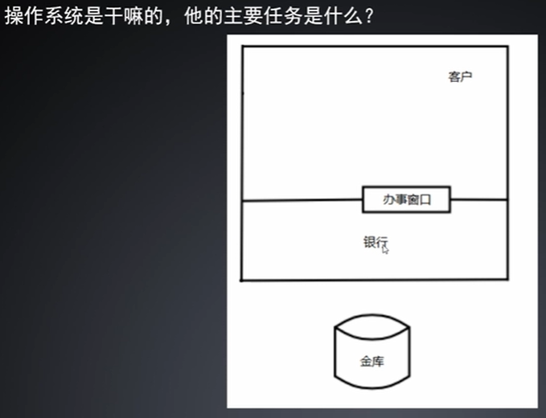

#  库函数和系统调用

系统调用之间是不能跨平台的(linux和windows的系统调用是不能互相使用的)，但是库函数是可以跨平台的(对于典型的C语言库函数，也就是libc，在linux上和windows上都是可以使用的)。

但是服务器方面的话，linux是比windows使用范围广的，这两个系统的系统调用操作底层是不同的。

**标准头文件和普通头文件的认识？**

  对于标准库，标准头文件件stdio.h等等是和普通头文件unistd.h等等，是不一样的。前者是不同平台都可以用的，后者是绑定Linux平台的。

## 一、系统编程文件

### 1. 什么是系统编程

操作系统是干嘛的，他的主要任务是什么？



hello world 是怎么输出到频幕上的？


### 2. 系统编程的特点


### 3. 文件IO标准库函数和系统调用的关系

#### io相关函数

常见的io库函数有：fopen，fwrite，fread

常见的io系统函数有：open，write，read

上面的io函数，会涉及到：FILE，文件描述符(整形fd)， io缓冲区，读写位置

1. fopen 是会调用系统函数 open 来帮忙打开文件的。

2. fwrite 写入文件的时候，io缓冲区写满了 ---> 是会调用write系统函数把用户io缓冲区写入文件的，并清空，用户继续写入io缓冲区。

3. fread 读取文件的时候，io缓冲区读完了 ---> 是会调用read系统函数读取文件到用户io缓冲区的，用户继续从用户io缓冲区读取。

当然，我们也是可以直接调用系统函数的，优势我们确实是这样的。但是为什么要提供系统调用呢？ 

效率(都调用系统调用的话，是低效的。io缓冲区类比快递点，系统调用类比快递运货公司，我们直接去快递点拿东西/发东西是更高效的) + 安全性(毕竟是跑在内核区的)

#### 缓冲区的认识

之前也是有了解过缓冲区的概念的：文件描述符有缓冲区(应该就是上面的那种io缓冲区了)、输入输出缓冲区(stdin，stdout，stderr)、socket缓冲区(tcp的发送和接收缓冲区，udp的接收缓冲区)、磁盘数据拷贝到用户中间得经过(内核态的缓冲区 read，write......)

只理解到这里了，具体的后面在深入。。。。。

1. 缓冲区有三种类型：全缓冲(满了就刷新)，行缓冲(碰到\n就刷新)，无缓冲(直接刷新，不经过缓冲区)

2. stdin属于全缓冲，stdout属于全缓冲和行缓冲，stderr属于无缓冲(有问题就直接打印到控制台)

3. 代码感受一下输入输出缓冲区(stdin，stdout，stderr)，都是针对控制台的哦：

下面的代码可见：是不会输出内容到控制台的(不能把下面的死循环去掉，那么程序关闭的时候会自动写回数据的)

换成 stderr 就会直接输出到控制台上的哦

```cpp
#include <stdio.h>

int main(void)
{
  fputc('A', stdout);
  fputc('A', stdout);
  fputc('A', stdout);

  while (1)
  {
    ;
  }

  return 0;
}
```

有一个 \n 或者 stdout 写满的时候 或者 fflush 函数刷新都是可以写到控制台的：

```cpp
#include <stdio.h>

int main(void)
{
  fputc('A', stdout);
  fputc('A', stdout);
  fputc('\n', stdout);
  // fflush(stdout); 

  while (1)
  {
    ;
  }

  return 0;
}
```

stdout 写满的时候，也是可以看出来 stdout 的 io缓冲区的大小是 1024 bety

```cpp
int main(void)
{
  for (int i = 0; i <= 1024; i++)
    fputc('A', stdout);

  while (1)
  {
    ;
  }

  return 0;
}
```

### 4. open系统调用创建文件

#### 4.1 open

```cpp
  #include <sys/types.h>
  #include <sys/stat.h>
  #include <fcntl.h>

  int open(const char *pathname, int flags);
  int open(const char *pathname, int flags, mode_t mode);
```

1. 返回值：成功返回新分配的文件描述符，出错返回 -1 并设置 error(可以用一个int类型的变量接收open函数的返回值，出错的话可以使用perror无缓冲的输出错误到控制台)。

2. pathname：要打开或创建的文件名，既可以是相对路径(一般是相对当前可执行文件的路径)也可以是绝对路径。

3. flags：有一系列的参数值可供选择，可以同时选择多个常数用按位或运算符连接起来。所以这些常数的宏定义都以 O_ 开头，表示 or。
  
    必选项：以下三个常数中必须指定一个，且仅允许指定一个。

    O_RDONLY 只读打开

    O_WRONLY 只写打开

    O_RDWR 可读可写打开

    可选项：可以同时指定0个或多个，和必选项按位或起来作为flags参数。

    O_CREAT 如果此文件不存在则创建它。必需要提供第三个参数mode，用来表示文件的访问权限。

    O_EXCL 如果同时指定了O_CREAT，并且文件已经存在，则返回出错(确保本次是我创建的文件)。

    O_TRUNC 如果文件已存在，并且以只读或可读可写方式打开，则将其长度截断为0bety。

    O_APPEND 表示追加。如果文件已有内容，这次打开文件所写的数据附加到文件的末尾。

    O_NONBLOCK 对于设备文件，以O_NONBLOCK方式打开可以做非阻塞I/O。

    mode：指定文件权限，可以用八进制数表示，比如0644表示-rw-r--r--，也是可以用S_IRUSR、S_IWUSR、S_IRGRP等宏定义按位或起来表示。


上面写的虽然没有官方的 man 手册那么全，但是 20% 的只是往往是能解决 80% 的问题的，毕竟也是学不完的。所以先一步一步来，以后需要用到的时候再看也是更快的。

代码感受在：5. umask + 关闭文件


### 5. umask + 关闭文件

#### 5.1 umask

umask: 用于设置文件和目录的创建权限掩码，取值范围(0000 - 0777)，被设置的是没有相应的权限的。

通过输入 umask 可以看到默认的 umask = 0002 ===> 如果创建一个文件的权限是0777，那么实际文件的权限是0776(所属组被设置的w权限被umask掩盖了)

1. 实操作： 用open系统函数，创建一个不存在的文件，设置文件权限为0777，再查看文件的实际权限

```cpp
#include <stdio.h>
#include <sys/types.h>
#include <sys/stat.h>
#include <fcntl.h>

int main(void)
{
  int fd = open("file.test", O_RDONLY | O_CREAT, 0777); // O_CREAT 是一个可选项，文件不存在就会创建这个文件的哦
  if (fd == -1)
    perror("open");
  else
    printf("open file.test success\n");

  return 0;
}
```

查看文件的实际权限 ===> 所属组被设置的w权限被umask掩盖了

```shell
[x@localhost testSysCall]$ ll
-rwxrwxr-x. 1 x x     0 Apr 10 00:21 file.test
```

2. 实操作： 可以 umask 0000 设置文件掩码，再用上面的代码创建文件，对应的权限就是 0777，再把 umask 设置回 0002 ===> 类似于恢复现场，哈哈哈

```cpp
#include <stdio.h>
#include <sys/types.h>
#include <sys/stat.h>
#include <fcntl.h>

int main(void)
{
  int fd = open("file.test2", O_RDONLY | O_CREAT, 0777); // O_CREAT 是一个可选项，文件不存在就会创建这个文件的哦
  if (fd == -1)
    perror("open");
  else
    printf("open file.test success\n");

  return 0;
}
```

```shell
[x@localhost testSysCall]$ ll
-rwxrwxrwx. 1 x x     0 Apr 10 00:27 file.test2
```

3. 实操：exit 和 return 有什么异同？

相同的是：都是可以退出程序的。

不同的是：return只是退出函数。exit退出是进程，对父子进程来说，父进程可以获取到子进程的退出码。

注意：可以使用 echo $? 接收最近一次错误返回值是什么 (echo $? 自己本身也是一条命令的，也是有返回值的，所以再次 echo $? 就是上一次 echo $? 的返回值)


#### 5.2 关闭文件

```cpp
  #include <unistd.h>

  int close(int fd);
```

返回值：成功返回 0，出错返回 -1 并设置 error

fd：是要关闭的文件描述符。当一个进程终止时，内核对该进程所有尚未关闭的文件描述符调用close关闭(类似现实中的临终遗言，哈哈哈)，所以即使用户不调用close，在终止时内核也会自动关闭它所打开的所有文件。

由 open 返回的文件描述符一定是该进程尚未使用的**最小**描述符。

实操：对于 open 返回的是最小的可用描述符的验证

```cpp
// 0,1,2 一般是 stdin,stdout,stderr 占用了
// 所以我们先open两个文件 ===> fd分别是3,4，再把fd=3关闭了，再open一个文件 ===> 这个文件的fd应该是 3

#include <stdio.h>
#include <sys/types.h>
#include <sys/stat.h>
#include <fcntl.h>
#include <unistd.h>

int main(void)
{
  int fd = 0;
  fd = open("file.1", O_RDONLY | O_CREAT, 0777);
  if (fd != -1)
    printf("fd1 = %d\n", fd); // 3
  fd = open("file.2", O_RDONLY | O_CREAT, 0777);
  if (fd != -1)
    printf("fd2 = %d\n", fd); // 4

  close(3);

  fd = open("file.1", O_RDONLY | O_CREAT, 0777);
  if (fd != -1)
    printf("fd3 = %d\n", fd); // 3

  close(3);
  close(4);

  return 0;
}

```

确实是没有问题的：

```shell
[x@localhost testSysCall]$ ./ma
fd1 = 3
fd2 = 4
fd3 = 3
```

### 6. read + write 入门

```cpp
  #include <unistd.h>

  ssize_t read(int fd, void *buf, size_t count);
```

read 函数从打开的设备或文件中读取数据。

返回值：成功返回读取的字节数，出错返回 -1 并设置 error，如果在调 read 之前已到达文件末尾，则这次 read 返回 0。

count: 是请求读取的字节数，读上来的数据保存在缓冲区buf中，同时文件的当前读写位置向后移动(这里的读写位置和库函数的读写位置是不一样的，库函数的读写位置指的是缓冲区buffer，这里的读写位置指的是设备或文件的读写位置)。注意：这个读写位置和使用C标准I/O库时的读写位置有可能不同，这个读写位置是记在内核中的，而使用C标准I/O库时的读写位置是用户空间I/O缓冲区中的位置。

有些情况下，实际读到的字节数(返回值)，会小于请求读的字节数 count。例如：

1. 读常规文件时，在读到 count 个字节之前已到达文件末尾。

2. 从终端设备读，通常以行为单位，读到换行符就返回了。


#### 实操1：测试 read 是否记录当前的读写位置，先 read 一部分，再 read 一部分 ===> 看是否第二次 read 是从第一次 read 之后的内容

test.1 文件中的内容为：

```cpp
12345
abcde
```

```cpp
#include <stdio.h>
#include <sys/types.h>
#include <sys/stat.h>
#include <fcntl.h>
#include <stdlib.h>
#include <unistd.h>

int main(int argc, char *argv[])
{
  if (argc < 2)
  {
    printf("usage: cmd filename\n");
    return -1;
  }

  int fd = open(argv[1], O_RDONLY);
  if (fd < 0)
  {
    perror("open");
    exit(3);
  }
  else
    printf("fd = %d\n", fd);

  char buffer[20];
  ssize_t n = read(fd, buffer, 10); // 读取 count = 10 个字节
  printf("read %d betys\n", n);
  for (int i = 0; i < n; i++)
    printf("%c", buffer[i]);
  printf("\n");

  n = read(fd, buffer, 10); // 读取 count = 10 个字节
  printf("read %d betys\n", n);
  for (int i = 0; i < n; i++)
    printf("%c", buffer[i]);
  printf("\n");

  close(fd);

  return 0;
}
```

运行：可见第二次 read 的内容，是第一次 read 之后的内容

```shell
[x@localhost testSysCall]$ ./ma test.1
fd = 3
read 10 betys
12345
abcd
read 2 betys
e

[x@localhost testSysCall]$ 
```

#### 实操2：从标准输入中读取

```cpp
#include <stdio.h>
#include <sys/types.h>
#include <sys/stat.h>
#include <fcntl.h>
#include <stdlib.h>
#include <unistd.h>

int main(int argc, char *argv[])
{
  char buffer[20];
  int n = read(STDIN_FILENO, buffer, 10); // 从标准输入中读取
  if (n < 0)
  {
    perror("read STDIN_FILENO");
    exit(-1);
  }

  printf("read %d betys\n", n);
  for (int i = 0; i < n; i++)
    printf("%c", buffer[i]);
  putchar(10);

  return 0;
}
```

运行：输入 1234567890ls，读取了前面，剩下的 ls 就在标准输入中了。shell 切换到前台，看到标准输入中有 ls，就自动运行 ls 了

```shell
[x@localhost testSysCall]$ ./ma
1234567890ls
read 10 betys
1234567890
[x@localhost testSysCall]$ ls
ma  makefile  readme.md  test.1  test.cc
```

#### 实操3：从标准输入中读取，写入到标准输出中

```cpp
#include <stdio.h>
#include <sys/types.h>
#include <sys/stat.h>
#include <fcntl.h>
#include <stdlib.h>
#include <unistd.h>

int main(int argc, char *argv[])
{
  char buffer[20];
  int n = read(STDIN_FILENO, buffer, 10); // 从标准输入中读取
  if (n < 0)
  {
    perror("read STDIN_FILENO");
    exit(-1);
  }
  printf("read %d betys\n", n);

  write(STDOUT_FILENO, buffer, n);
  write(STDOUT_FILENO, "\n", 1);

  return 0;
}
```

运行：和上面的 实操2 效果一样，因为 printf 也是向 STDOUT_FILENO 标准输出中写入

```shell
[x@localhost testSysCall]$ ./ma
1234567890ls
read 10 betys
1234567890
[x@localhost testSysCall]$ ls
ma  makefile  readme.md  test.1  test.cc
```

### 7. 非阻塞读

#### 阻塞和非阻塞的简单理解

**阻塞(Block)**: 当进程调用一个阻塞的系统调用时，该进程被置于睡眠(sleep)状态，这时内核调度其它进程运行，直到该进程等待的事件发生了(比如网络上接收到数据包，或者调用sleep指定的睡眠时间到了)，它才有可能继续运行。

与睡眠状态相对的是运行(Running)状态，在Linux内核中，处于运行状态的进程分为两种情况：

正在被调度执行：cpu处于该进程的上下文环境中，程序计数器(eip)里保存着该进程的指令地址，正在执行该进程的指令，正在读写该进程的地址空间。

就绪状态：该进程不需要等待什么事件发生，随时都可以执行，但cpu暂时还在执行另一个进程，所以该进程在一个就绪队列中等待内核调度。


**非阻塞(NoBlock)**: 如果在open一个设备时，指定了O_NONBLOCK标志，read/write就不会阻塞。以read为例，如果设备暂时没有数据可读就返回-1，同时置errno为EWOULDBLOCK(或者EAGAIN，这两个宏定义的值相同)，表示本来应该阻塞在这里(would block，虚拟语气)，事实上并没有阻塞而是直接返回errno，调用者应该试着再读一次(again)。这种行为方式称为轮询(poll)，调用者只是查询一下，而不是阻塞在这里死等，这样可以同时监视多个设备：

```cpp
while(1){
  非阻塞read(设备1);
  if(设备1有数据达到) 处理数据;

  非阻塞read(设备2);
  if(设备2有数据达到) 处理数据;

  非阻塞read(设备3);
  if(设备2有数据达到) 处理数据;

  // ......

  sleep(n);
}
```

上面的轮询(poll) ===> 网络中的poll好像也是轮询的哦，相互理解记忆


下面的阻塞和非阻塞是针对 open 函数的第二个参数是否设置 O_NONBLOCK 非阻塞(注意 read 函数是自带阻塞属性的)

#### 实例1：非阻塞

从 /dev/tty 上以 O_NONBLOCK 非阻塞的方式读：

```cpp
#include <stdio.h>
#include <sys/types.h>
#include <sys/stat.h>
#include <fcntl.h>
#include <stdlib.h>
#include <unistd.h>
#include <errno.h>

int main(int argc, char *argv[])
{
  int fd = open("/dev/tty", O_NONBLOCK);
  if (fd == -1)
  {
    perror("open /dev/tty");
    exit(-1);
  }

  char buffer[10];
  while (1)
  {
    ssize_t n = read(fd, buffer, 10);
    if (~n) // read 是阻塞的，得输入回车才会结束阻塞状态
    {
      printf("read %d bytes\n", n);
      write(STDOUT_FILENO, buffer, n);
      write(STDOUT_FILENO, "\n", 1);
      break;
    }
    if (errno != EAGAIN)
    {
      perror("open /dev/tty");
      exit(-1);
    }
    write(STDOUT_FILENO, "try again\n", 10);
    sleep(1);
  }

  close(fd);

  return 0;
}
```

#### 实例2：阻塞

下面的方式就是一个阻塞式的，因为 read 函数会阻塞的，所以没有非阻塞设置的话，死循环是不会打印 rty again 的效果的：

```cpp
#include <stdio.h>
#include <sys/types.h>
#include <sys/stat.h>
#include <fcntl.h>
#include <stdlib.h>
#include <unistd.h>
#include <errno.h>

int main(int argc, char *argv[])
{
  int fd = open("/dev/tty", O_RDONLY /*| O_NONBLOCK*/);
  if (fd == -1)
  {
    perror("open /dev/tty");
    exit(-1);
  }

  char buffer[10];
  while (1)
  {
    write(STDOUT_FILENO, "try again\n", 10);
    sleep(1);

    ssize_t n = read(fd, buffer, 10);
    if (~n) // read 是阻塞的，得输入回车才会结束阻塞状态
    {
      printf("read %d bytes\n", n);
      write(STDOUT_FILENO, buffer, n);
      write(STDOUT_FILENO, "\n", 1);
      break;
    }
    if (errno != EAGAIN)
    {
      perror("open /dev/tty");
      exit(-1);
    }
  }

  close(fd);

  return 0;
}
```

#### 实例3：read(STDIN_FILENO, buffer, 10) ===> 阻塞

下面是从 STDIN_FILENO 标准输入中读取内容，是一个 int 整形，没有阻塞非阻塞的说法，虽然效果和上面的实例2相同

因为 read 是自带阻塞功能的

```cpp
#include <stdio.h>
#include <sys/types.h>
#include <sys/stat.h>
#include <fcntl.h>
#include <stdlib.h>
#include <unistd.h>
#include <errno.h>

int main(int argc, char *argv[])
{
  char buffer[10];
  while (1)
  {
    write(STDOUT_FILENO, "try again\n", 10);
    sleep(1);

    ssize_t n = read(STDIN_FILENO, buffer, 10);
    if (~n) // read 是阻塞的，得输入回车才会结束阻塞状态
    {
      printf("read %d bytes\n", n);
      write(STDOUT_FILENO, buffer, n);
      write(STDOUT_FILENO, "\n", 1);
      break;
    }
    if (errno != EAGAIN)
    {
      perror("open /dev/tty");
      exit(-1);
    }
  }

  return 0;
}
```

### 8. 标准 IO 实现 mycat

使用标准库函数实现自己的 cat 工具：

```cpp
#include <stdio.h>
#include <stdlib.h>
#include <errno.h>

int main(int argc, char *argv[])
{
  // 1. 检查命令行是否正确
  if (argc < 2)
  {
    perror("usages: filename");
    exit(-1);
  }

  // 2. 打开文件，mode = 读
  FILE *file = fopen(argv[1], "r");
  if (!file) // !0 为真
  {
    perror("fopen");
    exit(-1);
  }

  // 3. 打印输出到控制台上
  char c;
  // while ((c = fgetc(file)) != EOF)
  while (~(c = fgetc(file))) // ~-1 为真，EOF就是-1
    printf("%c", c);

  // 4. 关闭 FILE
  fclose(file);

  return 0;
}
```

### 9. 标准 IO 实现 mycp + 测量文件大小

#### 9.1 fseek，ftell，rewind相关函数介绍

使用场景：主要是设置指向文件位置的指针，就可以在文件的不同位置读写，也可以计算出文件有多少betys。

fseek 库函数函数原型：

```cpp
  #include <stdio.h>

  int fseek(FILE *stream, long offset, int whence);
```

FILE* stream: 表示操作的是 stream 这个 FILE* 文件结构体

int whence: 表示的是移动文件指向位置，通常有三个可选项(SEEK_SET: 起始位置，SEEK_CUR：当前位置，SEEK_END: 结尾位置)

long offset: 表示的是相对上面指向位置的偏移量。正数表示向后偏移，负数表示向前偏移。

```cpp
// ftell 库函数：获取当前指向位置
The ftell() function obtains the current value of the file position indicator for the stream pointed to by stream.

// rewind 库函数：设置指向文件起始位置
The rewind() function sets the file position indicator for the stream pointed to by stream to the beginning of the file.  It is equivalent to:
      (void) fseek(stream, 0L, SEEK_SET)
```

#### 9.2 实操：mycp

实现自己的简单 cp 工具，并设置到系统环境变量中，就可以直接像 mycp src dst(类似于 cp src dst):

```cpp
#include <stdio.h>
#include <stdlib.h>
#include <errno.h>

int main(int argc, char *argv[])
{
  // 1. 检查命令行是否正确
  if (argc < 3)
  {
    perror("usages: srcFilename dstFilename");
    exit(-1);
  }

  // 2. 打开操作的两个文件 srcFilename 和 dstFilename
  FILE *fdr = fopen(argv[1], "r");
  if (!fdr) // !0 为真
  {
    perror("fopen srcFilename");
    exit(-1);
  }
  FILE *fdw = fopen(argv[2], "w");
  if (!fdw) // !0 为真
  {
    perror("fopen dstFilename");
    exit(-1);
  }

  // 3. 输出到 fdw
  char c;
  while (~(c = fgetc(fdr)))
    fputc(c, fdw);

  // 4. 关闭 FILE
  fclose(fdr);
  fclose(fdw);

  return 0;
}
```

可执行文件名为 mycp，把 mycp 设置到环境变量中，就不用加上 ./ 了，就直接类似于 cp 了。

```shell
[x@localhost testSysCall]$ echo $PATH #查看系统的环境变量
/home/x/.vscode-server/bin/1a5daa3a0231a0fbba4f14db7ec463cf99d7768e/bin/remote-cli:/opt/rh/devtoolset-11/root/usr/bin:/opt/rh/devtoolset-9/root/usr/bin:/opt/rh/devtoolset-9/root/usr/bin:/opt/rh/devtoolset-11/root/usr/bin:/opt/rh/devtoolset-9/root/usr/bin:/opt/rh/devtoolset-9/root/usr/bin:/usr/local/bin:/usr/bin:/usr/local/sbin:/usr/sbin:/usr/local/go/bin:/home/x/.local/bin:/home/x/bin:/usr/local/go/bin:/home/x/.local/bin:/home/x/bin
[x@localhost testSysCall]$ which cat #查看cat在哪个环境变量中(把自己的mycp放到和cat相同的地方去)
/usr/bin/cat
[x@localhost testSysCall]$ ls /usr/bin/mycp #看cat所在的环境变量中有没有mycp(防止下面覆盖原有的mycp了)
ls: cannot access /usr/bin/mycp: No such file or directory
[x@localhost testSysCall]$ mv mycp /usr/bin/ #把自己的mycp放到和cat相同的地方去
mv: cannot move ‘mycp’ to ‘/usr/bin/mycp’: Permission denied
[x@localhost testSysCall]$ sudo mv mycp /usr/bin/
[sudo] password for x:


# mycp src dst 就和 cp src dst 使用的方式是一样的：
[x@localhost testSysCall]$ cat src
123456
abcdef
[x@localhost testSysCall]$ mycp src dst
[x@localhost testSysCall]$ cat dst
123456
abcdef
```

#### 9.3 fseek，ftell，rewind的使用 & 测量文件的大小

```cpp
#include <stdio.h>
#include <stdlib.h>
#include <errno.h>

int main(int argc, char *argv[])
{
  // 1. 检查命令行是否正确
  if (argc < 2)
  {
    perror("usages: srcFilename");
    exit(-1);
  }

  // 2. 打开操作的两个文件 srcFilename 和 dstFilename
  FILE *fdr = fopen(argv[1], "r");
  if (!fdr) // !0 为真
  {
    perror("fopen srcFilename");
    exit(-1);
  }

  // 3. fseek 和 ftell 的联合使用
  int flags;
  // flags = fseek(fdr, 0, SEEK_SET); // 移动到文件起始位置，并获取当前位置 start
  rewind(fdr); // 等价上面的一行的
  int start = ftell(fdr);
  flags = fseek(fdr, 0, SEEK_END); // 移动到文件结束位置，并获取当前位置 end
  int end = ftell(fdr);
  printf("%s size = %d\n", argv[1], end - start); // 那么文件的大小就是 end - start 了

  // 4. 关闭 FILE
  fclose(fdr);

  return 0;
}
```

### 10. lseek用法

#### 10.1 lseek 系统函数的认识

宏观认识：lseek 是系统函数 ===> 操作的是 int fd ===> 需要使用产生 int fd 的 open 系统函数

lseek 和 fseek 的作用是差不多的，都是移动文件的读写位置的，只不过lseek是系统函数操作int fd，fseek是库函数操作 FILE* fd。

每个打开的文件都记录着当前的读写位置，打开文件时读写位置是0，表示文件开头，通常读写多少个字节就会将读写位置往后移动多少字节。

但是有一个例外，如果以O_APPEND方式打开，每次写操作都会在文件末尾追加数据，然后将读写位置移动到新的文件末尾。lseek和标准io库函数的fseek函数相似。

#### 10.2 实操：lseek / fseek 偏移文件读写位置，实现修改文件指定位置

```shell
#开始可见 src 文件的内容如下：
[x@localhost testSysCall]$ cat src
123456
abcdef

#实现修改 src 文件的内容如下：
[x@localhost testSysCall]$ cat src
1AB456
abcCDf
```

fseek 代码如下：

```cpp
#include <stdio.h>
#include <stdlib.h>
#include <errno.h>

int main(int argc, char *argv[])
{
  // 1. 检查命令行是否正确
  if (argc < 2)
  {
    perror("usages: src");
    exit(-1);
  }

  // 2. 打开操作的文件 src
  FILE *fdr = fopen(argv[1], "r+");
  if (!fdr) // !0 为真
  {
    perror("fopen src");
    exit(-1);
  }

  // 3. fseek 和 fwrite 的联合实现
  char c;
  fseek(fdr, 1, SEEK_SET); // 偏移到起始位置，向后偏移1个字节
  c = 'A';
  fwrite(&c, 1, 1, fdr);
  c = 'B';
  fwrite(&c, 1, 1, fdr);
  fseek(fdr, -3, SEEK_END); // 偏移到结束位置，向前偏移3个字节
  c = 'C';
  fwrite(&c, 1, 1, fdr);
  c = 'D';
  fwrite(&c, 1, 1, fdr);

  // 4. 关闭 FILE
  fclose(fdr);

  return 0;
}
```

lseek 代码如下：

```cpp
#include <stdio.h>
#include <stdlib.h>
#include <errno.h>
#include <sys/types.h>
#include <sys/stat.h>
#include <fcntl.h>
#include <unistd.h>

int main(int argc, char *argv[])
{
  // 1. 检查命令行是否正确
  if (argc < 2)
  {
    perror("usages: src");
    exit(-1);
  }

  // 2. 打开操作的文件 src
  int fdr = open(argv[1], O_WRONLY);
  if (!fdr) // !0 为真
  {
    perror("fopen src");
    exit(-1);
  }

  // 3. lseek 和 write 的联合实现
  char c;
  lseek(fdr, 1, SEEK_SET); // 偏移到起始位置，向后偏移1个字节
  c = 'A';
  write(fdr, &c, 1);
  c = 'B';
  write(fdr, &c, 1);
  lseek(fdr, -3, SEEK_END); // 偏移到结束位置，向前偏移3个字节
  c = 'C';
  write(fdr, &c, 1);
  c = 'D';
  write(fdr, &c, 1);

  // 4. 关闭 fd
  close(fdr);

  return 0;
}
```

注意：文件中的换行和最后的EOF都是各占一个字节的哦。


### 11. fcntl用法

作用：fcntl 系统函数可以用来看一个文件的权限，是否可读可写(F_GETFL获取文件的权限信息)，也可以设置文件的权限(F_SETFL设置文件的权限)。

直接上代码：

```cpp
#include <stdio.h>
#include <stdlib.h>
#include <errno.h>
#include <sys/types.h>
#include <sys/stat.h>
#include <fcntl.h>
#include <unistd.h>

int main(int argc, char *argv[])
{
  // 1. 检查命令行是否正确
  if (argc < 2)
  {
    perror("usages: src");
    exit(-1);
  }

  // 2. 获取对应的描述信息
  int flags;
  if ((flags = fcntl(atoi(argv[1]), F_GETFL)) < 0) // atoi 函数可以把一个 char* 数字字符串转化成 int 类型的整形
  {
    perror("fcntl get flags");
    exit(-1);
  }

  // 3. 打印看看
  printf("flags = %#x\n", flags);
  printf("O_RDONLY = %#x\n", O_RDONLY);
  printf("O_WRONLY = %#x\n", O_WRONLY);
  printf("O_RDWR = %#x\n", O_RDWR);
  printf("O_APPEND = %#x\n", O_APPEND);
  printf("O_NONBLOCK = %#x\n", O_NONBLOCK);
  printf("O_ACCMODE = %#x\n", O_ACCMODE);
  putchar(10);

  // 3. 判断 argv[1] 有什么权限
  switch (flags & O_ACCMODE)
  {
  case O_RDONLY:
    printf("read only");
    break;
  case O_WRONLY:
    printf("write only");
    break;
  case O_RDWR:
    printf("read write");
    break;
  defualt:
    printf("invalid access mode\n");
  }

  if (flags & O_APPEND)
    printf(", append");
  if (flags & O_NONBLOCK)
    printf(", nonblock");
  putchar(10); // 10 == '\n' 换行的作用

  return 0;
}
```

运行：可见O_ACCMODE = O_RDONLY & O_WRONLY & O_RDWR，默认的标准输入权限是读写和追加权限(不同的系统的默认权限是不同的)

```shell
[x@localhost testSysCall]$ ./ma 0
flags = 0x8402
O_RDONLY = 0
O_WRONLY = 0x1
O_RDWR = 0x2
O_APPEND = 0x400
O_NONBLOCK = 0x800
O_ACCMODE = 0x3

read write, append
```

### 12. 流的重定向 + ioctl的用法

ioctl 用于向设备发控制和配置命令

```cpp
  #include <sys/ioctl.h>

  int ioctl(int d, int request, ...);
```

d 是某个设备的文件描述符。request是ioctl的命令，可变参数取决于request，通常是一个指向变量或结构体的指针。若出错则返回-1，若成功则返回其他值，返回值也是取决于request。

实操：计算当前终端有多少行，多少列

```cpp
#include <stdio.h>
#include <stdlib.h>
#include <errno.h>
#include <sys/types.h>
#include <sys/stat.h>
#include <fcntl.h>
#include <unistd.h>
#include <sys/ioctl.h>

int main(int argc, char *argv[])
{
  struct winsize size;
  if (!isatty(1))
  {
    perror("1 is not tty\n");
    exit(-1);
  }

  if (ioctl(1, TIOCGWINSZ, &size) < 0)
  {
    perror("ioctl");
    exit(-1);
  }

  printf("%d rows, %d columns\n");

  return 0;
}
```

### 13. mmap 内存映射

对于 `mmap` 函数的理解：

参考视频： https://www.bilibili.com/video/BV1vz4y1j7gg/?spm_id_from=333.880.my_history.page.click

视频对应的文章：https://blog.csdn.net/HuangChen666/article/details/132798281 (有时间就扒下来，防止后面不能看了，哈哈哈)

是看到群里有人在搞`TinyWebServer`项目，自己简历上也是有一个类似的，就来观摩观摩(不得不说，这个小项目是真的五脏俱全，有些函数是没怎么用过，有些是看过的次数都很少)。我在晚上`OS`上机课调试这个项目的时候，同学在问我工作线程读取`.html`文件的代码在哪里？我当时也是比较懵的，因为这个流程影响不大，没想到，一追溯，就看到了`mmap`，`struct stat`，`stat`，`struct iovec`等内容。晚上就去b站搜了上面的视频。

可见上面视频讲到的：`32`位下，进程虚拟地址总空间是 `4G`，没问题。但是进程虚拟地址空间又分为用户空间`3G`和内核空间`1G`，并且户空间是独立的，内核空间是所有的进程共享的（这是我之前不了解的）


在 `man 2`，也就是系统调用(可以通过 `man man` 看到第二页是系统调用，第三页是库函数)

```cpp
  #include <sys/mman.h>
  void *mmap(void *addr, size_t length, int prot, int flags, int fd, off_t offset);
  int munmap(void *addr, size_t length);
```

`addr`: 如果addr参数为NULL，内核会自己在进程地址空间中选择一个合适的地址建立映射。如果addr不是NULL，则给内核一个提示，应该从什么地址开始映射，内核会选择addr之上的某个合适的地址开始映射。建立映射后，真正的映射首地址通过返回值可以得到。（直接给NULL）

`length`：是需要映射的那一部分文件的长度(可以通过struct stat，stat计算文件的大小等)。

`offset`：从文件的什么位置开始映射，必须是页大小的整数倍。

`fd`: 文件描述符

`prot`: 有四种取值

  PROT_EXEC 表示映射的这一段可执行，例如映射共享库

  PROT_READ 表示映射的这一段可读

  PROT_WRITE 表示映射的这一段可写

  PROT_NONE 表示映射的这一段不可访问

`flags`: 

  MAP_SHARED 多个进程对相同的文件映射共享

  MAP_PRIVATE 多个进程对相同文件映射不共享


mmap 的用法主要有下面四种：

1. 操作文件

2. 开辟空间

3. ipc 通信

4. 执行可执行程序


#### 13.1 mmap操作文件

使用 mmap 的返回值操作文件，只读

代码感受一下： 

```cpp
#include <iostream>
#include <stdio.h>
#include <string.h>

#include <sys/types.h>
#include <sys/stat.h>
#include <unistd.h>
#include <fcntl.h>
#include <sys/mman.h>

using namespace std;

int main(void)
{
  printf("%s\n", "run success, hello world\n\n");

  // 1. getcwd 库函数，用来获取当前程序运行所在的目录
  char doc_root[100];
  getcwd(doc_root, 100);
  int doc_root_len = strlen(doc_root);
  // cout << doc_root << endl; // /home/x/boost_learn/TinyWebServer-master/testSysCall

  // 2. 指定当前程序运行目录下的某个文件file_name
  char real_file_path[100];
  strcpy(real_file_path, doc_root);
  char *file_name = "/file.txt";
  strncpy(real_file_path + doc_root_len, file_name, strlen(file_name));

  // 3. 获取上面指定文件的信息
  struct stat file_stat; // 用来存储指定路径的文件或文件夹的信息。我们主要使用的是st_mode和st_size
  int ret = stat(real_file_path, &file_stat);
  if (ret == -1) // 查看 man 手册可见失败是返回 -1 的，成功是返回 0 的
  {
    perror("stat 失败\n");
    exit(1);
  }
  else if (ret == 0)
  {
    // S_IFMT、S_IFDIR ... 是一个宏函数 / 当然也是可以使用 st_mode 的类型来判断的
    if (S_IFMT & file_stat.st_mode)
      cout << real_file_path << "\t文件大小：" << file_stat.st_size << endl;
    else if (S_IFDIR & file_stat.st_mode)
      cout << real_file_path << "\t目录大小为：" << file_stat.st_size << endl;
  }

  // 4. 上面有了文件的大小，那么就可以直接使用 mmap 系统调用了
  // 就可以通过返回文件的首地址 dest 操作文件了
  // FILE *fd = fopen(real_file_path, O_RDONLY);
  int fd = open(real_file_path, O_RDONLY);
  char *dest = (char *)mmap(NULL, file_stat.st_size, PROT_READ, MAP_PRIVATE, fd, 0);
  if (*dest != -1)
  {
    // 打印文件内容
    char *pre = dest;
    for (int i = 0; i < file_stat.st_size; i++)
      cout << *(pre++);
  }
  else
  {
    cout << "mmap 失败" << endl;
  }

  return 0;
}
```

再来一个例子：使用 mmap 把文件内容倒序，读写

注意：MAP_SHARED 对于文件是否被修改的影响

```cpp
#include <assert.h>
#include <stdio.h>
#include <stdlib.h>

#include <fcntl.h>
#include <sys/mman.h>
#include <sys/stat.h>
#include <sys/types.h>
#include <unistd.h>

int main(int argc, char *argv[])
{
  // 获取需要打开文件的路径，可以是相对路径的哦
  assert(argc >= 2);
  const char *filepath = argv[1];

  // 打开文件
  int fd = open(filepath, O_RDWR);
  assert(fd >= 0);

  // struct stat 是用来获取文件信息的（下面就使用了 statbuf.st_size 来获取文件的大小）
  struct stat statbuf;
  int err = fstat(fd, &statbuf); // 也是可以使用 stat 函数的
  assert(err >= 0);

  // 通过 mmap 的返回值 char* ptr 操作对应的文件
  char *ptr = (char *)mmap(NULL, statbuf.st_size,
                           PROT_READ | PROT_WRITE,
                           //  MAP_PRIVATE,
                           MAP_SHARED, // 使用上面的 MAP_PRIVATE 是不会真实修改文件内容的，得用 MAP_SHARED
                           fd, 0);     // __offset 设置为 0 表示的是 ptr 指向的是文件的首地址
  assert(ptr != MAP_FAILED);
  close(fd);

  // 通过操作 mmap 的返回值 char* ptr来操作对应的文件
  for (size_t i = 0; i < statbuf.st_size / 2; ++i)
  {
    int j = statbuf.st_size - i - 1;

    // 实现：把文件内容倒序
    int t = ptr[i];
    ptr[i] = ptr[j];
    ptr[j] = t;
  }

  // 输出文件的内容 char* ptr 到 STDOUT_FILENO == 1 标准输出
  ssize_t n = write(STDOUT_FILENO, ptr, statbuf.st_size);
  assert(n == statbuf.st_size);

  // 类似于释放空间的感觉
  err = munmap(ptr, statbuf.st_size);
  assert(err >= 0);

  return 0;
}
```

#### 13.2 mmap开辟内存空间

直接使用 `mmap` 代替 `malloc` 开辟空间(不推荐，因为使用环境有限)

开辟空间，设置不共享

```cpp
#include <assert.h>
#include <stdio.h>

#include <sys/mman.h>

#define N 10

int main(int argc, char *argv[])
{
  // mmap 充当 malloc 等函数的功能用来开辟空间
  // - malloc等函数就是用mmap，munmap等函数来实现的，所以malloc相对于mmap少了一些灵活性；
  // - 直接用mmap是更优的，因为malloc等函数还用了其他的函数，效率上mmap > mmaloc
  int *xs = (int *)mmap(NULL, N * sizeof(int),
                        PROT_READ | PROT_WRITE,
                        MAP_PRIVATE | MAP_ANONYMOUS, // 不和别的进程共享(写时拷贝) | 文件不共享
                        0, 0);
  assert(xs != MAP_FAILED);

  // 使用mmap开辟的空间：一个数 = 前两个数的和
  assert(N >= 2);
  xs[0] = 0;
  xs[1] = 1;
  for (int i = 2; i < N; ++i)
    xs[i] = xs[i - 1] + xs[i - 2];

  for (int i = 0; i < N; ++i)
    printf("%d ", xs[i]);
  putchar(10); // 换行 10 == '\n'

  int err = munmap(xs, N * sizeof(int));
  assert(err >= 0);

  return 0;
}
```

#### 13.3 使用 mmap 进行 IPC 通信

开辟空间，设置共享

```cpp
#include <assert.h>
#include <stdio.h>

#include <sys/mman.h>
#include <sys/types.h>
#include <sys/wait.h>
#include <unistd.h>

#define N 10

int *xs = 0; // 充当共享内存的作用了

void print_xs(void)
{
  assert(N >= 1);
  printf("%d", xs[0]);
  for (int i = 1; i < N; ++i)
    printf(" %d", xs[i]);
  putchar(10);
}

int main(int argc, char *argv[])
{
  xs = (int *)mmap(NULL, N * sizeof(int), PROT_READ | PROT_WRITE, MAP_SHARED | MAP_ANONYMOUS, 0, 0); // 设置共享
  assert(xs != MAP_FAILED);

  for (int i = 0; i < N; ++i)
    xs[i] = i + 1;

  pid_t child_pid = fork();
  assert(child_pid != -1);

  // child
  if (child_pid == 0)
  {
    // 逆序 xs 数组
    for (int i = 0; i < N / 2; ++i)
    {
      int t = xs[i];
      xs[i] = xs[N - i - 1];
      xs[N - i - 1] = t;
    }
    printf("Child:\t");
    print_xs();
  }
  // parent
  else
  {
    waitpid(child_pid, NULL, 0);
    printf("Parent:\t");
    print_xs();
  }

  return 0;
}
```

可见 child 和 parent 打印的内容是一样的。

如果 parent 用 mmap 开辟 int* xs 的空间设置为 MAP_PRIVATE 的话 / int* xs 不是 mmap 创建的，那么 parent 打印的是：1 2 3 4 5 6 7 8 9 10(私有)，child 打印的是大倒序的(写时拷贝)。


#### 13.4 使用 mmap 执行可执行程序

test.asm 作为一个可执行文件，使用 mmap 返回指向test.asm文件的首地址 ptr，把 ptr 强转成 void(*)(void) 的函数指针，并执行 test.asm 这个可执行文件。

test.asm

注意：编译上面的 .asm 文件需要使用 nasm

**注意：[rel hello] 注意前面的 rel 是很重要的，没有的话 Hello World 是会输出到一个安全的地址的；因为默认情况下，编译器会创建一个安全的地址去执行可执行程序，就不会把内容输出到我们的控制台了。**

```asm
BITS 64
%define SYS_WRITE 1
%define SYS_EXIT 60
%define STDOUT 1

_start:
    ;; write
    mov rax, SYS_WRITE
    mov rdi, STDOUT
    lea rsi, [rel hello]
    mov rdx, hello_size
    syscall

    ret

hello: db "Hello, World", 10
hello_size: equ $-hello
```

```cpp
#include <assert.h>
#include <stdio.h>

#include <fcntl.h>
#include <sys/mman.h>
#include <sys/stat.h>
#include <sys/types.h>
#include <unistd.h>

#include <string.h>

int main(int argc, char *argv[])
{
  assert(argc >= 2);
  const char *filepath = argv[1];

  int fd = open(filepath, O_RDWR);
  assert(fd >= 0);

  struct stat statbuf;
  int err = fstat(fd, &statbuf);
  assert(err >= 0);

  // ptr 指向一个可执行文件
  void *ptr = mmap(NULL, statbuf.st_size, PROT_EXEC, MAP_PRIVATE, fd, 0);
  assert(ptr != MAP_FAILED);
  close(fd);

  // 注释这一行代码的话，程序打印的只是下面的 We are back!；不注释的话，会引发崩溃的哦
  // 把 ptr 类型强转成 void(*)(void) 函数类型，并执行
  ((void (*)(void))ptr)();

  printf("We are back!\n");

  return 0;
}
```

上面 mmap 的四种使用方式中可见(注意他们参数的设置):

void *mmap(void *__addr, size_t __len, int __prot, int __flags, int __fd, off_t __offset)

1. 操作文件：char *ptr = mmap(NULL, statbuf.st_size, PROT_READ | PROT_WRITE, MAP_PRIVATE, fd, 0);

传递文件描述符，设置不共享

2. 开辟空间：int *xs = (int *)mmap(NULL, N * sizeof(int), PROT_READ | PROT_WRITE, MAP_PRIVATE | MAP_ANONYMOUS, 0, 0);

开辟空间，设置不共享

3. ipc 通信：xs = (int *)mmap(NULL, N * sizeof(int), PROT_READ | PROT_WRITE, MAP_SHARED | MAP_ANONYMOUS, 0, 0);

开辟空间，设置共享

4. 执行文件可执行程序：void *ptr = mmap(NULL, statbuf.st_size, PROT_EXEC, MAP_PRIVATE, fd, 0);

传递文件描述符，设置不共享，设置 PROT_EXEC


### 14. ext2早期文件系统(现在更多的是虚拟文件系统)

#### 14.1 ext2 文件系统的认识


文件系统中 存储的最小单位是块(Block)，一个块究竟多大是在格式化时确定的，例如mke2fs的-b选项可以设定块的大小为1024、2048或4096字节。

- 启动块(Boot Block)

  大小就是1kb，由PC标准规定，用来存储磁盘分区信息和启动信息，任何文件系统都不能使用该块。

- 超级块(Super Block)

  描述整个分区的文件系统信息，例如：块大小、文件系统版本号、上次mount的时间等等。超级块在每个块组的开头都有一份拷贝。

- 块组描述符表(GDT, Group Descriptor Table)

  由很多块组描述符组成，整个分区分成多个块组就对应有多少个块组描述符。每个块组描述符存储一个块组的描述信息，包括inode表哪里开始，数据块从哪里开始，空闲的inode和数据块还有多少个等。块组描述符表在每个块组的开头也都有一份拷贝，这些信息是非常重要的，因此它们都有多份拷贝。

- 块位图(Block Bitmap)

  块位图就是用来描述整个块组中哪些块空闲的，本身占一个块，其中的每个bit代表本组块中的一个块，这个bit为1表示该块已用，这个bit为0表示该块空闲可用。

- inode位图(inode Bitmap)

  和块位图类似，本身占一个块，其中每个bit表示一个inode是否空闲可用。

- inodeb表(inode Table)

  文件类型(常规、目录、符号链接等)，权限，文件大小，创建 / 修改 / 访问时间等信息。存储在inode中，每个文件都有一个inode。

- 数据块(Data Block)

  常规文件：文件的数据存储在数据块中。

  目录：该目录下所有文件名和目录名存储在数据块中。（注意：文件名保存在它所在目录的数据块中，其中它信息都报错在该文件的inode中）

  符号链接：如果目标路径名比较短则直接保存在inode中以便更快的查找，否则分配一个数据块来保存。

  设备文件、FIFO和socket等特殊文件：没有数据块，设备文件的主设备号和次设备号保存在inode中。


#### 14.2 ext2文件系统简化图


### 15. stat 查看inode信息

#### 15.1 stat 命令查看文件的 inode 信息

数据块的大小是4096betys的整数倍

```shell
[x@localhost testSysCall]$ stat makefile 
  File: ‘makefile’
  Size: 159             Blocks: 8          IO Block: 4096   regular file
Device: 803h/2051d      Inode: 206732014   Links: 1
Access: (0664/-rw-rw-r--)  Uid: ( 1000/       x)   Gid: ( 1000/       x)
Context: unconfined_u:object_r:user_home_t:s0
Access: 2024-04-10 18:58:06.295427280 -0700
Modify: 2024-04-10 18:58:06.286427311 -0700
Change: 2024-04-10 18:58:06.286427311 -0700
 Birth: -
```

Access: time of last access 最后一次进入的时间

Modify: time of last modification 最后一次修改的时间

Change: time of last status change 最后一次状态调整的时间


#### 15.2 stat 相关的系统函数

通过 struct stat 结构体返回文件 inode 信息

再实操，用代码感受stat，mmap函数：

```cpp
  #include <sys/types.h>
  #include <sys/stat.h>
  #include <unistd.h>

  int stat(const char *pathname, struct stat *buf); 
  int fstat(int fd, struct stat *buf);
  int lstat(const char *pathname, struct stat *buf);

  // 对于 stat 和 lstat 看 man 手册的时候，可知 pathname 是一个链接(软硬链接)的时候，lstat 是查链接本身的 inode 信息，stat 是查链接指向的文件的 inode 信息。
```

读取文件的inode，然后把inode中的各种文件属性填入一个struct stat结构体传出给调用者。stat(1)命令是个基于stat函数实现的。stat需要根据传入的文件路径找到inode。

示例代码中 stat_mmap.cxx

有用到：printf，getcwd，strcpy，strncpy，perror，exit 等库函数

有用到：stat，mmap，munmap 系统函数，外加一个 struct stat 系统提供的 struct


### 16. 了解inode其他相关系统调用

#### 16.1 inode相关的其它系统调用

access(2): 检查文件权限

chmod(2) 和 fchmod(2): 文件权限相关，类似 chmod(1) 命令

chown(2) 和 fchown(2) / lchown(2):

utime(2):

truncate(2) 和 ftruncate(2):

link(2): link() creates a new link (also known as a hard link) to an existing file.

unlink(2): unlink()  deletes  a  name  from the file system.

rename(2):

readlink(2):

mkdir(2): 创建目录

rmdir(2): 删除目录


#### 16.2 注意细节

1. 注意：软硬链接的概念和在文件系统中的创建流程(也是有命令和对应的系统函数的)

硬链接：给文件起别名

软链接：相当于给windows中的快捷方式

2. 像对于C / D不同磁盘间的文件夹移动是得花比较长的时间的，但是相同磁盘下的文件夹移动是很快的。（在windows下不同的盘，有不同的文件系统）

3. 对于mkdir，假设在当前目录下创建一个文件夹，那么文件夹默认是会有.和..的，所以当前文件夹的inode的硬链接数会++的哦。

4. 经常可以见到 "句柄" 这个词，可以简单理解为 "门把手"，系统提供了一个简单，可以操作一个整体的把手。

像open返回的int fd 和 fopen 返回的 FILE* fd，都是可以理解为门把手的，通过操作门把手，就相当于是操作了其对应的内容。

5. 可见，stat，chmod......命令的实现基本是用的系统调用，所以命令基本都有对应的系统调用函数。

所以我们自己也是可以实现简单的 cat,cp,mv,stat,chmod,ls,table自动补齐......命令，哈哈哈。一些命令可能得使用多种系统函数，strace ls可以看到ls使用很多的系统函数，可以多思考......。学无止境，上面的内容只是少部分，更多的场景和使用要求得面对具体的要求，在后面的工作等具体要求下去学习和实现，任重而道远。


### 17. 目录操作代码讲解

#### 17.1 操作目录库函数的基本认识

使用场景：用于遍历目录数据块中的记录。

库函数：opendir, fdopendir, readdir, closedir

```cpp
  #include <sys/types.h>
  #include <dirent.h>

  DIR *opendir(const char *name); // 文件路径 / 文件名
  DIR *fdopendir(int fd); // 文件描述符(这里的操作目录还想是没有对应的系统函数，都是库函数。不然就是系统调用通过操作int fd，操作目录)

  struct dirent *readdir(DIR *dirp); // 读取上面open返回的DIR*目录的信息，通过 struct dirent 返回

  int closedir(DIR *dirp); // 关闭上面open返回的DIR*
```

下面可以看到 d_ino(inode的位置，体现了inode的重要性)，char d_name[256] (说明了目录名长度的限制)

```cpp
  struct dirent {
      ino_t          d_ino;       /* inode number */
      off_t          d_off;       /* not an offset; see NOTES */
      unsigned short d_reclen;    /* length of this record */
      unsigned char  d_type;      /* type of file; not supported
                                    by all file system types */
      char           d_name[256]; /* filename */
  };
```

**可以看到上面查看/操作inode的系统函数，基本都有inode在inode表的位置(inode number) ===> inode表和数据块是非常重要的。**

#### 17.2 实操：实现非递归和递归版本的简化 ls 命令

非递归：

```cpp
#include <stdio.h>
#include <error.h>
#include <dirent.h>
#include <sys/types.h>
#include <sys/stat.h>
#include <unistd.h>
#include <stdlib.h>
#include <string.h>

void PrintDir(char *dirname)
{
  char pathname[256]; // 通过 man 手册看 struct dirent 可见目录名的长度也就 256 betys
  DIR *dir;
  dir = opendir(dirname);
  struct dirent *dirent;

  struct stat st; // 需要看遍历的出来的是否是 dir，得继续递归下去
  while (dirent = readdir(dir))
  {
    printf("%s\t", dirent->d_name);

    sprintf(pathname, "%s/%s", dirname, dirent->d_name);
    if (stat(pathname, &st) < 0)
    {
      perror("stat");
      exit(-1);
    }
  }

  putchar(10); // 打印了一个文件夹就给一个换行
}

int main(int argc, char *argv[])
{
  if (argc < 2)
  {
    perror("usage: cmd + filename\n");
    exit(-1);
  }
  PrintDir(argv[1]);

  return 0;
}
```

递归：

```cpp
#include <stdio.h>
#include <error.h>
#include <dirent.h>
#include <sys/types.h>
#include <sys/stat.h>
#include <unistd.h>
#include <stdlib.h>
#include <string.h>

void PrintDir(char *dirname)
{
  char pathname[256]; // 通过 man 手册看 struct dirent 可见目录名的长度也就 256 betys
  DIR *dir;
  dir = opendir(dirname);
  struct dirent *dirent;

  struct stat st; // 需要看遍历的出来的是否是 dir，得继续递归下去
  while (dirent = readdir(dir))
  {
    printf("%s\t", dirent->d_name);

    sprintf(pathname, "%s/%s", dirname, dirent->d_name);
    if (stat(pathname, &st) < 0)
    {
      perror("stat");
      exit(-1);
    }

    // if (dirent->d_name == "." || dirent->d_name == "..") // error
    // 不是 . 或者 .. 目录的情况继续递归遍历
    if (S_ISDIR(st.st_mode) && (strcmp(dirent->d_name, ".") != 0 && strcmp(dirent->d_name, "..") != 0))
      PrintDir(pathname);
  }

  putchar(10); // 打印了一个文件夹就给一个换行
}

int main(int argc, char *argv[])
{
  if (argc < 2)
  {
    perror("usage: cmd + filename\n");
    exit(-1);
  }
  PrintDir(argv[1]);

  return 0;
}
```

### 18. vfs + dup用法讲解

#### 18.1 vfs：虚拟文件系统

Linux支持各种各样的文件系统格式，然而这些文件系统都可以mount到某个目录下，使我们看到一个统一的目录树，各种文件系统上的目录和文件我们用ls命令看起来是一样的，读写操作用起来也都是一样的，这是怎么做到的呢?

Linux内核在各种不同的文件系统格式之上做了一个抽象层，使得文件、目录、读写访问等概念成为抽象层的概念，因此各种文件系统看起来用起来都一样，这个抽象层称为虚拟文件系统（VFs,VirtualFilesystem）。


注意：虚拟地址空间，虚拟存储器.....概念


可见 file_struct 和 inode 都有对应的操作 operations


#### 18.2 dup, dup2 系统函数实现标准输入输入的重定向

```cpp
  #include <unistd.h>

  int dup(int oldfd);
  int dup2(int oldfd, int newfd);
```

dup 和 dup2 都可用来复制一个现存的文件描述符，使两个文件描述符指向同一个file结构体。

如果两个文件描述符指向同一个file结构体，File Status Flag和读写位置只保存一份在file结构体中，并且file结构体的引用计数是2。

如果两次open同一个文件得到两个文件描述符，则每个描述符对应一个不同的file结构体，可以有不同的File Status Flag和读写位置。

请注意区分上面的两种情况。


实操：先把STDOUT_FILENO指向test.txt，写入hello wordl，再指向 tty 写入hello world

```cpp
#include <stdio.h>
#include <error.h>
#include <sys/types.h>
#include <sys/stat.h>
#include <fcntl.h>
#include <unistd.h>
#include <stdlib.h>
#include <string.h>

int main(int argc, char *argv[])
{
  int fd = open("test.txt", O_WRONLY | O_CREAT); // 只写，不存在就创建的方式打卡文件 test.txt
  if (fd == -1)
  {
    perror("open");
    exit(-1);
  }

  int save_fd = dup(STDOUT_FILENO);          // save_fd 和 STDOUT_FILENO 指向同一个 tty
  dup2(fd, STDOUT_FILENO);                   // STDOUT_FILENO 指向 fd 指向的文件 test.txt
  close(fd);                                 // 关闭 fd 指向的文件 test.txt（并没有真的把 test.txt 关闭，因为还有 STDOUT_FILENO 指向它呢，所以一个file对应的file_operations中没有close，有release）
  write(STDOUT_FILENO, "hello world\n", 12); // 向 STDOUT_FILENO 中写入 hello world, 但是 STDOUT_FILENO 重定向到了 test.txt 所以 test.txt 中写入了 hello world

  dup2(save_fd, STDOUT_FILENO);              // 再把 STDOUT_FILENO 指向 save_fd 指向的 tty
  write(STDOUT_FILENO, "hello world\n", 12); // 向 STDOUT_FILENO 中写入 hello world, 此时写入的是控制台 tty
  close(save_fd);                            // 断开 save_fd 指向 tty 的连接

  return 0;
}
```

操作图：


### 总结io库函数和io系统函数的使用

上面的多个io库函数和系统函数的实操可见：库函数围绕操作的是FILE*，系统函数围绕操作的是文件描述符fd。

1. 所以使用 fopen(返回值为 FILE* fd)，fread，fwrite，fseek，ftell，rewind 等库函数操作 FILE* fd，因为操作的是 FILE* fd，所以肯定得有产生 FILE* fd 的 fopen 函数 ===> 库函数的这一套使用函数搭配

2. 所以使用 open(返回值为 int fd)，read，write，lseek，fcntl，ioctl，mmap，munmap, stat, dup, dup2 等系统函数操作的基本上都是 int fd, 所以肯定得有产生 int fd 的 open 函数 ===> 系统函数这一套使用函数搭配


3. 注意：也不定是必须得用 open / fopen，向下面的就是已经打开的 int fd / FILE* fd

STDIN_FILENO, STDOUT_FILENO, STDERR_FILENO 是 int fd 类型的，可以在系统函数中使用。

/dev/tty 是设备可以在库函数中使用。


上面的内容来自：https://space.bilibili.com/50657960/channel/series

非常感谢！！！！！！
