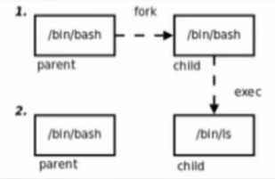
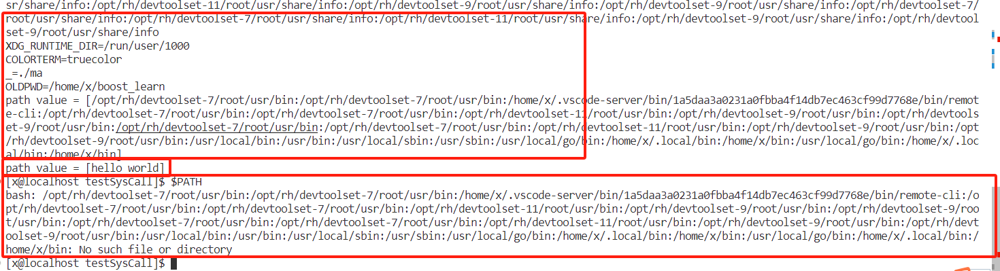
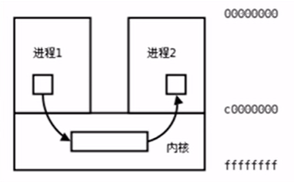
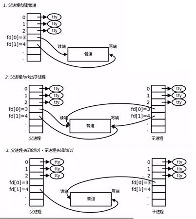
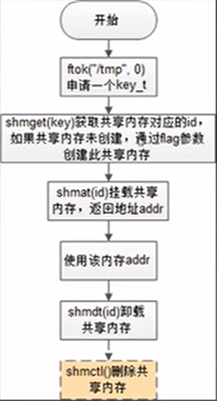
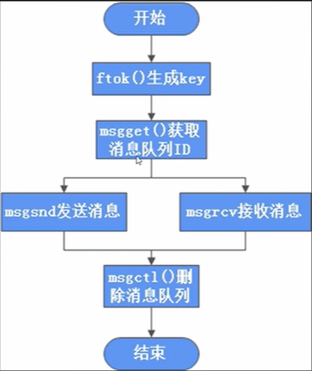

# 系统编程fork进程部分

## 1. 进程标识：task_struct(PCB) & 进程创建：fork 

`fork() creates a new process by duplicating the calling process.`

pstree 命令可以看到系统的这个进程树。 

===> systemd / init 1 号进程

===> 守护进程通常采用以 d 结尾的名字，表示 Daemon

### 1.1 task_ctruct(PCB): 进程内核结构体

**task_struct 结构体：**

进程 id，系统中每一个进程有唯一的 id，在 C语言中用 pid_t 类型表示，其实就是一个非负整数。

进程的状态，有运行、挂起、停止、僵尸等状态。

进程切换时需要保存和恢复的一些CPU寄存器。

描述虚拟地址空间的信息。

描述控制终端的信息。

当前工作目录（Current Working Directory）

umask 文件掩码

文件描述符表，包含很多指向 file_struct 结构体的指针

信号相关的信息

用户 id 和组 id

控制终端、Session和进程组

进程可以使用的资源上限(Resource Limit)

### 1.2 fork：复制一个子进程

fork 的作用是根据一个现有的进程复制出一个新的进程，原来的进程称为父进程（Parent Process），新进程称为子进程（Child Process）。系统中同时运行着很多的进程，这些进程都是从一个最初只有一个进程开始一个一个复制出来的。

**bash 的运行原理**：在 shell 下输入命令可以运行一个程序，是因为 shell 进程在读取用户输入的命令之后会调用 fork 复制出一个新的 shell 进程(新进程出了问题不会影响到父进程，哈哈哈)，新的 shell 进程通过 exec 族函数替换执行用户输入的命令程序去了。

bash 中可以通过 `echo $?` 命令输出上一次 bash 执行的命令或程序的返回值。



```cpp
#include <sys/types.h>
#include <unistd.h>

// On failure, -1 is returned in the parent, no child process is created, and errno is set appropriately.
// On success, the PID of the child process is returned in the parent, and 0 is  returned in  the child.
pid_t fork(void); 
```

### 1.3 僵尸进程 + 孤儿进程概念

僵尸进程: 僵尸进程是当子进程比父进程先结束，而父进程又没有回收子进程，释放子进程占用的资源，此时子进程将成为一个僵尸进程。

孤儿进程：父进程先于子进程退出(一般来说父进程得wait子进程)，此时子进程将成为一个僵尸进程，被 init 进程接管。

### 1.4 实操

下面的代码，父进程没有等待子进程，没有接收子进程的退出信息，此时子进程就是一个孤儿进程。（其实具体情况，父子进程谁先退出，谁快谁慢是不确定的，由cpu调度决定）

```cpp
#include <stdio.h>
#include <unistd.h>
#include <string.h>

int main(int argc, char *argv[])
{
  int n;
  char *msg;
  pid_t child_pid = fork();
  if (child_pid == 0)
  {
    msg = "child# ";
    n = 6;
  }
  else
  {
    msg = "parent# ";
    n = 3;
  }

  for (int i = 0; i < n; i++)
  {
    printf(msg);
    printf("self_pid = %d, parent_pid = %d\n", getpid(), getppid());
    sleep(1);
  }

  return 0;
}
```

效果：可见父进程是先于子进程退出的。

```shell
[x@localhost testSysCall]$ ./ma
parent# self_pid = 119760, parent_pid = 106702
child# self_pid = 119761, parent_pid = 119760
parent# self_pid = 119760, parent_pid = 106702
child# self_pid = 119761, parent_pid = 119760
parent# self_pid = 119760, parent_pid = 106702
child# self_pid = 119761, parent_pid = 119760
child# self_pid = 119761, parent_pid = 119760
[x@localhost testSysCall]$ child# self_pid = 119761, parent_pid = 1
child# self_pid = 119761, parent_pid = 1
```

细节：后面打印的 `[x@localhost testSysCall]$ child# self_pid = 119761, parent_pid = 1 child# self_pid = 119761, parent_pid = 1` 是父进程退出后，bash接管控制台，输出了他的信息 `[x@localhost testSysCall]$`。后面的 child 是子进程输出的，子进程(变成了孤儿进程)被 init 进程(1 号进程)接管了(bash 并没有接收孙子进程)，所以子进程和bash进程同时占用控制台造成打印错乱的现象。


## 3. 进程ID：getpid & getppid

### 3.1 概念

```cpp
  #include <sys/types.h>
  #include <unistd.h>

  pid_t getpid(void);  // 获取进程id
  pid_t getppid(void); // 获取父进程id
```

`getpid() returns the process ID of the calling process.` 获取当前进程的进程id

`getppid() returns the process ID of the parent of the calling process.` 获取当前进程的父进程id

### 3.2 进程id和线程id的区别

单线程 / 进程的情况下：pid = tid

多线程进程的情况下：各个线程有自己唯一的 tid，但是 pid 相同(属于同一个线程中)

```cpp
gettid(2)  returns  the  caller's  thread ID (TID).  
In a single-threaded process, the thread ID is equal to the process ID (PID, as returned by getpid(2), 因为linux中进程和线程用的都是task_struct).  
In a multithreaded process, all threads have the same PID, but each one has a unique TID.  For further details, see the discussion of CLONE_THREAD in clone(2).
```

### 3.3 实操

使用 getpid 和 getppid 查看进程id

```cpp
#include <stdio.h>
#include <unistd.h>
#include <string.h>

int main(int argc, char *argv[])
{
  // child1
  pid_t child_pid = fork();
  if (child_pid == 0)
    printf("child1 ===> [id] = %d, [parent_id] = %d\n", getpid(), getppid());
  else
  {
    // child2
    child_pid = fork();
    if (child_pid == 0)
      printf("child2 ===> [id] = %d, [parent_id] = %d\n", getpid(), getppid());
    else
      printf("parent ===> [id] = %d, [parent_id] = %d\n", getpid(), getppid());
  }

  return 0;
}
```

可见：存在子进程的id + 1 = 父进程id，但是子进程id + 1 不一定 = 父进程的父进程id(注意：可能是因为这个父进程创建了多个子进程，所以子进程 + 1就不一定是父进程id了)

```shell
[x@localhost testSysCall]$ ./ma
child1 ===> [id] = 115767, [parent_id] = 115766
parent ===> [id] = 115766, [parent_id] = 106702
child2 ===> [id] = 115768, [parent_id] = 115766
```


## 4. 进程程序替换：exec 族函数

### 4.1 概念介绍

**1. gdb调试多进程**

```cpp
先打断点：b 行数
再设置追踪哪个进程(以parent进程为例)：set follow-fork-mode parent
再运行：r
进入一个函数(类似于vs中的逐过程)：s
打印相关的变量值：p 变量名
```

**2. exec族函数前言：**bash 想要运行一个命令的话，是得复制一个进程，再去运行的，所以是可以通过 exec 族函数简单实现的。

当进程调用一种exec函数时，该进程的用户空间代码和数据完全被新的进程程序替代，从新的程序中启动例程开始执行。

exec 族函数:

```cpp
#include <unistd.h>

// 以 NULL 结尾，虚函数表好像也是以 NULL 结尾的(哨兵，输出的时候就可以通过这个哨兵控制结束输出了)，哈哈哈
int execl(const char *path, const char *arg, ...);
int execlp(const char *file, const char *arg, ...);
int execle(const char *path, const char *arg, ..., char *const envp[]);

int execv(const char *path, char *const argv[]);
int execvp(const char *file, char *const argv[]);
int execvpe(const char *file, char *const argv[], char *const envp[]);

int execve(const char *filename, char *const argv[], char *const envp[]);
```

前六个是库函数，execve 是系统函数。所以前六个最后调用的也是最后一个系统函数实现的。

这些函数如果调用成功则返回新加载的程序从启动代码开始执行，不再返回，如果出错则返回 -1 并设置 error，所以 exec 函数只有出错的返回值而没有成功的返回值。

带有字母l(list)的exec函数，要求新程序的每个命令行参数都当作一个参数传给它，命令行参数的个数是可变的，最后一个可变参数应该是 nullptr，起 sentinel 的作用。

对于带有字母v(vector)的exec函数，则应该先构造一个指向各参数的指针数组，然后将改数组的数组首地址当作参数传给它，数组中的最后一个指针也应该是 nullptr，像main函数argv参数或者环境变量表一样。

不带字母p(path)的exec函数，第一个参数必须是程序的相对路径或绝对路径，例如"/bin/ls"或"./a.out"。

对于以e(environment)结尾的exec函数，可以把一份新的环境变量覆盖当前的环境变量表，其他的exec函数仍然使用当前的换将变量表执行新的程序。

相关细节也可参考下面的文章：

[execve函数（切换进程）](https://blog.csdn.net/weixin_49503250/article/details/129593580)

[Linux进程控制（精讲）](https://blog.csdn.net/chenlong_cxy/article/details/120444275)


**3. 环境变量相关的函数和变量**

exec 系统调用执行新程序时会把命令行参数和环境变量表传递给 main 函数。和命令行参数 argv 类似，环境变量表也是一个字符串数组 name=value:

```cpp
// 环境变量（extern 表示的是外部有人定义好了，我们这里只是调用一下）
extern char **environ; 
```

可以用 getenv 函数，查询对应 name 的 value

```cpp
#include <stdlib.h>
char* getenv(const char* name);
```

可用 setenv 函数，将环境变量 name 的值设置为 value

```cpp
#include <stdlib.h>
int setenv(const char* name, const char* value, int overwrite); // 第三个参数表示是否覆盖原来的 value 值
void unsetenv(const char* name); // 移除 name 对应的环境变量
```

**3. 输出系统的环境变量 & 修改环境变量**

```cpp
#include <stdio.h>
#include <string.h>
#include <stdlib.h>

int main(int argc, char *argv[])
{
  extern char **environ;

  // 输出系统的环境变量
  for (int i = 0; environ[i] != nullptr; i++)
    printf("%s\n", environ[i]);

  // 获取 name 的环境变量
  printf("path value = [%s]\n", getenv("PATH"));

  // 修改系统的环境变量
  setenv("PATH", "hello world", true);
  printf("path value = [%s]\n", getenv("PATH"));

  return 0;
}
```



可见系统的环境变量并没有被改变的哦；

因为 bash 运行 ./ma 程序使用 exec 进程程序替换，./ma 进程的内容是赋值 bash 进程的内容的；又因为进程具有独立性，所以 ./ma 进程修改了自己的环境变量，但是并不影响 bash 进程的环境变量的哦。

(至于为什么需要使用 exec 新创建一个进程去跑用户的命令，相当于 exec 出来的进程充当了替死鬼，好处全被 bash 占了，哈哈哈)


### 4.2 进程程序替换：exec 族函数

`./ma` 进程替换成 `ls -al` 程序：

```cpp
#include <stdio.h>
#include <unistd.h>
#include <stdlib.h>

int main(int argc, char *argv[])
{
  // 1. 进程程序替换：这个进程替换成 ls(/usr/bin/ls) 这个程序了
  int ret = execlp("ls", "", "-a", "-l", nullptr);
  // 2. exec 族函数只有出错的返回值，是没有成功的返回值的 ===> 失败的话才会向后运行；成功的话，后面的代码是不会运行的了
  if (ret == -1)
  {
    perror("execlp");
    exit(-1);
  }
  else
    printf("execlp 成功\n");

  // 3. 注意上面的参数 const char* arg, ....："ls", "-a", "-l" 第一个是不会执行的

  return 0;
}
```

**注意**：arg 的第一个参数是没有使用到的。


### 4.3 自己实现流的重定向

流的重定向： `<` 和 `>` 的问题

实现：`./ma infilename outfilename` 把 infilename 作为输入文件，小写字母转大写，输出到 outfilename 文件中

test.cc

```cpp
#include <stdio.h>
#include <unistd.h>
#include <stdlib.h>
#include <sys/types.h>
#include <sys/stat.h>
#include <fcntl.h>
#include <ctype.h>
#include <strings.h>

int main(int argc, char **argv)
{
  if (argc < 3)
  {
    printf("argc = %d [usage: ./exe infilename outfilename]\n", argc);
    exit(-1);
  }

  int in_fd = open(argv[1], O_RDONLY);
  if (in_fd == -1)
  {
    perror("open infile");
    exit(-1);
  }
  int out_fd = open(argv[2], O_CREAT | O_RDWR, 0777);
  if (out_fd == -1)
  {
    perror("open outfile");
    exit(-1);
  }

  // 流的重定向
  dup2(in_fd, STDIN_FILENO);
  close(in_fd);
  dup2(out_fd, STDOUT_FILENO);
  close(out_fd);
  int ret = execlp("./toupper", "", nullptr); // 进程程序替换
  if (ret == -1)
  {
    perror("execlp");
    exit(-1);
  }
  else
    printf("execlp no error\n");

  // 下面的程序使用上面的 execlp 函数去另一个文件中执行了
  // char ch;
  // while ((ch = getchar()) != EOF)
  // {
  //   ch = toupper(ch);
  //   putchar(ch);
  // }

  return 0;
}
```

toupper.cc

```cpp
#include <stdio.h>
#include <ctype.h>

// 小写转大写的程序
int main(int argc, char **argv)
{
  char ch;
  while ((ch = getchar()) != EOF)
  {
    ch = toupper(ch);
    putchar(ch);
  }

  return 0;
}
```

**注意**：自己的程序是得加上 `./` 的，官方的程序是不用加上 `./` 的。（`execlp("./toupper", "", nullptr)` 不能写成 `execlp("toupper", "", nullptr);`）


## 5. 进程退出：wait & waitpid(在一定程度上实现了进程同步)

一个进程在终止时会关闭所有的文件描述符，释放在用户空间分配的内存，但它的 PCB 还保留着，内核在其中保存了一些信息；如果是正常终止则保存着退出状态，如果是异常终止则保持着导致该进程终止的信号是哪个。

父进程可以调用wait或waitpid获取这些信息，然后彻底清除掉这个进程。

```cpp
#include <sys/types.h>
#include <sys/wait.h>

pid_t wait(int* status);
pid_t waitpid(pid_t pid, int* status, int options);
```

例如：一个进程的退出状态可以在 shell 中用特殊的变量 $?(通过 echo $? 输出到控制台上)，因为shell是他的父进程，当它终止时shell调用wait或waitpid得到它的退出状态同时彻底清除掉这个进程。

也是可以参考下面的文章：

[_exit()函数（退出当前进程）](https://blog.csdn.net/weixin_49503250/article/details/129600415)

[wait，waitpid函数（等待子进程结束）](https://blog.csdn.net/weixin_49503250/article/details/129684186)


## 6. 进程间通信：匿名管道pipe

### 6.0 为什么要进程间通信

每个进程各自有不同的用户地址空间，任何一个进程的全局变量在另一个进程中都看不到，所以进程之间要交换数据必须通过内核，在内核中开辟一块缓冲区，进程1把数据从用户空间拷贝到内核缓冲区，进程2再从内核缓冲区把数据读走，内核提供的这种机制称为进程间通信(IPC, InterProcess Communication)



### 6.1 相关概念

管道是一种最基本的IPC机制，由pipe函数创建

```cpp
#include <unistd.h>

int pipe(int filefds[2]);
```

调用pipe函数时在内核中开辟一块缓冲区(称为管道)用于通信，他有一个读端一个写端，然后通过filefds参数传出给用户程序两个文件描述符，filefds[0]指向管道的读端，filefds[1]指向管道的写端(很好记，就像0是标准输入，1是标准输出一样hhh)。



### 6.2 父子进程通过父进程创建的匿名管道进行通信

核心：子进程复制父进程的独立地址空间

```cpp
#include <stdio.h>
#include <unistd.h>
#include <stdlib.h>
#include <string.h>
#include <strings.h>

int main(int argc, char **argv)
{
  // 1. 父进程创建管道
  int filefds[2];
  if (pipe(filefds) == -1)
  {
    perror("pipe");
    exit(-1);
  }

  // 2. 创建子进程
  pid_t child_pid = fork();
  if (child_pid == -1)
  {
    perror("fork");
    exit(-1);
  }

  // 3. 父子进程通过管道进行通信
  else if (child_pid == 0)
  {
    close(filefds[1]); // 子进程关闭写端，读端打开
    char readBuffer[32];
    bzero(readBuffer, sizeof(readBuffer));
    while (true)
    {
      read(filefds[0], readBuffer, sizeof(readBuffer));
      printf("child read# %s", readBuffer);
    }
    close(filefds[0]);
  }
  else
  {
    close(filefds[0]); // 父进程关闭读端，写端打开
    char writeBuffer[32];
    bzero(writeBuffer, sizeof(writeBuffer)); // 清空 writeBuffer，也是可以使用 void *memset(void *s, int c, size_t n);
    while (true)
    {
      printf("parent write# ");
      fgets(writeBuffer, sizeof(writeBuffer), stdin); // 读取一行

      // 细节1：只输入了一个回车
      if (strlen(writeBuffer) == 1)
        continue;
      // 细节2：上面输入一行的最后面加上一个 '\0'，防止 child 继续读取后面的内容；因为上面多加了一个 '\0'，所以下面长度 +1
      writeBuffer[strlen(writeBuffer)] = '\0';
      write(filefds[1], writeBuffer, strlen(writeBuffer) + 1);
      // 细节3：因为父子进程共用console，造成数据竞争，使得console打印的内容错乱，这里让父进程慢一下，进行一个同步
      usleep(10);
    }
    close(filefds[1]);
  }

  return 0;
}
```

注意上面的代码的细节地方。


### 6.3 server和client通过server创建的匿名管道进行通信(error)

核心：想法来自共享内存，又是 comm.h 充当配置文件

- 但是不行，和共享内存不一样，具体为什么也是一个值得思考的问题，哈哈哈，文件描述符数组不一样，虽然结构一样哈哈哈哈

comm.h

```cpp
#include <stdio.h>
#include <unistd.h>
#include <stdlib.h>
#include <string.h>
#include <strings.h>

// client 和 server 都可见的操作管道的文件描述符
int filefds[2];
```

client.cc

```cpp
#include "comm.h"

int main(int argc, char **argv)
{
  // 1. client 发送数据
  char writeBuffer[32];
  bzero(writeBuffer, sizeof(writeBuffer)); // 清空 writeBuffer，也是可以使用 void *memset(void *s, int c, size_t n);
  while (true)
  {
    printf("client write# ");
    fgets(writeBuffer, sizeof(writeBuffer), stdin); // 读取一行

    // 细节1：只输入了一个回车
    if (strlen(writeBuffer) == 1)
      continue;
    // 细节2：上面输入一行的最后面加上一个 '\0'，防止 child 继续读取后面的内容；因为上面多加了一个 '\0'，所以下面长度 +1
    writeBuffer[strlen(writeBuffer)] = '\0';
    write(filefds[1], writeBuffer, strlen(writeBuffer) + 1);
    // 细节3：因为server和client进程共用console，造成数据竞争，使得console打印的内容错乱，这里让client进程慢一下，进行一个同步
    usleep(10);
  }

  return 0;
}
```

server.cc

```cpp
#include "comm.h"

int main(int argc, char **argv)
{
  // 1. server 创建管道
  if (pipe(filefds) == -1)
  {
    perror("pipe");
    exit(-1);
  }
  printf("filefds[0] = %d, filefds[1] = %d\n", filefds[0], filefds[1]);

  // 2. server 直接使用打开的 filefds[0] 进行读取数据
  char readBuffer[32];
  bzero(readBuffer, sizeof(readBuffer));
  while (true)
  {
    read(filefds[0], readBuffer, sizeof(readBuffer));
    printf("server read# %s", readBuffer);
  }

  // 3. server 退出的话负责关闭打开的 filefds
  close(filefds[0]);
  close(filefds[1]);

  return 0;
}
```

测试可见，是不行的。

因为 server 和 client 进程使用的文件描述符数组是不一样的，fork出来的父子进程具有复制的公共属性(有些内容也是会发生写时拷贝的)，可以通过匿名管道进行通信。

上面的例子有父进程把文件描述符传给子进程之后父子进程之间通信，也可以父进程fork两次，把文件描述符传给两个子进程，然后两个子进程之间通信(这两个子进程也是没有血缘关系的)，总之**需要通过fork传递文件描述符使两个进程都能访问同一管道，它们才能通信**（这里和后面的共享内存是不一样的），最后父进程关闭文件描述符filefds。


## 7. 管道的4种特殊情况 & 简易myshell

### 7.1 基本概念

使用管道需要注意以下4中特殊情况(假设都是阻塞I/O操作，没有设置O_NONBLOCK标志)：

1、没有写端，读端读完后会返回0

如果所有指向管道写端的文件描述符都关闭了，而仍然有进程从管道的读端读数据，那么管道中剩余的数据都被读取后，再次read才会返回0，就像读到文件末尾一样。

2、有写端不写，读端读完了后会阻塞

如果有指向管道写端的文件描述符没关闭，而持有管道写端的进程也没有向管道中写数据，这时有进程从管道读端读数据，那么管道中剩余的数据被读取后，再次read会阻塞，直到管道中有数据可读了才会返回数据并返回。

3、没有读端，写端写入会收到SIGPIPE信号

如果所有指向管道读端的文件描述符都关闭了，这时有进程向管道的写端write，那么该进程会收到SIGPIPE信号，通常会导致进程异常终止。

4、有读端不读，写端写满会阻塞

如果有指向管道读端的文件描述符没关闭，而持有管道读端的进程也没有从管道中读数据，这时有进程向管道写端写数据，那么管道被写满时再次write会阻塞，直到管道中有空位了才会写入数据成功并返回写入成功的数据量。

使用上面父子进程使用匿名管道通信的代码实现上面的四种情况 ===> 管道的大小是 64KB


### 7.2 实现一个简易版的 shell

shell 的工作原理：shell 是通过 fork 一个新的子进程，子进程再通过 exec 相关的函数去替换 shell 要指向的程序。

具体流程：

```text
1. 获取命令行 parent
2. 解析命令行 parent
3. 创建子进程 parent
4. 替换子进程 [child] 子进程作为一个工具人，用完就没了，哈哈哈
5. 等待子进程退出 parent
```

```cpp
#include <stdio.h>
#include <unistd.h>
#include <stdlib.h>
#include <sys/types.h>
#include <sys/wait.h>
#include <ctype.h>
#include <string.h>
#include <pwd.h>
#include <semaphore.h>
#include <signal.h>

// 注意：
// 下面的两个数组放在 main 函数内是有问题的哦：error: declaration of ‘char (* argv)[32]’ shadows a parameter
char buffer[32]; // 获取命令行字符数组
char *argv[32];  // 解析命令行字符数组

// 注意：
// 1. 使用信号量控制父子进程同步一下顺序使用控制台: error 父子进程地址空间独立（信号量和信号都是不行的，不能做到同步父子进程的目的）
// 2. 下面使用的是匿名管道可以做到同步父子进程的目的，其实父进程的 wait 已经做到了父子进程同步使用 console 的目的了
// sem_t sem;

int main(int argc, char **argv)
{
  extern char **environ;

  // 主机名  当前目录
  char hostname[32], pwd[128]; // 空间可以适量的给大一点的哦
  struct passwd *password = getpwuid(getuid());
  gethostname(hostname, sizeof(hostname) - 1);
  getcwd(pwd, sizeof(pwd) - 1);
  int len = strlen(pwd);
  char *p = pwd + len - 1;
  while (*p != '/')
  {
    p--;
  }
  p++;
  // printf("[%s@%s %s]# ", password->pw_name, hostname, p); // debug

  // bzero(buffer, strlen(buffer));
  // sem_init(&sem, 0, 0);
  while (true)
  {
    // 1. 获取命令行
    // 得读取一行的哦
    // scanf("%s", buffer);
    // 1. STDIN_FILENO 是 int 类型，stdin 是 FILE* 类型    2. 得用 sizeof(buffer), 而不是 strlen(buffer)
    fgets(buffer, sizeof(buffer), stdin);
    buffer[strlen(buffer) - 1] = '\0';

    // 2. 解析命令行
    int i = 0;
    argv[i++] = strtok(buffer, " ");
    while (argv[i] = strtok(NULL, ""))
      i++;

    // 创建匿名管道进行父子进程之间的通信(这里是父子进程之间的同步：父进程输入命令回车使用console --> 子进程输出结果 ---> .......)
    int pipefd[2];
    int ret = pipe(pipefd);
    if (ret == -1)
    {
      perror("pipe");
      exit(-1);
    }

    // 3. 创建子进程
    pid_t child_pid = fork();
    if (child_pid == 0)
    {
      // error：使用信号量的话，子进程是会发生写实拷贝的
      // sem_post(&sem);
      // error：子进程退出会向父进程发送 SIGCHLD 信号，但是实验的时候好像父进程设置的 pause / suspend 并没有收到子进程的 SIGCHLD 信号(有可能是子进程比 pause / suspend 先执行)
      // kill(getppid(), SIGCHLD);
      // 父进程从匿名管道中写入内容，父进程阻塞式的读取，实现同步
      close(pipefd[0]);
      write(pipefd[1], "child execvp...", 15);

      // 4. 子进程程序替换
      // putchar(10); // 不用手动换行了，父进程输入命令行会输入换行的
      int ret = execvp(argv[0], argv); // 刚刚好把 argv 数组全传给它了（第一个参数不用，我也不用处理了，巧了，哈哈哈）
      if (ret == -1)
      {
        perror("execvp");
        exit(-1);
      }
      else
        printf("execvp success\n");
    }
    else
    {
      // 父进程从匿名管道中阻塞的读取内容
      close(pipefd[1]);
      char child_msg[16];
      // 默认是阻塞式的读取的哦(这里是和共享内存不同的地方；共享内存的话是得手动做到同步互斥的使用，所以在这里就会轮询)
      while (read(pipefd[0], child_msg, 15) == -1)
        usleep(10);
      child_msg[15] = '\0';

      // 5. 获取子进程退出状态码，子进程不正常退出才打印
      int status;
      // pid_t ret = wait(&status);
      pid_t ret = waitpid(child_pid, &status, 0);
      if (WIFEXITED(status))
        printf("exited, status=%d\n", WEXITSTATUS(status));
      else if (WIFSIGNALED(status))
        printf("killed by signal %d\n", WTERMSIG(status));
      else
        printf("child exit code: %d\n", WEXITSTATUS(status));

      // sem_wait(&sem);
      printf(R"(["%s"@'%s' %s]# )", password->pw_name, hostname, p);
    }
  }

  return 0;
}
```

代码细节：

1. 子进程修改拷贝父进程的信号量，全局变量..... 是会发生写实拷贝的；（注意与管道(自带互斥使用)和共享内存(需要维护实现互斥使用)的区别）

2. 父进程 `wait` / `waitpid` 子进程，在一定程度上实现了父子进程之间的同步。

3. `exec` 族函数传参的是会，第一个参数是不用的，上面的示例代码中是更加便捷的；(输入的 `ls -a -l` 直接使用一个字符数组解决，不用区分可执行程序 `ls` 和可执行程序的参数 `-a -l`，是更加便捷的)

4. `getpwuid`、`gethostname` 和 `getcwd` 等函数的使用。

5. 子进程调用 `exec` 相关族函数后也是会向父进程发送 `SIGCHLD` 信号的；（在创建子进程之前使用 `signal` / `sigaction` 来设置 `SIGCHLD` 信号的自定义事件，可见是会调用自定义事件的。）

6. 使用 `pause` / `suspend` 函数挂起进程，直到有信号触发；这种方式是不行的哦，具体原因有点未知。

7. `R"(string)"` 是 `C++11` 中的用法，支持其中的字符串 `string` 可以使用双引号和单引号就像上面代码中的 `R"(["%s"@'%s' %s]# )"` 是没有问题的（不然双引号中使用但引号是可以的，但是使用双引号的话得加上 `\` 来转义的哦；同理单引号中使用双引号是没有问题的，但是使用单引号也是得加上 `\` 来转义的哦）。


### 7.3 简易shell进阶版

使用上面的 C 函数实现一个简易的交互式 shell，要求：

1、给提示符，让用户输入一行命令，识别程序名和参数并调用适当的 exec 函数执行程序，待指向完成后再次给出提示符。

2、识别和处理以下符号：

- 一些常用的命令：cd echo kill ulimit umask exit help man ls ......
- 简答的标准输入输出重定向( < 和 > )
- 管道( | ): shell 进程先调用 pipe 创建一对管道描述符，然后 fork 出两个子进程，一个子进程关闭读端，调用 dup2 把写端赋给标准输出，另一个子进程关闭写端，调用 dup2 赋给标准输入，两个子进程分别调用 exec 指向程序，而 shell 进程把管道的两端都关闭，调用 wait 等待两个子进程终止。


即支持流的重定向和管道

shell.cc debug ...... 

```cpp

```


## 8. popen & pclose：集成了pipe & fork & exec 

这两个函数实现的操作是：创建一个管道，fork 一子进程，关闭管道的不使用端，exec 一个 cmd 命令，等待命令终止。
 
```cpp
#include <stdio.h>

FILE* popen(const char* command, const char* type);
// 返回：若成功则为文件指针，若出错则为null

int pclose(FILE* stream);
// 返回：command的终止状态，若出错则为-1
```

函数popen先执行pipe，再fork，然后调用exec执行command，并且返回一个标准I/O文件指针。

如果type是"r"，则文件指针连接到command的标准输出。

如果type是"w"，则文件指针连接到command的标准输入。

plcose函数关闭标准I/O流，等待命令执行结束，然后返回command的终止状态，如果command不能被执行，则pclose返回的终止状态与shell执行exit一样。


实操：shell 进程从 FILE* fp 中 "r" 数据；fork的子进程执行 "cat ./makefile" 向管道中写数据

```cpp
#include <stdio.h>
#include <stdlib.h>
#include <ctype.h>

int main(void)
{
  FILE *fp = popen("cat ./makefile", "r");
  if (fp == NULL)
  {
    perror("popen");
    exit(-1);
  }

  int c;
  while (~(c = fgetc(fp)))
    putchar(toupper(c));

  pclose(fp);

  return 0;
}
```

实操: shell 进程从 FILE* fp 中 "w" 数据；fork的子进程并执行 "./toupper" 向管道中读数据

```cpp
#include <stdio.h>
#include <stdlib.h>
#include <ctype.h>

int main(void)
{
  FILE *fp = popen("./toupper", "w");
  if (fp == NULL)
  {
    perror("popen");
    exit(-1);
  }

  fprintf(fp, "hello world");

  pclose(fp);

  return 0;
}
```


## 9. 进程间通信：有名管道mkfifo

FIFO IPC机制是利用文件系统中的特殊文件来标识的。可以用mkfifo命令创建一个FIFO文件。

```shell
mkfifo tube
ls -l tube 
# 可见 tube 是 p(管道文件)    对应的权限可以设置先修改 umask 
prw-rw-r--. 1 x x     0 Apr 30 11:53 tube
```

FIFO文件在磁盘上没有数据块，仅用来标识内核中的一条通道，个进程可以打开这个文件进行read/write，实际上是在读写内核通道(根本原因在于这个file结构体所指向的read、write函数和常规文件不一样)，这样就实现了进程间通信。

实操：通过有名管道实现server和client进程间通信(相对于匿名管道的不同，这里就可以使用comm.h了)

comm.h

```cpp
#include <stdlib.h>
#include <stdio.h>
#include <unistd.h>
#include <string.h>
#include <sys/types.h>
#include <sys/wait.h>
#include <sys/stat.h>
#include <fcntl.h>

// server可以创建一个子进程调用exec代码创建tube管道文件（当然也是可以我们自己手动来创建的）
#define fifoname "tube"
```

server.cc

```cpp
#include "comm.h"

int main(void)
{
  // 1. 子进程exec创建 tube(也是有 mkfifo 这个函数可以创建一个管道，和使用命令行的效果是一样的)
  pid_t child_pid = fork();
  if (child_pid == -1)
  {
    perror("fork");
    exit(-1);
  }
  else if (child_pid == 0)
  {
    // char command[32];
    // strcpy(command, fifoname); // 拷贝到 command 的首地址，可以使用 sprintf(command, "%s", fifoname)；strcpy 和 strncpy 是不一样的哦
    execlp("mkfifo", " ", fifoname, NULL); // exec族函数的第一个参数不用的哦，mkfifo bube
    exit(-1);
  }
  else
  {
    // 2. 父进程等待子进程退出
    int status;
    waitpid(child_pid, &status, 0);
    if (WIFEXITED(status))
      printf("exited, status=%d\n", WEXITSTATUS(status));
    else if (WIFSIGNALED(status))
      printf("killed by signal %d\n", WTERMSIG(status));
    else
      printf("child process success exit\n");

    // 3. 父进程使用tube接收client的数据
    // 只有上面子进程创建好管道后，父进程才能使用tube ===> 父进程waitpid子进程的时候，在一定程度上实现了父子进程间的同步
    int fifofd = open(fifoname, O_RDONLY);
    if (fifofd == -1)
    {
      perror("open");
      exit(-1);
    }
    char readBuffer[32];
    char dest[32]; // 判断是否退出
    while (true)
    {
      // 看上面管道的特殊使用情况以及实验的结果，默认是阻塞式的读取的(不用像共享内存一样会轮询)
      ssize_t ret = read(fifofd, readBuffer, sizeof(readBuffer));
      if (ret < 0)
      {
        perror("read");
        break;
      }
      else if (ret == 0) // client quit
      {
        printf("server quit!!!\n");
        break;
      }
      else
        printf("server read# %s", readBuffer);
    }

    close(fifofd);
  }

  return 0;
}
```

client.cc

```cpp
#include "comm.h"

int main(void)
{
  // 1. 打开命名管道 tube
  int fifofd = open(fifoname, O_WRONLY);
  if (fifofd == -1)
  {
    perror("open");
    exit(-1);
  }

  // 2. client进程用tube向server发送数据
  char writeBuffer[32];
  bzero(writeBuffer, sizeof(writeBuffer));
  char dest[32]; // 判断是否退出
  while (true)
  {
    printf("client send# ");
    fgets(writeBuffer, sizeof(writeBuffer), stdin);
    if (strlen(writeBuffer) == 1)
      continue;
    // client 输入 quit 退出(单方面的读写都是会阻塞的)
    strncpy(dest, writeBuffer + 0, strlen("quit"));
    dest[strlen(dest)] = '\0';     // 得加上 '\0' 的哦
    if (0 == strcmp(dest, "quit")) // strcmp(writeBuffer, "quit") 这样直接比较是不行的哦
    {
      printf("client quit!!!\n");
      break;
    }
    writeBuffer[strlen(writeBuffer)] = '\0';
    write(fifofd, writeBuffer, strlen(writeBuffer) + 1); // 再加一个 \0, 所以长度 +1
  }
  close(fifofd);

  return 0;
}
```

**实验可见**

1、client使用ctrl c 或者输入 "quit" 都会把 client 给 quit 了，server的read返回0也就quit退出了。

2、client 输入 "quit" 后就退出了，所以 server 不能通过 read 读取上来的内容是否是 "quit" 来判断是否退出，此时读取上来的内容已经不是client发送来的内容了。（因为此时 read 函数的返回是 0，隐藏的表明了 client 的退出，可见有时返回值的优先判断是很重要的）。

3、read 默认是阻塞式的读取。

4、`char* strncpy(char* dest + idx, const char* src + iidx, size_t count);` 注意 dest 和 src 是可以加上偏移，实现从 src 中任意位置截取 count 个字符到 dest 中的，注意最后的 `dest[strlen(dest)] = '\0';` 的必要性。

注意: **strcpy[会拷贝 \0] 和 strncpy[count没有超过src长度是不会拷贝 \0，这里通常会有 bug 产生，以为后面有一个 \0 哈哈哈; 超过了就会拷贝 \0，就和 strcpy 差不多了]**


## 10. 进程通信：共享内存ftok & shmget & shmat & shmdt & shmctl

### 10.1 共享内存概念

共享存储允许两个或多个进程共享一给定的存储区。因为数据不需要在客户机和服务器之间复制，所以这是最快的一种IPC。

操作共享内存的相关函数，相关函数的参数和返回值的意义了解是很必要的，详情可以参考相关文章 [Linux进程信号](https://blog.csdn.net/chenlong_cxy/article/details/121315266) 或者 man 手册。

```cpp
#include <sys/ipc.h>
#include <sys/shm.h>
       
// 功能：创建 key
// 参数：相同的参数 __pathname 和 __proj_id 可以得到相同的 key（有点类似于 hash 函数的味道）
// 返回值：失败返回 -1，并设置 error(设置 error 的一般是可以通过 perror(error) 来看是什么问题)；成功返回 key
key_t ftok(const char *__pathname, int __proj_id);       

// 功能：创建 / 获取共享内存用户级标识 shmid
// 参数：相同的 key，可以得到同一块 size 大小的共享内存；如果不存在的话可以创建，通过第三个变量 shmflg 来设置的 
// 返回值：失败同上；成功返回在用户空间标识共享内存的 shmid
int shmget(key_t key, size_t size, int shmflg);          

// 功能：映射到当前进程的虚拟地址空间 task_struct
// 参数：shmid；shmaddrr 用户推荐OS共享内存映射在用户空间的 shmaddr 指向的地方，通常设置nullptr由OS自己控制；shmflg 通常设为 0
// 返回值：失败同上；成功返回 void* 类型的指针指向共享内存，可以强转为 int* / char* ......
void* shmat(int shmid, const void* shmaddr, int shmflg); 

// 功能：取消映射
// 参数：shmat 返回的指向共享内存的指针 
// 返回值：失败同上；
int shmdt(const void* shmaddr);                          

// 功能：删除创建的共享内存(也是可以通过 ipcrm -m shmid 命令来删除的，其实命令也是通过函数来实现的，哈哈哈)
// 参数：shmid；cmd 通常为 IPC_RMID；buf 通常为 nullptr
// 返回值：失败同上；
int shmctl(int shmid, int cmd, struct shmid_ds* buf);     
```



**聊一聊 shmat 函数：**

调用一旦创建了一个共享存储段，进程就可调用 shmat 将其连接到它的地址空间中。

```cpp
void* shmat(int shmat, const void* addr, int shmflg);
```

返回: 若成功则为指向共享存储段的指针，若出错则为 -1

共享存储段连接到调用进程的哪个地址上与 addr 参数以及在 flag 中是否指定 SHM_RND 位有关:

如果addr为NULL，则此段连接到由内核选择的第一个可用地址上。

如果addr非NULL，并且没有指定SHM_RND，则此段连接到addr所指定的地址上。

如果addr非0，并且指定了SHM_RND，则此段连接到(addr一(addr mod SHMLBA))所表示的地址上。

SHM_RND命令的意思是: 取整。

SHM_LBA的意思是:低边界地址倍数，它总是2的乘方。

该算式是将地址向下取最近1个SHMLBA的倍数。般应指定addr为0，以便由内核选择地址。

说了这么多，一般还是传 NULL 的，addr 给OS指定，哈哈哈。


### 10.2 实操: 父子进程通过共享内存进行通信

实操：父进程输入内容，输入quit就退出。子进程打印父进程输入的内容。

```cpp
#include <stdio.h>
#include <unistd.h>
#include <string.h>
#include <sys/shm.h>
#include <sys/ipc.h>
#include <sys/types.h>
#include <sys/wait.h>
#include <strings.h>
#include <stdlib.h>

int main(int argc, char *argv[])
{
  // 1. 在内核空间创建共享内存
  key_t key = ftok("makefile", 9);
  if(key < 0){
    perror("ftok");
    exit(-1);
  }
  int shmid = shmget(key, 20, IPC_CREAT | IPC_EXCL | 0666);
  if(shmid < 0){
    perror("shmget");
    exit(-1);
  }
  // 2. 把内核空间的共享内存映射到用户空间
  char* shmp = (char*)shmat(shmid, NULL, 0);
  if(shmp == NULL){
    perror("shmat");
    exit(-1);
  }

  // 3. 使用共享内存
  // 父进程输入内容，输入quit就退出。子进程打印父进程输入的内容。
  bzero(shmp, 20); // 清空
  pid_t child_pid = fork();
  if(child_pid < 0){
    perror("fork");
    exit(-1);
  }
  if(child_pid != 0){
    // parent process
    while(1){
      scanf("%s", shmp);
      if(!strcmp(shmp, "quit")) break;
    }
    wait(NULL);
  }else{
    // child process
    while(1){
      if(!strcmp(shmp, "quit")) break;
      // debug：可见有在轮询
      // printf("shmptr == nullpt");
      if(*shmp){
        printf("%s\n", shmp);
        bzero(shmp, 20); // 清空
      }
      sleep(1);
    }
  }

  // 4. 解除用户空间和内核空间的共享内存映射
  shmdt(shmp);

  // 5. 释放共享内存
  // shmctl(shmid, IPC_RMID, NULL);

  return 0;
}
```

可见上面的子进程打印父进程输入的内容，是有缺陷的，因为不够实时，子进程一直在轮询(所以后面得配合信号量 / 条件变量，父进程写入了，就通知子进程读取是更好的)。

- 使用 ipcrm -m shmid，可以把代码中创建的共享内存 rm 掉。(也是可以通过 shmctl 系统函数设置删除的)

可见上面的匿名管道和共享内存都是可以实现父子进程之间的通信的。


### 10.3 实操: server和client通过server创建的共享内存进行通信

好像有点短路了，对吧？反正我有一点短路，哈哈哈（后面你可以看到其实是对于 shmget 函数的第一个参数的不太了解其作用导致的：相同的 key，可以得到同一块共享内存）。

我们上面的父子进程之间通过共享内存进行通信，是因为父进程先 ftok、shmget、shmat 创建共享内存，

后面 fork 创建复制的子进程后，子进程复制了一份父进程的资源，所以共享内存什么的都是可以直接使用的，所以后面父子进程操作的共享内存是同一个。

**那么这里的 client 进怎么获取到 server 进程创建的共享内存呢？ ===> 使用一个配置文件嘛(一个公共的头文件，包含公共的 __pathname 和 __proj_id，通过 ftok 自然得到相同的 key，再通过 shmget 自然得到 server 创建的共享内存)！！！**

可见 [Linux进程间通信](https://blog.csdn.net/chenlong_cxy/article/details/121184624) 详情，也可见下面的代码：


实操：client 向 shmptr 指向的共享内存写入内容，server 向共享内存中读取内容。

comm.h 代码：

```cpp
#include <stdio.h>
#include <unistd.h>
#include <signal.h>
#include <stdlib.h>
#include <sys/types.h>
#include <sys/ipc.h>
#include <sys/shm.h>
#include <string.h>

#define __pathname "./"
#define __proj_id 0666
#define SHMSIZE 20
```

server.cc 代码：

```cpp
// g++ -o srever server.cc

#include "comm.h"

int main(void)
{
  // 1. 获取唯一的 key_t key
  key_t key = ftok(__pathname, __proj_id);
  if (key == -1) // 这些系统函数的报错一般都是返回 -1
  {
    perror("ftok");
    exit(-1);
  }

  // 2. 创建共享内存
  int shmid = shmget(key, SHMSIZE, IPC_CREAT | IPC_EXCL | 0777); // 第三个参数和文件描述符的作用类似(文件描述符和这里的 shmid 都是句柄)
  if (shmid == -1)
  {
    perror("shmget");
    exit(-1);
  }

  // debug
  printf("srever debug: key = %d  shmid = %d\n", key, shmid);

  // 3. 映射进当前 server 进程的虚拟地址空间
  char *shmptr = (char *)shmat(shmid, NULL, 0); // 第二个参数是指定共享内存开辟的地址，默认是 OS 自己帮你设置的
  if (shmptr == nullptr)
  {
    perror("shmat");
    exit(-1);
  }
  // 注意使用shmptr执行共享内存的执行流：shmptr最开始就设置为nullptr -> client写入 -> server读取完再清空 -> client写入 -> server读取完再清空 -> ......
  bzero(shmptr, SHMSIZE);

  // 4. 操作 shmptr 指向的共享内存空间
  while (1)
  {
    if (shmptr != nullptr && !strcmp(shmptr, "quit")) // 提取 quit 为退出
      break;
    else if (shmptr != nullptr)
    {
      printf("client say# %s\n", shmptr); // STDOUT_FILENO 是全缓冲和行缓冲，不加上 \n 的话，得打满缓冲区才会输出}
      bzero(shmptr, SHMSIZE);             // srever 读取完就清空(因为没有实现同步机制，防止轮询读取历史数据)
    }
    sleep(1);
  }

  // 5. 取消关联
  if (shmdt(shmptr) == -1)
  {
    perror("shmdt");
    exit(-1);
  }

  // 6. server 进程退出了就删除共享内存，当然不删除也是可以的
  if (shmctl(shmid, IPC_RMID, NULL) == -1)
  {
    perror("shmctl");
    exit(-1);
  }

  printf("server debug: server 正常退出! \n");

  return 0;
}
```

client.cc 代码：

```cpp
// g++ -o client client.cc

#include "comm.h"

int main(void)
{
  // 1. 获取唯一的 key_t key
  key_t key = ftok(__pathname, __proj_id);
  if (key == -1) // 这些系统函数的报错一般都是返回 -1
  {
    perror("ftok");
    exit(-1);
  }

  // 2. 创建共享内存
  int shmid = shmget(key, SHMSIZE, IPC_CREAT); // 第三个参数和文件描述符的作用类似(文件描述符和这里的 shmid 都是句柄)
  if (shmid == -1)
  {
    perror("shmget");
    exit(-1);
  }

  // debug
  printf("key = %d  shmid = %d\n", key, shmid);

  // 3. 映射进当前 server 进程的虚拟地址空间
  char *shmptr = (char *)shmat(shmid, NULL, 0); // 第二个参数是指定共享内存开辟的地址，默认是 OS 自己帮你设置的
  if (shmptr == nullptr)
  {
    perror("shmat");
    exit(-1);
  }

  // 4. 操作 shmptr 指向的共享内存空间
  while (1)
  {
    scanf("%s", shmptr);         // client: 直接向 shmptr 指向的共享内向写入内容
    if (!strcmp(shmptr, "quit")) // 设置输入 quit 为退出
      break;
    sleep(1);
  }

  // 5. 取消关联
  if (shmdt(shmptr) == -1)
  {
    perror("shmdt");
    exit(-1);
  }

  printf("client debug: client 正常退出! \n");

  // 6. server 创建的由 server 去销毁
  // shmctl(shmid, IPC_RMID, NULL);

  return 0;
}
```

测试：

```shell
[x@localhost testSysCall]$ g++ -o client client.cc
[x@localhost testSysCall]$ ./client
key = -1241285908  shmid = 56
nohao
clientToserver
quit
client debug: client 正常退出!

[x@localhost testSysCall]$ g++ -o server server.cc
[x@localhost testSysCall]$ ./server
srever debug: key = -1241285908  shmid = 56
client say# 
client say# 
client say# nohao
client say# 
client say# clientToserver
client say# 
server debug: server 正常退出!
```

注意：

- 上面的 server 是在不断的轮询的，这是一个弊端，后面可以通过进程同步的机制来达到同步的目的，使得 shmptr 指向的共享内存间接变成了一个生产者消费者容量池。

- 共享内存的大小好像也不是 shmget 传参时指定的大小，测试的时候，好像是会变大的，类似 vector 扩容了哈哈哈。

上面的两种实操基本上包括共享内存使用的大部分场景了：

- 父子进程间通过共享内存通信(有血缘关系)

- server进程和client进程间通过共享内存通信(无有血缘关系)。


**学习心得**：学习就是需要有一些思考，一些卡住的地方，想通了就会很开心，有些许影响深刻的感觉。如果直接递给你正确的答案，自己没有思考感觉还是不佳的。并自己去写代码验证。


## 11. 进程间通信：消息队列

### 11.1 消息队列的基本概念

系统内核维护了一个存放消息的队列，不同的用户可以向队列中发送消息，或者从队列中接收消息。

```cpp
#include <sys/types.h>
#include <sys/ipc.h>
#include <sys/msg.h>

// 一个消息的格式
#define MSGLEN 32
struct msgbuf{
  long mtype;          // 此消息的类型
  char mtext[MSGLEN];  // 此消息的内容
};

// 和共享变量的用法一样
key_t ftok(const char* pathname, int __proj_id);

// 系统创建或获取消息队列
int msgget(key_t key, int msgflg);

// 往队列里发送一条消息。此操作被中断后不会被重启(信号处理中SA_RESTART)。
int msgsnd(int msgid, const void* msgp, size_t msgsz, int msgflg);

// 接收消息
ssize_t msgrcv(int msgid, void* msgp, size_t msgsz, long msgtyp, int msgflg);
```




### 11.2 实操：server和client通过消息队列通信

comm.h

```cpp
#include <stdio.h>
#include <sys/types.h>
#include <sys/ipc.h>
#include <sys/msg.h>
#include <string.h>
#include <stdlib.h>

// 单个消息的格式
#define MSGLEN 32
typedef struct msgnode
{
  long mtype;
  char mtext[MSGLEN];
} MSGNODE;

// key_t ftok(const char* pathname, int proj_id); 函数的参数，返回值唯一决定使用的是哪一个消息队列的哦
#define PATHNAME "./makefile"
#define PROJ_ID 9
```

server.cc

```cpp
#include "comm.h"

int main(void)
{
  // 前置准备
  key_t key = ftok(PATHNAME, PROJ_ID);
  if (key == -1)
  {
    perror("ftok");
    exit(-1);
  }
  int msqid = msgget(key, IPC_CREAT | 0777);
  if (msqid == -1)
  {
    perror("msgget");
    exit(-1);
  }

  // server接收消息
  MSGNODE recvNode;
  ssize_t text_size = msgrcv(msqid, &recvNode, sizeof(recvNode), 2, 0);
  if (text_size > 0)
    printf("%s\n", recvNode.mtext);

  putchar(10);
  text_size = msgrcv(msqid, &recvNode, sizeof(recvNode), 1, 0);
  if (text_size > 0)
    printf("%s\n", recvNode.mtext);

  return 0;
}
```

client.cc

```cpp
#include "comm.h"

int main(void)
{
  // 前置准备
  key_t key = ftok(PATHNAME, PROJ_ID);
  if (key == -1)
  {
    perror("ftok");
    exit(-1);
  }
  int msqid = msgget(key, IPC_CREAT | 0777);
  if (msqid == -1)
  {
    perror("msgget");
    exit(-1);
  }

  // client 发送消息
  MSGNODE sendNode;
  sendNode.mtype = 2;
  // sendNode.mtext = "hello world"; // error
  strncpy(sendNode.mtext, "client -> hello server", 23);
  int ret = msgsnd(msqid, &sendNode, sizeof(sendNode), 0);
  if (ret == -1)
  {
    perror("msgsnd");
    exit(-1);
  }

  sendNode.mtype = 1;
  strncpy(sendNode.mtext, "client -> online", 20);
  ret = msgsnd(msqid, &sendNode, sizeof(sendNode), 0);
  if (ret == -1)
  {
    perror("msgsnd");
    exit(-1);
  }

  return 0;
}
```

实验可见：

- 消息队列msq中如果没有server要msgrcv的消息类型的话，server是会阻塞的。
- 消息的msgsnd发送顺序和msgrcv接收顺序没有太大的关系；主要是这个类型的消息是否有，不然server会阻塞。


## 12. 进程间通信：信号量sem_init & sem_wait & sem_post

信号量在 `./3_linux-pthread.md` 中有介绍，也是可以参考推荐的博客的。

注意：不过信号量通常更多的用在同步互斥上，进程间通信用的更多的是共享内存和消息队列。


## 总结

0、为什么需要进程间通信(IPC)

1、6种进程间的通信方式IPC: 管道，信号量，消息队列，信号，socket(对应的缓冲区/空间都是在内核区创建的)，共享内存(内存中开辟空间，可映射到用户空间)。

- 同一主机的进程间通信：管道，信号量，消息队列，信号，共享内存
- 同一主机的进程间通信：socket

2、总结一下上面实例部分代码的同步问题：

```cpp
1. 父子进程竞争打印数据到 console，造成打印信息错乱时，使用的是 usleep 来同步使用 console。
2. 父进程等待子进程 exec 指向命令或创建共享资源时，wait / waitpid 已经实现了这一点上的同步。
3. 读完 shmptr，清空 shmptr，因为没有实现同步机制，防止轮询时读取历史数据（同步使用共享内存需要使用后面的同步机制，管道的话具有互斥使用的性质了）。


匿名管道：fork, pipe
1. 父子进程通过匿名管道通信    usleep(10)，fork 复制拷贝
2. server，client通过匿名管道通信    comm.h 配置文件，默认为阻塞I/O，没有fork不能通信

简易 shell：fork, exec
1. 简易shell    fork子进程，子进程exec需要执行的程序，父进程wait/waitpid子进程的退出
2. 进阶shell 

popen & pclose
集成了上面的 pipe fork exec 官方自己实现来了同步的问题

命名管道：mkfifo
1. server，client通过命名管道通信    comm.h 配置文件，server等待子进程exec创建命名管道

共享内存：ftok, shmget, shmat, shmdt, shmctl 
1. 父子进程通过共享内存通信    fork复制，阻塞读，读完清空，读轮询(看起来父进程一输入，子进程就打印，其实子进程有轮询判断shmptr是否为空)(不像管道，共享内存需要自己实现同步)
2. server，client通过共享内存通信    comm.h 配置文件，阻塞读，读完清空，读轮询(不像管道，共享内存需要自己实现同步)

条件队列：ftok, msgget, msgsnd, msgrcv
1. server和client通过消息队列通信

信号量：sem_t, sem_init, sem_wait, sem_post
更多的是用在同步互斥上
```

3、一些注意点

**代码编写的便捷**：exec 族函数参数传递上，第一个参数不用，再一定程度上需要执行的一行命令只用一个char数组存放即可，在代码编写上是更加方便的(qt中不是这样的，哈哈哈)。

**进程同步**：等待进程退出 wait 和 waitpid 在一定程度上实现了进程同步。

**进程同步**：管道具有单向通信的特点，使用是不用再同步；共享内存就需要自己实现同步。

**console竞争使用**：注意多进程时，1. shell运行程序时是创建子进程的，子进程就是我们自己写的程序可能会创建进程，如果子进程先退出了，就会有孤儿进程的产生，被init即1号进程领养，那么注意shell和孤儿进程共用console，造成打印数据的错乱问题。 2. 父子进程打印数据到console时，也得注意是否有竞争使用console的问题。

**异同点**：条件队列相对共享内存的使用很相似，条件队列的使用简单一点，功能强大一点；共享内存通信速度最快。

**异同点**：匿名管道只能通过fork传递，也就是说只有同一个父进程fork出来的子进程之间可以使用匿名管道通信；命名管道就不用fork了。

**多个进程之间传递公有数据**：源文件编译出来的可执行程序可简单称为进程吧，因为进程是具有独立性的，所以可以使用一个头文件 comm.h 来传递一个公有的数据，相当于是一个配置文件了吧。

**一些用户信息的获取**：`getpwuid`、`gethostname` 和 `getcwd` 等函数的使用。

**双引号和单引号**：`R"(string)"` 是 `C++11` 中的用法，支持其中的字符串 `string` 可以使用双引号和单引号就像上面代码中的 `R"(["%s"@'%s' %s]# )"` 是没有问题的（不然双引号中使用但引号是可以的，但是使用双引号的话得加上 `\` 来转义的哦；同理单引号中使用双引号是没有问题的，但是使用单引号也是得加上 `\` 来转义的哦）。

**管道使用的4种特殊情况**：甚至有信号中断哦 ---> 没有读端，写端写入会收到SIGPIPE信号

**read函数返回值先判断问题**：client 输入 "quit" 后就退出了，所以 server 不能通过 read 读取上来的内容是否是 "quit" 来判断是否退出，此时读取上来的内容已经不是client发送来的内容了。（因为此时 read 函数的返回是 0，隐藏的表明了 client 的退出，可见有时返回值的优先判断是很重要的）。

**strcpy和strncpy**：`char* strncpy(char* dest + idx, const char* src + iidx, size_t count);` 注意 dest 和 src 是可以加上偏移，实现从 src 中任意位置截取 count 个字符到 dest 中的，注意最后的 `dest[strlen(dest)] = '\0';` 的必要性。

**注意**: strcpy[会拷贝 \0] 和 strncpy[count没有超过src长度是不会拷贝 \0，这里通常会有 bug 产生，以为后面有一个 \0 哈哈哈; 超过了就会拷贝 \0，就和 strcpy 差不多了]

**shell的工作原理**：创建子进程去运行命令，跑崩溃了也是没有问题的，不影响shell；当然内建命令是不用创建子进程去跑的，非内建命令是得创建子进程去跑的。

**write和read为什么可以用于tcp的socket**：socket也是一个int类型的整数，和open打开一个文件一样返回一个int类型的整数fd。所以socket和fd都是可以用write写入内容的，只不过socket更常用send/sendto。write对于fd是写入到文件缓冲区，对于socket是写入到内核的tcp发送缓冲区(udp是没有发送缓冲区的)。

**学习心得**：学习就是需要有一些思考，一些卡住的地方，想通了就会很开心，有些许影响深刻的感觉。如果直接递给你正确的答案，自己没有思考感觉还是不佳的。并自己去写代码验证。


上面的内容来自：https://space.bilibili.com/50657960/channel/series

非常感谢！！！！！！

