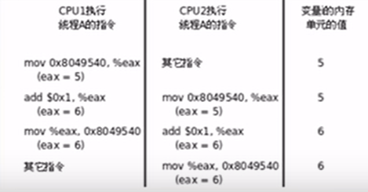

# linux 线程

## 1. 线程的概念介绍

有些情况需要在一个进程中同时执行多个控制流程，比如实现一个图形界面的下载软件，一方面需要和用户交互，等待和处理用户的鼠标键盘事件，另一方面又需要同时下载多个文件，等待和处理从多个网络主机发来的数据，这些任务都需要一个“等待-处理”的循环，那么如何才能同时进行多项任务呢?

线程(thread) :

是操作系统能够进行运算调度的最小单位。它被包含在进程之中，是进程中的实际运作单位。一条线程指的是进程中一个单一顺序的控制流，一个进程中可以并发多个线程，每条线程并行执行不同的任务。

由于同一进程的多个线程共享同一地址空间，因此Text Segment、Data Segment都是共享的，如果定义一个函数，在各线程中都可以调用，如果定义一个全局变量，在各线程中都可以访问到，除此之外，各线程还共享以下进程资源和环境:

1. 文件描述符表

2. 每种信号的处理方式3.当前工作目录

4. 用户id和组id

但有些资源是每个线程各有一份的:
1. 线程id

2. 上下文，包括各种寄存器的值、程序计数器和栈指针3.栈空间

4. errno变量

5. 信号屏蔽字

6. 调度优先级

在Linux上线程函数位于libpthread共享库中，因此在编译时要加上 `-lpthread`

```cpp
  #include <pthread.h>

  int pthread_create(pthread_t *thread, const pthread_attr_t *attr, void *(*start_routine) (void *), void *arg);
```

返回值: 成功返回0，失败返回错误号。以前学过的系统函数都是成功返回0,失败返回-1，而错误号保存在全局变量errno中，而pthread库的函数都是通过返回值返回错误号，虽然每个线程也都有一个errno，但这是为了兼容其它函数接口而提供的，pthread库本身并不使用它，通过返回值返回错误码更加清晰。


**可见上面的 pthread_create 函数就是一个回调函数(回调函数参数：有要调用的函数和传递的参数)**。


## 2. 线程简单代码实现

根据上面的说明，运行一个线程：

```cpp
#include <stdio.h>
#include <unistd.h>
#include <string.h>
#include <stdlib.h>
#include <pthread.h>
#include <iostream>
#include <string>

using namespace std;

typedef struct node
{
  string username;
  int value;
} Node;

void print(const char *str); // 前面的 run 函数调用后面的 print 函数，所以 print 函数得在 run 函数的前面声明
void *run(void *arg)
{
  Node data = *((Node *)arg);
  string str = data.username + to_string(data.value);
  print(str.c_str()); // const char* str = char* str(权限缩小) / const char* str(权限平移)， char* str = const char* str(权限放大，error)
  return nullptr;
}

void print(const char *str)
{
  std::cout << str << std::endl;
}

int main(int argc, char *argv[])
{
  Node data;
  data.username = "张三";
  data.value = 90;

  pthread_t p_pthread;
  int ret = pthread_create(&p_pthread, nullptr, run, &data);
  if (ret < 0)
  {
    perror("pthread_create");
    exit(-1);
  }

  print("main pthread"); // 是否注释是会影响上面子线程的打印情况的哦

  return 0;
}
```

跑一下试试：

大部分是下面的打印"张三90"，少部分是打印上面的情况。

但是主线程不打印 `print("main pthread");` 的话，几乎打印的是 0，甚至没有打印输出。

```shell
[x@localhost testSysCall]$ ./ma
main pthread
0
[x@localhost testSysCall]$ ./ma
main pthread
张三90
```

上面的运行测试 ===> main pthread 是得等待子线程的退出的（对应下面线程的不同退出方式）。


## 3. 线程控制概念 + 线程不同方式退出方式实操

### 3.1 概念

如果需要只终止某个线程而不终止整个进程(在都有线程和进程的程序中，使用exit退出的话，可以整个程序退出的)，可以有三种方法:

1. 从线程函数return。这种方法对主线程不适用，从main函数return相当于调用exit。

2. 一个线程可以调用pthread_cancel终止同一进程中的另一个线程。

```cpp
  #include <pthread.h>

  int pthread_cancel(pthread_t thread);
```

3. 线程可以调用pthread_exit终止自己。

```cpp
  #include <pthread.h>

  void pthread_exit(void *value_ptr);
```

value_ptr是void *类型，和线程函数返回值的用法一样，其它线程可以调pthread_join获得这个指针。

```cpp
  #include <pthread.h>

  int pthread_join(pthread_t thread, void **retval); // retval == nullptr 的时候，表示主线程不用知道子线程的退出情况
```

需要注意，pthread_exit或者return返回的指针所指向的内存单元必须是全局是用malloc分配的，不能在线程函数的栈上分配，因为当其它线程得到这个返下程函数已经退出了。


### 3.2 pthread_join 线程等待函数的说明

```cpp
  #include <pthread.h>

  int pthread_join(pthread_t thread, void **retval); // retval == nullptr 的时候，表示主线程不用知道子线程的退出情况
```

调用该函数的线程将挂起等待，直到id为thread的线程终止。thread线程以不同的方式终止，通过pthread_join得到的终止状态是不同的，总结如下：

1. 如果thread线程通过return返回，retval所指向的单元里存放的是thread线程函数的返回值。

2. 如果thread线程被别的线程调用pthread_cancel异常终止掉，retval所指向的单元里存放的是常数 PTHREAD_CANCELED。

3. 如果thread线程是自己调用pthread_exit终止的，retval所指向的单元存放的是传给pthread_exit的参数。

4. 如果对thread线程的终止状态不是很感兴趣，可以传nullptr个retval参数。


### 3.3 实操

模拟上面线程退出的三种方式：

1. 线程自己 return 终止自己：

2. 其他的线程 pthread_cancel 终止自己：

3. 线程自己 pthread_exit 终止自己：

```cpp
#include <stdio.h>
#include <unistd.h>
#include <string.h>
#include <stdlib.h>
#include <pthread.h>
#include <iostream>
#include <string>

using namespace std;

typedef struct node
{
  string username;
  int value;
} Node;

void print(const char *str); // 前面的 run 函数调用后面的 print 函数，所以 print 函数得在 run 函数的前面声明
void *run(void *arg)
{
  Node data = *((Node *)arg);
  string str = data.username + to_string(data.value);
  print(str.c_str()); // const char* str = char* str(权限缩小) / const char* str(权限平移)， char* str = const char* str(权限放大，error)

  // 设置退出信息
  const char *retval = "子线程正常退出";
  // 3. 线程自己 pthread_exit 终止自己（主线程可以使用 pthread_join 获取子线程退出的原因）
  // pthread_exit((void *)retval);
  // while (1)
  //   sleep(1);

  // 1. 线程自己 return 终止自己（主线程可以使用 pthread_join 获取子线程退出的原因）
  return nullptr;
}

void print(const char *str)
{
  std::cout << str << std::endl;
}

int main(int argc, char *argv[])
{
  Node data;
  data.username = "张三";
  data.value = 90;

  pthread_t p_pthread;
  int ret = pthread_create(&p_pthread, nullptr, run, &data);
  if (ret < 0)
  {
    perror("pthread_create");
    exit(-1);
  }

  // 2. 其他的线程 pthread_cancel 终止自己，那么主线程下面再 pthread_join 是没有必要了，会 Segmentation fault (core dumped)。retval所指向的单元里存放的是常数 PTHREAD_CANCELED。
  // pthread_cancel(p_pthread);

  // 主线程获取子线程的退出原因
  void *retval = nullptr;
  pthread_join(p_pthread, &retval);
  if (retval != nullptr)
    cout << "子线程 pthread_exit 设置退出原因: " << (char *)retval << endl;
  else
    cout << "子线程没有 pthread_exit 设置退出信息" << endl;

  return 0;
}
```

上面的情况下，主线程是可以调用 pthread_join 函数获取子线程的退出情况的，是因为上面情况被干掉了，哈哈哈(查明死亡情况)。


## 4. 线程间资源竞争实操

多个线程同时访问共享数据时可能会冲突，这跟前面讲信号时所说的可重入性是同样的问题。比如两个线程都要把某个全局变量增加 1，这个操作在某平台需要三条指令完成:

1. 从内存读变量值到寄存器

2. 寄存器的值加 1

3. 将寄存器的值写回内存




```cpp
#include <stdio.h>
#include <unistd.h>
#include <string.h>
#include <stdlib.h>
#include <pthread.h>

int count = 0;
void *countAdd(void *arg)
{
  int val;
  for (int i = 0; i < 5000; i++)
  {
    val = count;
    printf("%p: %d\n", pthread_self(), val);
    count = count + 1;
  }
  return nullptr;
}

int main(int argc, char *argv[])
{
  pthread_t p_pthread, s_pthread;
  pthread_create(&p_pthread, nullptr, countAdd, nullptr);
  pthread_create(&s_pthread, nullptr, countAdd, nullptr);

  pthread_join(p_pthread, nullptr);
  pthread_join(s_pthread, nullptr);

  printf("count: %d\n", count);

  return 0;
}
```

上面的代码大部分情况下还是没有问题的，但理论上分析是有问题的。 所以就有了下面的线程同步的内容。


## 5. 线程实现同步

### 5.1 相关概念

pthread_mutex_init函数对Mutex做初始化，参数attr设定Mutex的属性，如果attr为NULL则表示缺省属性。

用pthread_mutex_init函数初始化的Metex可以用pthread_mutex_destroy销毁。

如果Mutex变量是静态分配的(全局变量或static变量)，也可以用宏定义PTHREAD_MUTEX_INITIALIZER来初始化，相当于用pthread_mutex_init初始化并且attr参数为NULL。

```cpp
  #include <pthread.h>

  int pthread_mutex_destroy(pthread_mutex_t *mutex);
  int pthread_mutex_init(pthread_mutex_t *restrict mutex, const pthread_mutexattr_t *restrict attr);
  pthread_mutex_t mutex = PTHREAD_MUTEX_INITIALIZER; // static pthread_mutex_t mutex = PTHREAD_MUTEX_INITIALIZER;
```

Mutex的加锁和解锁操作可以用下列函数:

```cpp
  #include <pthread.h>

  int pthread_mutex_lock(pthread_mutex_t *mutex);
  int pthread_mutex_trylock(pthread_mutex_t *mutex);
  int pthread_mutex_unlock(pthread_mutex_t *mutex);
```

返回值:成功返回0，失败返回错误号。

一个线程可以调用pthread_mutex_lock获得Mutex，如果这时另一个线程已经调用pthread_mutex_lock获得了该Mutex，则当前线程需要挂起等待，直到另一个线程调用pthread_mutex_unlock释放Mutex，当前线程被唤醒，才能获得该Mutex并继续执行。

如果一个线程既想获得锁，又不想挂起等待，可以调用pthread_mutex_trylock如果Mutex已经被另一个线程获得，这个函数会失败返回EBUSY，而不会使线程挂起等待。


### 5.2 实操

用 pthread_mutex_t 修改上面 4 部分的代码：

```cpp
#include <stdio.h>
#include <unistd.h>
#include <string.h>
#include <stdlib.h>
#include <pthread.h>

pthread_mutex_t add_lock = PTHREAD_MUTEX_INITIALIZER;

int count = 0;
void *countAdd(void *arg)
{
  int val;
  for (int i = 0; i < 5000; i++)
  {
    pthread_mutex_lock(&add_lock); // 对于临界区加 pthread_mutex_t 保证同时只能有一个线程操作全局变量 count，解决数据竞争的问题
    val = count;
    printf("%p: %d\n", pthread_self(), val);
    count = count + 1;
    pthread_mutex_unlock(&add_lock);
  }
  return nullptr;
}

int main(int argc, char *argv[])
{
  pthread_t p_pthread, s_pthread;
  pthread_create(&p_pthread, nullptr, countAdd, nullptr);
  pthread_create(&s_pthread, nullptr, countAdd, nullptr);

  pthread_join(p_pthread, nullptr);
  pthread_join(s_pthread, nullptr);

  printf("count: %d\n", count);

  return 0;
}
```

## 6. 条件变量的概念

**“挂起等待”和“唤醒等待线程”的操作如何实现?**

每个Mutex有一个等待队列，一个线程要在Mutex上挂起等待，首先在把自己加入等待队列中，然后置线程状态为睡眠，然后调用调度器函数切换到别的线程。一个线程要唤醒等待队列中的其它线程，只需从等待队列中取出一项，把它的状态从睡眠改为就绪，加入就绪队列，那么下次调度器函数执行时就有可能切换到被唤醒的线程。


**死锁**

如果同一个线程先后两次调用lock，在第二次调用时，由于锁已经被占用，该线程会挂起等待别的线程释放锁，然而锁正是被自己占用着的，该线程又被挂起而没有机会释放锁因此就永远处于挂起等待状态了，这叫做死锁(Deadlock）。

另一种典型的死锁情形是这样:线程A获得了锁1，线程B获得了锁2，这时线程A调用lock试图获得锁2，结果是需要挂起等待线程B释放锁2，而这时线程B也调用lock试图获得锁1，结果是需要挂起等待线程A释放锁1，于是线程A和B都永远处于挂起状态了。不难想象，如果涉及到更多的线程和更多的锁，有没有可能死锁的问题将会变得复杂和难以判断。


写程序时应该尽量避免同时获得多个锁，如果一定有必要这么做，则有一个原则:

如果所有线程在需要多个锁时都按相同的先后顺序获得锁，则不会出现死锁。比

如一个程序中用到锁1、锁2、锁3，它们所对应的Mutex变量是锁1->锁2->锁3，那么所有线程在需要同时获得2个或3个锁时都应该按锁1、锁2、锁3的顺序获得。如果要为所有的锁确定一个先后顺序比较困难，则应该尽量使用pthread_mutex_trylock调用代替pthread_mutex_lock调用，以免死锁。


线程间的同步还有这样一种情况:线程A需要等某个条件成立才能继续往下执行,现在这个条件不成立，线程A就阻塞等待，而线程B在执行过程中使这个条件成立了，就唤醒线程A继续执行。在pthread库中通过条件变量(Condition Variable)来阻塞等待一个条件，或者唤醒等待这个条件的线程。Condition Variable用pthread_cond_t类型的变量表示，可以这样初始化和销毁:

```cpp
#include <pthread.h>

int pthread_cond_destroy(pthread_cond_t *cond);
int pthread_cond_init(pthread_cond_t *restrict cond, const pthread_condattr_t *restrict attr);

// 全局变量 / static 变量，是可以使用 PTHREAD_COND_INITIALIZER 宏来实现 pthread_cond_init 函数初始化同样的效果的。
pthread_cond_t cond = PTHREAD_COND_INITIALIZER; 
```
返回值:成功返回0，失败返回错误号。

**pthread_cond_t 的操作可以使用下面的函数：**

```cpp
#include <pthread.h>

int pthread_cond_timedwait(pthread_cond_t *restrict cond, pthread_mutex_t *restrict mutex, const struct timespec *restrict abstime);
int pthread_cond_wait(pthread_cond_t *restrict cond, pthread_mutex_t *restrict mutex);

int pthread_cond_broadcast(pthread_cond_t *cond);
int pthread_cond_signal(pthread_cond_t *cond);
```

**注意上面的 pthread_cond_t 相关的函数参数有传递 pthread_muetx_t 变量的哦，后面的 sem_t 是没有的，所以 sem_t 的代码写法上可能会有死锁的情况哦。**

返回值:成功返回0，失败返回错误号。

pthread_cond_timedwait函数还有一个额外的参数可以设定等待超时，如果到达了abstime所指定的时刻仍然没有别的线程来唤醒当前线程，就返回ETIMEDOUT。一个线程可以调用pthread_cond_signal唤醒在某个Condition Variable上等待另一个线程，也可以调用pthread_cond_broadcast唤醒在这个ConditionVariable上等待的所有线程。


## 7. 条件变量实现生产者消费者程序

看上面的 pthread_cond_t 的相关使用函数，可见需用配合 pthread_mutex_t 一起使用的哦。

### 实操

链表模拟队列，生产者生成节点挂到链表上，消费者从链表上取节点

```cpp
#include <stdio.h>
#include <unistd.h>
#include <string.h>
#include <stdlib.h>
#include <pthread.h>
#include <time.h>

typedef struct node
{
  int data;
  struct node *next;
} Node;

Node *head = nullptr; // 消费链表的头节点
pthread_mutex_t pthread_mutex = PTHREAD_MUTEX_INITIALIZER;
pthread_cond_t pthread_cond = PTHREAD_COND_INITIALIZER;

void *p(void *arg) // 生产者线程执行的函数
{
  Node *node;
  while (1)
  {
    node = (Node *)malloc(sizeof(Node));
    node->data = rand() % 70;
    pthread_mutex_lock(&pthread_mutex);
    node->next = head;
    head = node;
    pthread_mutex_unlock(&pthread_mutex);
    pthread_cond_signal(&pthread_cond); // 通知
    printf("p_pthread p data = %d\n", node->data);
    sleep(2);
  }
}

void *s(void *arg) // 消费者线程执行的函数
{
  Node *node;
  while (1)
  {
    pthread_mutex_lock(&pthread_mutex);
    // 抢到 pthread_mutex_t 并上锁了，还是得判断链表是否为空的哦。
    if (head == nullptr)
      pthread_cond_wait(&pthread_cond, &pthread_mutex); // 如果为空就得在条件变量的等待队列中等待唤醒(信号量也是有一个等待队列的)，并释放 pthread_mutex_t
    node = head;
    head = head->next;
    pthread_mutex_unlock(&pthread_mutex);
    printf("s_pthread s data = %d\n", node->data);
    sleep(2);
  }
}

int main(int argc, char *argv[])
{
  srand(time(nullptr)); // 防止每次的是都是相同的

  pthread_t p_pthread, s_pthread;
  int ret = pthread_create(&p_pthread, nullptr, p, nullptr); // 失败的话，会返回 errno 的，可以通过 strerror(errno) 查看具体信息的
  if (ret < 0)
  {
    printf("pthread_create p_pthread error: %s\n", strerror(ret));
    exit(-1);
  }
  ret = pthread_create(&s_pthread, nullptr, s, nullptr); // 失败的话，会返回 errno 的，可以通过 strerror(errno) 查看具体信息的
  if (ret < 0)
  {
    printf("pthread_create s_pthread error: %s\n", strerror(ret));
    exit(-1);
  }

  // 主线程等待两个子线程退出
  pthread_join(p_pthread, nullptr);
  pthread_join(s_pthread, nullptr);

  return 0;
}
```

## 8. 信号量实现生产者消费者程序

Mutex变量是非0即1的，可看作一种资源的可用数量，初始化时Mutex是1，表示有一个可用资源，加锁时获得该资源，将Mutex减到0，表示不再有可用资源，解锁时释放该资源，将Mutex重新加到1，表示又有了一个可用资源。

信号量(Semaphore)和Mutex类似，表示可用资源的数量，和Mutex不同的是这个数量可以大于1。这种信号量不仅可用于同一进程的线程间同步，也可用于不同进程间的同步。


```cpp
  #include <semaphore.h>

  int sem_init(sem_t *sem, int pshared, unsigned int value);

  int sem_wait(sem_t *sem); // P 操作: 获取资源
  int sem_trywait(sem_t *sem);
  int sem_timedwait(sem_t *sem, const struct timespec *abs_timeout);

  int sem_post(sem_t *sem); // V 操作：释放资源

  int sem_destroy(sem_t *sem);
```

### 实操1

使用信号量改写，上面第7节的代码：

下面的代码，跑起来是没有问题的，如果有问题的话，可以再改一改。

```cpp
#include <stdio.h>
#include <unistd.h>
#include <string.h>
#include <stdlib.h>
#include <pthread.h>
#include <time.h>
#include <semaphore.h>

typedef struct node
{
  int data;
} Node;

const int NUM = 5;
Node nodeArr[NUM];
pthread_mutex_t pthread_mutex = PTHREAD_MUTEX_INITIALIZER;
sem_t node_num; // 0
sem_t free_num; // 5
int p_count = 0;
int s_count = 0;

void *p(void *arg) // 生产者线程执行的函数
{
  while (1)
  {
    sem_wait(&free_num); // P
    pthread_mutex_lock(&pthread_mutex);
    nodeArr[p_count].data = rand() % 100;
    printf("p_pthread p data = %d\n", nodeArr[p_count].data); // 模拟生产一个node节点
    p_count = (p_count + 1) % NUM;                            // 向下走一步
    pthread_mutex_unlock(&pthread_mutex);
    sem_post(&node_num); // V
    // sleep(1);
  }
}

void *s(void *arg) // 消费者线程执行的函数
{

  while (1)
  {
    sem_wait(&node_num); // P
    pthread_mutex_lock(&pthread_mutex);
    printf("s_pthread s data = %d\n", nodeArr[s_count].data); // 模拟消费一个node节点
    s_count = (s_count + 1) % NUM;                            // 向下走一步
    pthread_mutex_unlock(&pthread_mutex);
    sem_post(&free_num); // V
    // sleep(1);
  }
}

int main(int argc, char *argv[])
{
  srand(time(nullptr)); // 防止每次的是都是相同的

  // 初始化 sem_t node_num
  int temp = sem_init(&node_num, 1, 0); //
  if (temp < 0)
  {
    printf("node_num sem_init error: %s\n", strerror(temp));
    exit(-1);
  }
  temp = sem_init(&free_num, 1, NUM); //
  if (temp < 0)
  {
    printf("free_num sem_init error: %s\n", strerror(temp));
    exit(-1);
  }

  pthread_t p_pthread, p2_pthread, s_pthread, s2_pthread;
  int ret = pthread_create(&p_pthread, nullptr, p, nullptr); // 失败的话，会返回 errno 的，可以通过 strerror(errno) 查看具体信息的
  if (ret < 0)
  {
    printf("pthread_create p_pthread error: %s\n", strerror(ret));
    exit(-1);
  }
  ret = pthread_create(&p2_pthread, nullptr, p, nullptr); // 失败的话，会返回 errno 的，可以通过 strerror(errno) 查看具体信息的
  if (ret < 0)
  {
    printf("pthread_create p2_pthread error: %s\n", strerror(ret));
    exit(-1);
  }

  ret = pthread_create(&s_pthread, nullptr, s, nullptr); // 失败的话，会返回 errno 的，可以通过 strerror(errno) 查看具体信息的
  if (ret < 0)
  {
    printf("pthread_create s_pthread error: %s\n", strerror(ret));
    exit(-1);
  }
  ret = pthread_create(&s2_pthread, nullptr, s, nullptr); // 失败的话，会返回 errno 的，可以通过 strerror(errno) 查看具体信息的
  if (ret < 0)
  {
    printf("pthread_create s2_pthread error: %s\n", strerror(ret));
    exit(-1);
  }

  // 主线程等待两个子线程退出
  pthread_join(p_pthread, nullptr);
  pthread_join(s_pthread, nullptr);

  return 0;
}
```

注意这里是会有死锁的情况的：不能先拿lock，再sem_wait。因为sem_wait失败的话，线程是会进入sem的等待队列休眠的(**不会unlock，因为sem_wait中没有传递lock，和条件变量的一个不同之处**)，等待对应的sem_post唤醒。

```cpp
  pthread_mutex_lock(&pthread_mutex);
  sem_wait(&free_num); // P
```

### 实操2

下面是官方的一份代码：

```cpp
#include <stdio.h>
#include <stdlib.h>
#include <semaphore.h>
#include <time.h>
#include <assert.h>
#include <errno.h>
#include <signal.h>
#include <string.h>
#include <unistd.h>

sem_t sem;

#define handle_error(msg) \
  do                      \
  {                       \
    perror(msg);          \
    exit(EXIT_FAILURE);   \
  } while (0)

static void
handler(int sig)
{
  write(STDOUT_FILENO, "sem_post() from handler\n", 24);
  if (sem_post(&sem) == -1)
  {
    write(STDERR_FILENO, "sem_post() failed\n", 18);
    _exit(EXIT_FAILURE);
  }
}

int main(int argc, char *argv[])
{
  struct sigaction sa;
  struct timespec ts;
  int s;

  if (argc != 3)
  {
    fprintf(stderr, "Usage: %s <alarm-secs> <wait-secs>\n",
            argv[0]);
    exit(EXIT_FAILURE);
  }
  if (sem_init(&sem, 0, 0) == -1)
    handle_error("sem_init");

  /* Establish SIGALRM handler; set alarm timer using argv[1] */

  sa.sa_handler = handler;
  sigemptyset(&sa.sa_mask);
  sa.sa_flags = 0;
  if (sigaction(SIGALRM, &sa, NULL) == -1)
    handle_error("sigaction");

  alarm(atoi(argv[1]));

  /* Calculate relative interval as current time plus
     number of seconds given argv[2] */

  if (clock_gettime(CLOCK_REALTIME, &ts) == -1)
    handle_error("clock_gettime");

  ts.tv_sec += atoi(argv[2]);

  printf("main() about to call sem_timedwait()\n");
  while ((s = sem_timedwait(&sem, &ts)) == -1 && errno == EINTR)
    continue; /* Restart if interrupted by handler */

  /* Check what happened */

  if (s == -1)
  {
    if (errno == ETIMEDOUT)
      printf("sem_timedwait() timed out\n");
    else
      perror("sem_timedwait");
  }
  else
    printf("sem_timedwait() succeeded\n");

  exit((s == 0) ? EXIT_SUCCESS : EXIT_FAILURE);
}
```

## 总结

1. 避免死锁的情况

2. 注意pthread_mutex_t(资源数 == 1)和sem_t(资源数 == n)的一些不同点。

3. 注意pthread_cond_t和sem_t的一些不同点。


上面的内容来自：https://space.bilibili.com/50657960/channel/series

非常感谢！！！！！！

