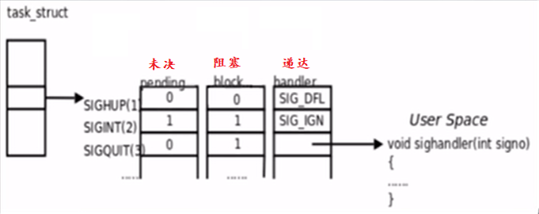
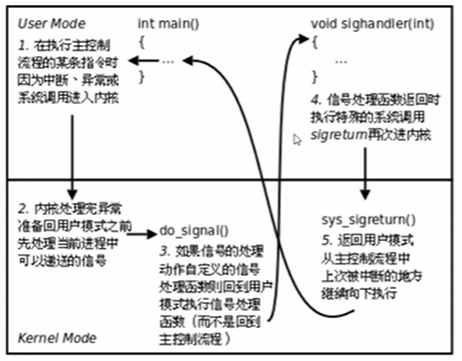
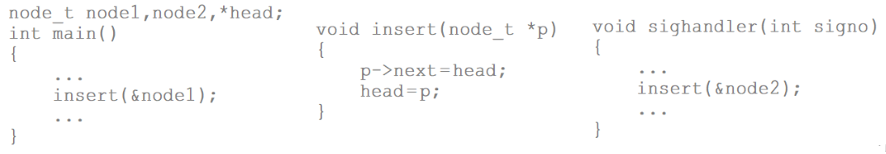
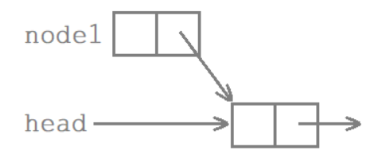
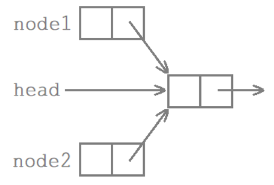
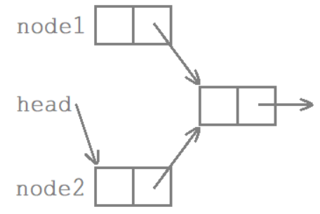
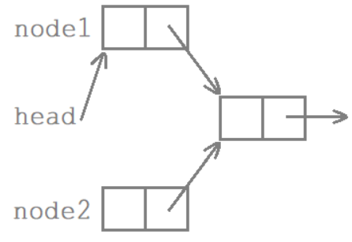
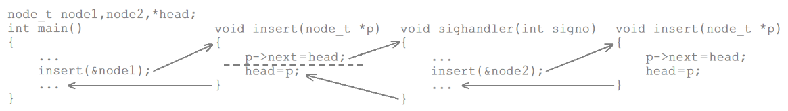
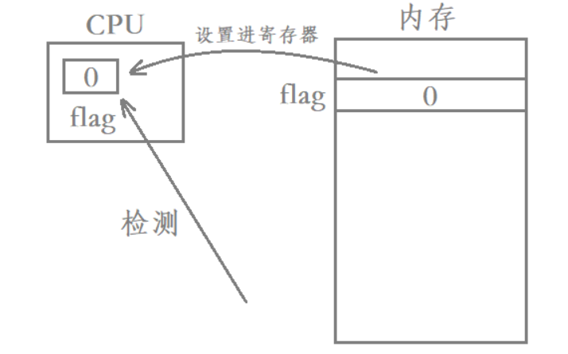

# linux 信号


之前的内容中有接触到信号的概念，这一节是具体讲linux中的信号的。

先来一个问题：用户态怎么切换到内核态？

据我现在所知：系统函数的调用，ctrl c等硬件中断，异常中有除零异常等等。


## 1. 信号的概念 + coredump概念

用户输入命令，在 shell 下启动一个前台进程。

用户按下 ctrl c，这个键盘输入产生一个硬件中断。

如果CPU当前正在执行这个进程的代码，则该进程的用户空间代码暂停执行，CPU从用户态切换到内核态处理硬件中断。

中断驱动程序将ctrl c解释成SIGINT信号，记在该进程的PCB中(也可以说发送了一个SIGINT信号给该进程)。

当某个时刻要从内核返回到该进程的用户空间，代码继续执行之前，首先处理PCB中记录的信号，发现有一个SIGINT信号待处理，而这个信号的默认处理动作是终止进程，所以直接终止进程而不再返回它的用户空间代码执行。

kill-l命令可以察看系统定义的信号列表:

```bash
[x@localhost TinyWebServer-raw_version]$ kill -l
 1) SIGHUP       2) SIGINT       3) SIGQUIT      4) SIGILL       5) SIGTRAP
 6) SIGABRT      7) SIGBUS       8) SIGFPE       9) SIGKILL     10) SIGUSR1
11) SIGSEGV     12) SIGUSR2     13) SIGPIPE     14) SIGALRM     15) SIGTERM
16) SIGSTKFLT   17) SIGCHLD     18) SIGCONT     19) SIGSTOP     20) SIGTSTP
21) SIGTTIN     22) SIGTTOU     23) SIGURG      24) SIGXCPU     25) SIGXFSZ
26) SIGVTALRM   27) SIGPROF     28) SIGWINCH    29) SIGIO       30) SIGPWR
31) SIGSYS      34) SIGRTMIN    35) SIGRTMIN+1  36) SIGRTMIN+2  37) SIGRTMIN+3
38) SIGRTMIN+4  39) SIGRTMIN+5  40) SIGRTMIN+6  41) SIGRTMIN+7  42) SIGRTMIN+8
43) SIGRTMIN+9  44) SIGRTMIN+10 45) SIGRTMIN+11 46) SIGRTMIN+12 47) SIGRTMIN+13
48) SIGRTMIN+14 49) SIGRTMIN+15 50) SIGRTMAX-14 51) SIGRTMAX-13 52) SIGRTMAX-12
53) SIGRTMAX-11 54) SIGRTMAX-10 55) SIGRTMAX-9  56) SIGRTMAX-8  57) SIGRTMAX-7
58) SIGRTMAX-6  59) SIGRTMAX-5  60) SIGRTMAX-4  61) SIGRTMAX-3  62) SIGRTMAX-2
63) SIGRTMAX-1  64) SIGRTMAX
```

上面的信号可以分为两大类：1 - 31 号的非实时信号，后面的都是实时信号。

这些信号各自在什么条件下产生，默认的处理动作是什么，在signal(7)中都有详细说明。

Term表示终止当前进程，Core表示终止当前进程并且Core Dump，Ign表示忽略该信号，Stop表示停止当前进程，Cont表示继续执行先前停止的进程。


## 2. 产生coredump的其它几种情况

当一个进程要异常终止时，可以选择把进程的用户空间内存数据全部保存到磁盘上，文件名通常是 core，后缀通常是进程号，这叫做 core dump。

ulimit 命令可以设置 core 文件的大小：

```shell
[x@localhost testSysCall]$ ulimit -u 1024
[x@localhost testSysCall]$ ulimit
unlimited
```

下面是几种常见的产生 core dump 的情况：

**除零错误**

**double free**

**接到 SIGSEGV 信号**


## 3. kill产生信号

### 3.1 相关的概念

kill 系统函数可以给一个指定的进程发送指定的信号。kill命令就是调用kill系统函数实现的，下面的 raise 和 abort 库函数也是 kill 系统函数实现的。

raise 库函数函数可以给当前进程发送指定的信号(自己给自己发送信号，是可以用上面的kill系统函数实现的: kill(getpid(), sig);)。

abort 库函数使当前进程接收到SIGABRT信号而异常终止。

```cpp
#include <sys/types.h>
#include <signal.h>

int kill(pid_t pid, int sig);
```

```cpp
#include <stdlib.h>

int raise(int sig);
void abort(void);
```

获取当前进程的 pid 和 父进程的 pid:

```cpp
#include <sys/types.h>
#include <unistd.h>

pid_t getpid(void);
pid_t getppid(void);
```

上面函数的具体内容可以看 man 手册。 

### 3.2 实操

父进程先wait捕捉子进程的退出信息，再通过kill系统函数给子进程发送信号

```cpp
#include <stdio.h>
#include <signal.h>
#include <sys/types.h>
#include <sys/wait.h>
#include <stdlib.h>
#include <unistd.h>

int main(void)
{
  pid_t pid = fork();
  if (pid < 0)
  {
    perror("fork");
    exit(1);
  }

  if (pid)
  {
    sleep(3);
    if (kill(pid, SIGQUIT) < 0) // 这里的 pid 是子进程的 pid
    {
      perror("kill");
      exit(1);
    }

    int sts;
    wait(&sts);
    if (WIFSIGNALED(sts))
      printf("child termineta by signal %d\n", WTERMSIG(sts));
    else
      printf("child exit other ways %d\n", WTERMSIG(sts));
  }
  else
  {
    while (1)
    {
      printf("child ...\n");
      sleep(1);
    }
  }

  return 0;
}
```

## 4. raise + abort 产生信号实操 + 管道产生信号

### 4.1 abort 产生信号，把自己干没了

```cpp
#include <stdio.h>
#include <unistd.h>
#include <stdlib.h>

int main(int argc, char *argv[])
{
  sleep(2);
  abort();

  return 0;
}
```

### 4.2 管道使用异常产生信号

父子进程中，匿名管道的读端都关闭的情况下，向管道中写入内容会引发管道的13号SIGPIPE信号：

```cpp
#include <stdio.h>
#include <unistd.h>
#include <stdlib.h>
#include <sys/types.h>
#include <sys/wait.h>

int main(int argc, char *argv[])
{
  int pipefd[2];
  int ret = pipe(pipefd);
  if (ret == -1)
  {
    perror("pipe");
    exit(-1);
  }

  pid_t pid = fork();
  if (pid == 0)
  {
    close(pipefd[0]);
    sleep(3);
    write(pipefd[1], "hello world\n", 12);
  }
  else
  {
    close(pipefd[0]);
    int status;
    pid_t pid = wait(&status);
    if (WIFSIGNALED(status) == true)
      printf("signal = %d\n", WTERMSIG(status));
    else if (WIFEXITED(status) == true)
      printf("exit other ways\n", WTERMSIG(status));
  }

  return 0;
}
```

```shell
[x@localhost testSysCall]$ ./ma
signal = 13
```

## 5. 软件条件alarm产生信号实操

### 5.1 相关内容

调用 alarm 系统函数可以设定一个闹钟，也就是告诉内核 seconds 秒之后给当前进程发送 SIGALRM 信号。（具体用法可见 man 手册）

### 5.2 实操

给一个 alarm(5) 的定时器，sleep(3)，再设置定时器 alarm(5)

```cpp
#include <stdio.h>
#include <signal.h>
#include <sys/types.h>
#include <sys/wait.h>
#include <stdlib.h>
#include <unistd.h>

int main(void)
{
  alarm(5);
  sleep(3);

  // 返回值: 上次调用 alarm 函数设置的定时时间还有多少秒没有走完
  unsigned int left = alarm(5);
  printf("left = %d\n", left);

  while (1)
  {
    printf("sleep 1 sec\n");
    sleep(1);
  }

  return 0;
}
```

## 6. 阻塞信号原理

Pending: 信号从产生到递达之间的状态，称为信号未决(Pending)。

Block: 进程可以选择阻塞(Block)某个信号。被阻塞的信号产生时将保持在未决状态，直到进程解除对此信号的阻塞，才执行递达(Delivery)的动作。

Delivery: 实际执行信号的处理动作称为信号递达(Delivery)。



所以后面的内容基本就是围绕上面：未决，阻塞，递达的处理了。

每个信号都有两个标志位分别表示阻塞和未决，还有一个函数指针表示处理信号产生时，内核在该进程控制块中设置该信号的未决标志，直到信号递达才取消该标志。

**如果在进程解除对某信号的阻塞之前这种信号产生过多次，将如何处理?**

Linux是这样实现的: 常规信号在递达之前产生多次只计一次，而实时信号在递达之前产生多次可以依次放在一个队列里。

阻塞信号集也叫做当前进程的信号屏蔽字(Signal Mask)。


## 7. 信号屏蔽字实操：Block

sigset_t 类型对于每种信号用一个 bit 表示"有效"或"无效"状态，至于这个类型内部如何存储这些 bit 则依赖于系统实现，从使用者的角度是不必关心的，使用者只能调用一下函数来操作 sigset_t 变量。

```cpp
#include <signal.h>

int sigemptyset(siget_t* set);
int sigfillset(sigset_t* set);
int sigaddset(sigset_t* set, int signo);
int sigdelset(sigset_t* set, int signo);
int sigismember(const sigset_t* set, int signo);
```

调用函数 sigprocmask(进程信号掩码) 可以读取或更改进程的信号屏蔽字。

```cpp
#include <signal.h>

int sigprocmask(int how, const sigset_t *set, sigset_t *oldset);
```

如果oldset是非空指针，则读取进程当前的信号屏蔽字通过oldset参数传出。

如果set是非空指针，则更改进程的信号屏蔽字，参数how指示如何更改。

如果oldset和set都是非空指针，则先将原来的信号屏蔽字备份到oldset里，然后根据set和how参数更改信号屏蔽字。

假设当前的信号屏蔽字为mask，下表说明了how参数的可选值及其含义：

- SIG_BLOCK：set包含了我们希望添加到当前信号屏蔽字的信号，相当于mask=mask|set
- SIG_UNBLOCK：set包含了我们希望从当前信号屏蔽字中解除阻塞的信号，相当于mask=mask|~set
- SIG_SETMASK：设置当前信号屏蔽字为set所指向的值，相当于mask=set

**如果调用 sigprocmask 解除了对当前若干个未决信号的阻塞，则在 sigprocmask 返回前，至少将其中一个信号递达。**

### 实操

操作 block，实现 SIG_INT 信号的屏蔽，在前 7 秒按 ctrl c 无效，信号被阻塞处于 pending。

恢复 block mask 后，之前 ctrl c 处于 pending 的信号被递达：

```cpp
#include <stdio.h>
#include <signal.h>
#include <sys/types.h>
#include <sys/wait.h>
#include <stdlib.h>
#include <unistd.h>

int main(void)
{
  sigset_t newSet, oldSet;
  sigemptyset(&newSet);
  sigaddset(&newSet, SIGINT);
  sigprocmask(SIG_BLOCK, &newSet, &oldSet); // 把 SIG_INT(ctrl c) 信号屏蔽掉
  int n = 7;
  while (n--)
  {
    sleep(1);
    printf("newSet ...\n");
  }

  sigprocmask(SIG_SETMASK, &oldSet, nullptr); // 恢复
  n = 7;
  while (n--)
  {
    sleep(1);
    printf("oldSet ...\n");
  }

  return 0;
}
```

`Each of the threads in a process has its own signal mask.` ===> 进程中的线程是有它自己的信号屏蔽字的。

`signum specifies the signal and can be any valid signal except SIGKILL and SIGSTOP.` ===> SIGKILL、SIGSTOP 不能被屏蔽


## 8. 未决信号集：Pending

sigpending 读取当前进程的未决信号集(被阻塞的信号集)，通过 set 参数传出。

```cpp
#include <signal.h>

int sigpending(sigset_t *set);
```

### 实操

屏蔽 SIG_INT 和 SIG_QUIT 两个信号，(手动 ctrl c，ctrl \ 触发 SIG_INT，SIG_QUIT)每秒输出一次未决信号集，输出10次后接触 SIG_INT，SIG_QUIT 的屏蔽：

```cpp
#include <stdio.h>
#include <stdlib.h>
#include <signal.h>
#include <unistd.h>

int main(void)
{
  sigset_t maskSet;
  if (sigemptyset(&maskSet) == -1) // 1. 清空一下信号集 sigset_t* set
  {
    perror("sigemptyset");
    exit(-1);
  }
  if (sigaddset(&maskSet, SIGINT) == -1) // 2. ctrl c 触发 SIGINT 信号
  {
    perror("sigaddset");
    exit(-1);
  }
  if (sigaddset(&maskSet, SIGQUIT) == -1) // 3. ctrl \ 触发 SIGQUIT 信号
  {
    perror("sigaddset");
    exit(-1);
  }
  if (sigprocmask(SIG_BLOCK, &maskSet, nullptr) == -1) // 4. sigset_t* set 中的 SIGQUIT 信号和 SIGINT 信号都给屏蔽掉了
  {
    perror("sigprocmask");
    exit(-1);
  }

  // int sigpending(sigset_t *set); 函数的使用
  int printCount = 10;
  while (printCount--)
  {
    // 5. 每隔一秒通过 sigpending 函数获取被阻塞的信号集(未决信号集)
    sigset_t pendingSet;
    if (sigpending(&pendingSet) == -1)
    {
      perror("sigpending");
      exit(-1);
    }

    // 6. 通过 int sigismember(const sigset_t *set, int signum); 函数判断 int signum(1 - 31 号信号)信号的对应是否在 const sigset_t *set 中
    for (int i = 1; i < 32; i++)
    {
      if (sigismember(&pendingSet, i) == 1)
        printf("1");
      else if (sigismember(&pendingSet, i) == 0)
        printf("0");
      else
      {
        perror("sigismember");
        exit(-1);
      }
    }
    putchar(10); // 输出一个换行

    // 前 5 秒触发的多次 SIG_INT 和 SING_QUIT 都是会被阻塞的；
    // 第 5 秒的时候，解除了信号的屏蔽，那么未决的信号就会马上递达
    // if (printCount == 5)
    // {
    //   if (sigprocmask(SIG_UNBLOCK, &maskSet, nullptr) == -1)
    //   {
    //     perror("sigprocmask");
    //     exit(-1);
    //   }
    // }

    sleep(1);
  }

  // 7. 打印 10 次的时候就接触屏蔽，退出程序
  if (sigprocmask(SIG_UNBLOCK, &maskSet, nullptr) == -1)
  {
    perror("sigprocmask");
    exit(-1);
  }

  return 0;
}
```

## 9. 信号捕捉原理：Delivery

**递达/运行信号的自定义处理动作是在用户态。内核态 ---> 用户态时判断是否有信号递达，省得来回切换状态。**

1.如果信号的处理动作是用户自定义函数，在信号递达时就调用这个函数，这称为捕捉信号。由于信号处理函数的代码是在用户空间的，处理过程比较复杂：



2.sigaction 函数可以读取和修改与指定信号相关联的处理动作：

```cpp
#include <signal.h>

int sigaction(int signum, const struct sigaction *act, struct sigaction *oldact);


struct sigaction {
  void     (*sa_handler)(int);                        // 设置对非实时信号的捕捉
  void     (*sa_sigaction)(int, siginfo_t *, void *); // 该成员与sa_handler也一样是函数指针，但它用于对实时信号的捕获；
  sigset_t sa_mask;                                   // 用来设置在处理该信号时暂时将sa_mask 指定的信号集搁置；
  int      sa_flags;                                  // 用来设置信号处理的其他相关操作；默认情况下赋值0即可
  void     (*sa_restorer)(void);                      //
};
```

sa_handler：

- 将sa_handler赋值为常数SIG_IGN传给sigaction函数，表示忽略信号。

- 将sa_handler赋值为常数SIG_DFL传给sigaction函数，表示执行系统默认动作。

- 将sa_handler赋值为一个函数指针，表示用自定义函数捕捉信号，或者说向内核注册了一个信号处理函数。

**注意**： 所注册的信号处理函数的返回值为void，参数为int，通过参数可以得知当前信号的编号，这样就可以用同一个函数处理多种信号。显然这是一个回调函数，不是被main函数调用，而是被系统所调用。

3.ma_mask字段的理解：

当某个信号的处理函数被调用时，内核会自动将当前信号加入进程的信号屏蔽字，当信号处理函数返回时自动恢复原来的信号屏蔽字，这样就保证了在处理某个信号时，如果这种信号再次产生，那么它会被阻塞到当前处理结束为止。如果在调用信号处理函数时，除了当前信号被自动屏蔽之外，还希望自动屏蔽另外一些信号，则用ma_mask字段说明这些需要格外屏蔽的信号，当信号处理函数返回时自动恢复原来的信号屏蔽字。

### 实操1: 信号的自定义捕捉

实现对于 SIGALRM 信号的自定义捕捉，打印是什么信号触发这个信号捕捉函数(注意：信号捕捉函数的参数就是这个信号触发的这个函数)

```cpp
#include <unistd.h>
#include <signal.h>
#include <stdio.h>
#include <stdlib.h>

// 注意信号捕捉函数的设置：void (*sa_handler)(int);
void Print(int signo)
{
  printf("signo: %d ===> Print\n", signo);
}

unsigned int mySleep(int seconds)
{
  unsigned int unSleepTime = 0; // alarm 函数的返回值是距离上一次 alarm 函数的还没有定时完的时间
  struct sigaction newact, oldact;
  sigset_t newmask, oldmask, suspmask;

  // 1. 为 SIGALRM 信号设置捕捉函数
  newact.sa_handler = Print;
  sigemptyset(&newact.sa_mask);
  newact.sa_flags = 0;
  if (sigaction(SIGALRM, &newact, &oldact) == -1)
  {
    perror("sigaction");
    exit(-1);
  }

  // 2. 屏蔽 SIGALRM 信号
  if (sigemptyset(&newmask) == -1)
  {
    perror("sigemptyset");
    exit(-1);
  }
  if (sigaddset(&newmask, SIGALRM) == -1)
  {
    perror("sigaddset");
    exit(-1);
  }
  if (sigprocmask(SIG_BLOCK, &newmask, &oldmask) == -1)
  {
    perror("sigprocmask");
    exit(-1);
  }

  // 3. seconds 秒后触发 SIGALRM 信号
  alarm(seconds);

  // 4. 构造一个调用sigsuspend临时有效的阻塞信号集
  // 在临时阻塞信号集里解除SIGALARM的阻塞
  suspmask = oldmask;            // oldmask里的SIGALRM没有被屏蔽（也有可能被屏蔽）
  sigdelset(&suspmask, SIGALRM); // 这行代码可以确保SIGALRM没有被屏蔽（解除屏蔽），即将SIGALRM信号从suspmask删除

  // 5. sigsuspend调用期间，采用临时阻塞信号集suspmask替换原有阻塞信号集
  // 这个信号集中不包括SIGALRM信号，同时挂起等待
  // 当sigsuspend被信号唤醒返回时，恢复原有的阻塞信号集
  sigsuspend(&suspmask); // sigsuspend的作用如pause，sigsuspend执行期间，信号屏蔽字由suspmask（对SIGALRM信号处于解除状态）决定。

  unSleepTime = alarm(0); // alarm(0)保证闹钟取消切实有效

  // 6. 恢复SIGALRM原有的处理动作，呼应前面注释1
  sigaction(SIGALRM, &oldact, NULL);

  // 7. 解除对SIGALRM的阻塞，呼应前面注释2
  // sigprocmask(SIG_SETMASK, &oldmask, NULL);
  if (sigprocmask(SIG_UNBLOCK, &newmask, nullptr) == -1) // 直接使用之前的 newmask 和 SIG_UNBLOCK 是更合理的哦
  {
    perror("sigprocmask");
    exit(-1);
  }
}

int main(void)
{
  mySleep(3);

  return 0;
}
```

```shell
[x@localhost testSysCall]$ ./ma
signo: 14 ===> Print
```

### 实操2：执行捕捉函数期间，如果多次捕捉到 signum 信号，sigaction 函数只对前两次做处理，其余的丢弃

原因：

**第一次捕捉后递达，signo位置的pending位图bit位设置为0；期间多次捕捉也是把signo位置的pending位图bit位由0设置为1；没有计数的功能**(某些时候可能是一个优点，可能是一个缺点哈哈哈)。

```cpp
#include <unistd.h>
#include <signal.h>
#include <stdio.h>
#include <stdlib.h>

// 注意事项：sleep(1) 耗时任务，不然看不到效果
void Count(int cnt)
{
  while (cnt)
  {
    printf("cnt:%.2d\r", cnt);
    fflush(stdout);
    cnt--;
    sleep(1);
  }
  putchar(10);
}

// 信号捕捉函数
void Print(int signo)
{
  printf("signo: %d ===> Print\n", signo);
  // 注意事项：(得是一个耗时的任务，不然看不到效果)处理一个耗时的任务，在处理期间收到的多个 signo 信号只处理后面的一次(因为pending位图只有一个bit位，只能处理后面的一次信号，没有计数的功能)
  // 原因：所以sigaction函数捕捉了多次同一个信号，只处理前两次(第一次捕捉后pending位图signo位置bit位设置为0，期间多次捕捉也是把signo对应的pending位图bit位设置为1)
  Count(10);
}

int main(void)
{
  struct sigaction newaction, oldaction;
  sigset_t newset, oldset;

  newaction.sa_handler = Print;
  sigemptyset(&newaction.sa_mask);
  newaction.sa_flags = 0;
  sigaction(SIGINT, &newaction, &oldaction);

  while (1)
  {
    sleep(1);
  }

  return 0;
}
```

### 实操3: 执行捕捉函数期间，struct sigaction 结构体中 sigset_t ma_mask 的可以屏蔽其它信号

**sigaction 函数对其他信号的屏蔽**: 执行 sigaction 捕捉函数期间，屏蔽其它的信号，可以使用 sigset_t ma_mask；执行完了后是不会屏蔽的。

上面实操2中，在执行捕捉函数Print期间中(Count函数是一个耗时任务)，如果接收了 ctrl \ 触发的 3 号 SIGQUIT 信号，是会被终止的；

如果设置了 sigset_t ma_mask 对 SIGQUIT 信号的捕捉，那么得先让前面的 SIGINT 信号的自定义行为执行完再执行 SIGQUIT 信号的处理动作。

相对于实操2，只加了一行 `sigaddset(&newaction.sa_mask, SIGQUIT);`:

```cpp
#include <unistd.h>
#include <signal.h>
#include <stdio.h>
#include <stdlib.h>

// 注意事项：sleep(1) 耗时任务，不然看不到效果
void Count(int cnt)
{
  while (cnt)
  {
    printf("cnt:%.2d\r", cnt);
    fflush(stdout);
    cnt--;
    sleep(1);
  }
  putchar(10);
}

// 信号捕捉函数
void Print(int signo)
{
  printf("signo: %d ===> Print\n", signo);
  // 注意事项：(得是一个耗时的任务，不然看不到效果)处理一个耗时的任务，在处理期间收到的多个 signo 信号只处理后面的一次(因为pending位图只有一个bit位，只能处理后面的一次信号，没有计数的功能)
  // 原因：所以sigaction函数捕捉了多次同一个信号，只处理前两次(第一次捕捉后pending位图signo位置bit位设置为0，期间多次捕捉也是把signo对应的pending位图bit位设置为1)
  Count(10);
}

int main(void)
{
  struct sigaction newaction, oldaction;
  sigset_t newset, oldset;

  newaction.sa_handler = Print;
  sigemptyset(&newaction.sa_mask);
  sigaddset(&newaction.sa_mask, SIGINT); // 可加可不加
  sigaddset(&newaction.sa_mask, SIGQUIT);

  newaction.sa_flags = 0;
  sigaction(SIGINT, &newaction, &oldaction); // 上面的 sigaddset(&newaction.sa_mask, SIGINT); 可以不用设置，在该信号递达期间，OS自动会屏蔽该信号

  while (1)
  {
    sleep(1);
  }

  return 0;
}
```

实操2与实操3在运行过程中，都向该进程发送了3号信号，但处理的方式并不同。实操2的2号信号仍在被进行自定义捕获处理(10秒内)过程内，OS就向进程发送3号信号，由于没有针对3号信号的捕获，进程立即对3号信号做默认递达处理，在2号信号还没有被递达完毕时，进程就立即自我终止;

而实操3的2号信号在被进行捕获处理的过程中(10秒内)，向进程发送了3号信号，因为sigaddset函数添加过3号信号的原因，在2号信号被捕获处理的一瞬间，系统也就屏蔽阻塞了2号3号的信号，导致进程无法立即对3号信号做默认递达处理，需要等到第2个二号信号被递达处理完毕，进程才能递达处理3号信号，完成默认自我终止。

### 实操4：ma_mask 屏蔽多个信号，验证信号串行处理现象

设置 ma_mask 在信号递达/执行期间，屏蔽了 2 号， 3 号， 4 号， 5 号四个信号，并自定义捕捉处理动作函数，可以用来进行些实验测试下面的总结

```cpp
/*

ma_mask 屏蔽了 2  3  4  5  6  7  8  10  11  12，并设置了捕捉函数，测试：

快速输入:
测试顺序1：
kill -7 60749; kill -3 60749; kill -4 60749; kill -2 60749; kill -5 60749; kill -12 60749; kill -11 60749; kill -6 60749; kill -8 60749; kill -10 60749

7  3  4  2  5  12  11  6  8  10

信号的执行顺序 ---> 7 -> 4 5 8 11 -> 2 3 6 10 12


测试顺序2：
kill -4 60749; kill -2 60749; kill -7 60749; kill -10 60749; kill -5 60749; kill -12 60749; kill -6 60749; kill -8 60749; kill -3 60749; kill -11 60749

4  2  7  10  5  12  6  8  3  11

信号的执行顺序 ---> 4 5 7 8 11 2 3 6 10 12

可见是没有一定的顺序的，但是每个信号的递达是得执行完再递达其他的信号的（可能不同的电脑顺序不同，玄学了，哈哈哈）

*/

#include <unistd.h>
#include <signal.h>
#include <stdio.h>
#include <stdlib.h>

// 注意事项：sleep(1) 耗时任务，不然看不到效果
void Count(int signo, int cnt)
{
  while (cnt)
  {
    printf("signo: %d    cnt:%.2d\r", signo, cnt);
    fflush(stdout);
    cnt--;
    sleep(1);
  }
  putchar(10); // 换行
}

// SIGILL信号捕捉函数
void SIGILLPrint(int signo)
{
  printf("signo: %d ===> SIGILL\n", signo);
  Count(signo, 2);
}

// SIGINT信号捕捉函数
void SIGINTPrint(int signo)
{
  printf("signo: %d ===> SIGINT\n", signo);
  Count(signo, 2);
}

// SIGQUIT信号捕捉函数
void SIGQUITPrint(int signo)
{
  printf("signo: %d ===> SIGQUIT\n", signo);
  Count(signo, 2);
}

// SIGTRAP信号捕捉函数
void SIGTRAPPrint(int signo)
{
  printf("signo: %d ===> SIGTRAP\n", signo);
  Count(signo, 2);
}

// SIGABRT信号捕捉函数
void SIGABRTPrint(int signo)
{
  printf("signo: %d ===> SIGABRT\n", signo);
  Count(signo, 2);
}

// SIGBUS信号捕捉函数
void SIGBUSPrint(int signo)
{
  printf("signo: %d ===> SIGBUS\n", signo);
  Count(signo, 2);
}

// SIGFPE信号捕捉函数
void SIGFPEPrint(int signo)
{
  printf("signo: %d ===> SIGFPE\n", signo);
  Count(signo, 2);
}

// SIGUSR1信号捕捉函数
void SIGUSR1Print(int signo)
{
  printf("signo: %d ===> SIGUSR1\n", signo);
  Count(signo, 2);
}

// SIGSEGV信号捕捉函数
void SIGSEGVPrint(int signo)
{
  printf("signo: %d ===> SIGSEGV\n", signo);
  Count(signo, 2);
}

// SIGUSR2信号捕捉函数
void SIGUSR2Print(int signo)
{
  printf("signo: %d ===> SIGUSR2\n", signo);
  Count(signo, 2);
}

int main(void)
{
  struct sigaction newaction, oldaction;
  sigset_t newset, oldset;

  sigemptyset(&newaction.sa_mask);
  sigaddset(&newaction.sa_mask, SIGQUIT); // 3
  sigaddset(&newaction.sa_mask, SIGINT);  // 2
  sigaddset(&newaction.sa_mask, SIGILL);  // 4
  sigaddset(&newaction.sa_mask, SIGTRAP); // 5
  sigaddset(&newaction.sa_mask, SIGABRT); // 6
  sigaddset(&newaction.sa_mask, SIGBUS);  // 7
  sigaddset(&newaction.sa_mask, SIGFPE);  // 8
  sigaddset(&newaction.sa_mask, SIGUSR1); // 10
  sigaddset(&newaction.sa_mask, SIGSEGV); // 11
  sigaddset(&newaction.sa_mask, SIGUSR2); // 12
  newaction.sa_flags = 0;

  newaction.sa_handler = SIGILLPrint;
  sigaction(SIGILL, &newaction, &oldaction);

  // 对于在递达期间屏蔽该信号：上面的 sigaddset(&newaction.sa_mask, SIGINT); 可以不用设置，在该信号递达期间，OS自动会屏蔽该信号
  newaction.sa_handler = SIGINTPrint;
  sigaction(SIGINT, &newaction, &oldaction);

  newaction.sa_handler = SIGQUITPrint;
  sigaction(SIGQUIT, &newaction, &oldaction);

  newaction.sa_handler = SIGTRAPPrint;
  sigaction(SIGTRAP, &newaction, &oldaction);

  newaction.sa_handler = SIGABRTPrint;
  sigaction(SIGABRT, &newaction, &oldaction);

  newaction.sa_handler = SIGBUSPrint;
  sigaction(SIGBUS, &newaction, &oldaction);

  newaction.sa_handler = SIGFPEPrint;
  sigaction(SIGFPE, &newaction, &oldaction);

  newaction.sa_handler = SIGUSR1Print;
  sigaction(SIGUSR1, &newaction, &oldaction);

  newaction.sa_handler = SIGSEGVPrint;
  sigaction(SIGSEGV, &newaction, &oldaction);

  newaction.sa_handler = SIGUSR2Print;
  sigaction(SIGUSR2, &newaction, &oldaction);

  while (1)
  {
    sleep(1);
  }

  return 0;
}
```

ps ma 查看 ma 程序名的相关进程信息，主要是获取其进程 id。

在第一个信号递达/执行期间内，输入完(可以 kill -2 58010; kill -4 58010; kill -3 58010; kill -5 58010 快速输入)：

```shell
[x@localhost testSysCall]$ kill -2 58010
[x@localhost testSysCall]$ kill -4 58010
[x@localhost testSysCall]$ kill -3 58010
[x@localhost testSysCall]$ kill -5 58010
```

另一个终端打印的情况：

```shell
[x@localhost testSysCall]$ ./ma
signo: 2 ===> SIGINT
signo: 2    cnt:01
signo: 4 ===> SIGILL
signo: 4    cnt:01
signo: 5 ===> SIGTRAP
signo: 5    cnt:01
signo: 3 ===> SIGQUIT
signo: 3    cnt:01
```

可见，在递达的信号执行完了再执行其它未决的信号(相当于每个信号的递达/执行是独占cpu的)，但是信号递达的顺序却不一定是最初设置的顺序(多个信号的递达/执行顺序是随机的)。但在一定程度上实现了信号的串行处理。


### 总结：进程处理信号、进程对信号的自定义捕捉

1.进程处理信号，总结出来就是：

- pending未决 ---> (block阻塞) ---> handler递达

- 没有阻塞的话是顺序递达的，只不过时间很短(默认的信号处理动作的执行时间是很短的)看起来是立即递达的。

2.进程对信号的自定义捕捉，总结出来就是：

- 当我们对某个进程连续发送多个相同的信号时，进程处理信号的原则是: 串行处理(一个一个处理)相同的信号，不允许递归处理。多次发送相同的信号(只有前两次的能被处理)，并且是串行处理。

- 串行处理现象：上面实操2中，多次发送相同的2号信号(只有前两次的能被处理)，是第一次的处理完，第二次的2号信号才能接着被处理。

- 串行处理原因: 当进程在递达某一个信号期间(执行信号处理动作：默认的，自定义的)，相同的信号无法递达(串行处理原因：OS自动把当前处理信号加入到了进程的信号屏蔽字一一block位图。因为再递达的话是会再返回内核态的，bit位图没有多次的功能，造成不必要的开销)。当该信号被递达完毕(执行信号处理动作完毕)，系统会解除对该信号的屏蔽。

- 关注 sigaction 函数和 struct sigaction 结构体常见相关字段的理解：sa_handler针对非实时信号的捕捉函数设置；ma_mask在递达期间(执行信号动作处理期间)先屏蔽其它信号，使得串行处理(注意：多次触发相同信号时，只有前两个会被执行，并且是串行处理的)；sa_flags默认设置为0。

- 相同的信号触发时是串行处理的。不同的信号触发时不是串行处理的，是立即处理 ===> ma_mask 的作用。

- 上面的实操4可见，在递达的信号执行完了再执行其它未决的信号(相当于每个信号的递达/执行是独占cpu的)，但是信号递达的顺序却不一定是最初设置的顺序(多个信号的递达/执行顺序是随机的)。


## 10. 利用pause实现sleep

1.pause 函数使调用进程挂起，直到有信号递达。

```cpp
#include <unistd.h>

int pause(void);
```

- 如果信号的处理动作是**终止进程**，则进程终止，`pause` 函数没有机会返回；

- 如果信号的处理动作是**忽略**，则进程继续处于挂起状态，`pause`不返回；

- 如果信号的处理动作是**捕捉**，则调用了信号处理函数之后`pause`返回`-1`，`error`设置为`EINTR`，表示"被信号中断"，所以`pause`只有出错的返回值。


2.还有什么函数只有出错返回值？

exec


### 实操：简单实现一个标准库中的 sleep 休眠/挂起函数

使用 `pause` 函数，具有挂起的功能，直到有信号递达。

```cpp
#include <unistd.h>
#include <signal.h>
#include <stdio.h>
#include <stdlib.h>
#include <fcntl.h>
#include <string.h>

// main函数设置的SIGALRM信号捕捉函数
void mainSIGALRMPrint(int signo)
{
  printf("mainSIGALRMPrint\n");
}

// mysleep函数设置的SIGALRM信号捕捉函数
void SIGALRMPrint(int signo)
{
  // printf("signo: %d ===> SIGALRM\n", signo); // 捕捉处理函数里面没有内容是更好的哦，越接近设置的休眠时间
  return;
}
// 简单实现一个标准库中的 sleep 休眠/挂起函数
unsigned int mysleep(unsigned int seconds)
{
  struct sigaction newaction, oldaction;

  // 1. 设置定时器的捕捉处理动作
  sigemptyset(&newaction.sa_mask);
  newaction.sa_flags = 0;
  newaction.sa_handler = SIGALRMPrint;
  // newaction.sa_handler = NULL; // 这样是有问题的
  sigaction(SIGALRM, &newaction, &oldaction);

  // 2. 把输出到频幕上的内容，重定向到（一个文件 test.txt 或 /dev/null 黑洞），使得像 sleep 一样没有输出内容到频幕上
  int fd = open("test.txt", O_WRONLY | O_CREAT | O_APPEND, 0600); // 【只写，不存在就创建的方式打卡文件 test.txt，以追加的方式写入文件】 【文件权限：-rw-------，删除文件需要 w 权限，不然会有一个询问是否删除的提示】
  if (fd == -1)
  {
    perror("open");
    exit(-1);
  }
  int save_fd = dup(STDOUT_FILENO); // 保存 STDOUT_FILENO 原来指向的 tty，防止丢失
  dup2(fd, STDOUT_FILENO);          // STDOUT_FILENO 指向 fd 指向的文件 test.txt
  close(fd);                        // 关闭 fd 指向的文件 test.txt（并没有真的把 test.txt 关闭，因为还有 STDOUT_FILENO 指向它呢，所以一个file对应的file_operations中没有close，有release）

  // 3. 开启定时器
  alarm(seconds);

  // 4. 开始挂起
  // 向标准输出指向的文件 test.txt 中写入内容
  int ret = pause();
  char *str = "";
  if (ret == -1)
  {
    str = "执行: perror(\"pause\");\n";
    write(STDOUT_FILENO, str, strlen(str));
  }
  else
  {
    str = "不执行: perror(\"pause\");\n";
    write(STDOUT_FILENO, str, strlen(str));
  }

  // 5. 再把 STDOUT_FILENO 标准输出重定向回去（不重定向回去也应该是可以的，因为指向这个程序虽然是 shell，但是是shell重新fork出来的一个子进程执行的，进程具有独立性，所以子进程的变化不影响shell进程）
  dup2(save_fd, STDOUT_FILENO); // 再把 STDOUT_FILENO 指向 save_fd 指向的 tty
  close(save_fd);               // 断开 save_fd 指向 tty 的连接

  // 6. 还原 oldaction，防止调了 mysleep 后，获取到 SIGALRM 信号恢复原来的情况(解决 main --> mysleep --> SIGALRM 的问题)
  // 注意这里的oldaction也是得从mysleep的参数传递过来的，但是 sleep 函数参数并没有传递 oldaction ===> 实验可以看到 oldaction 不用传递，自动恢复 main 函数设置 SIGALRM 信号的捕捉动作（sigaction 函数的第二个参数）
  // 怎么知道SIGALRM信号是否有设置自定义捕捉函数? main 函数设置的实验，发送 SIGALRM 信号，看调用 mysleep 函数前后，触发的动作是否一样
  sigaction(SIGALRM, &oldaction, NULL); // 第三个参数为 NULL，表示 oldaction 之前的状态不用看了

  // 7. 因为可能还没有休眠指定的 seconds 时间，pause 就被打断了，所以得获取还没有休眠的时间 unsleep(也就是 sleep 的返回值，返回0的话说明设置的休眠时间全部休眠了)。
  // 是可以通过 alarm(0) 的返回值获取的，并关闭所有的定时器
  unsigned int unsleep = 0;
  unsleep = alarm(0);
  return unsleep;
}

int main(void)
{
  // main函数设置SIGALRM信号捕捉函数
  struct sigaction newaction;
  sigemptyset(&newaction.sa_mask);
  newaction.sa_flags = 0;
  newaction.sa_handler = mainSIGALRMPrint;
  sigaction(SIGALRM, &newaction, NULL);

  while (1)
  {
    // mysleep函数是会设置SIGALRM信号的捕捉函数（退出时记得恢复原来的状态）
    unsigned int unsleep = mysleep(60);
    printf("mysleep unsleep = %d\n", unsleep);

    sleep(60);
  }

  return 0;
}
```

下面的测试是 `mysleep` 函数加上了 `sigaction(SIGALRM, &oldaction, NULL);` 的还原操作；如果没有加上的话，那么发送 `SIGALRM` 信号之前设置的 `mainSIGALRMPrint` 函数是不会触发的：

```shell
[x@localhost testSysCall]$ kill -14 75874
[x@localhost testSysCall]$ kill -14 75874
[x@localhost testSysCall]$ kill -14 75874
[x@localhost testSysCall]$ kill -14 75874
[x@localhost testSysCall]$ kill -14 75874
[x@localhost testSysCall]$ kill -14 75874
[x@localhost testSysCall]$ kill -14 75874
[x@localhost testSysCall]$ kill -14 75874
[x@localhost testSysCall]$ kill -14 75874
[x@localhost testSysCall]$ kill -14 75874

[x@localhost testSysCall]$ ./ma
mysleep unsleep = 49
mainSIGALRMPrint
mysleep unsleep = 58
mainSIGALRMPrint
mysleep unsleep = 59
mainSIGALRMPrint
mysleep unsleep = 59
mainSIGALRMPrint
mysleep unsleep = 59
mainSIGALRMPrint
```

注意事项：

- 可以把 `STDOUT_FILENO` 标准输出重定向到 `/dev/null` 黑洞中，使得用起来更像 `sleep`。

- `mysleep` 函数第`6`处注释的地方是得加上的，不用再传递一个 `oldaction` 参数的，因为 sigaction 函数的第二个参数就是获取之前的 struct sigaction 的信息的哦(怎么获取之前的 struct sigaction 的相关的问题也就迎刃而解)。

- 通过 `alarm(0)` 的返回值，获取上一次调用 `alarm` 函数设置的定时时间，有多少没有定时够。

- 注意上面实现的 mysleep 是有一些问题的：如果cpu比较忙，下面 pause函数挂起，cpu就去忙别的事去了；调用 alarm(seconds) 函数，seconds 时间后 SIGALRM 信号是会递达的，所以陷入内核，cpu去看是否的信号递达，处理完信号处理函数SIGALARMPrint，再返回用户态执行 pause 函数，所以后面就一致挂起了。 ===> alarm 函数设置的 SIGALRM 信号的递达是不需要cpu时间片的。

- sigprocmask 函数的第二个参数，同理是可以获取之前的 sigset_t 信息的。

先执行完 SIGALRM 信号的处理函数，再执行 pause 挂起，这种情况怎么处理？ 下面的 sigsuspend 函数就可以解决这个问题。


## 11. 利用sigsuspend优化sleep

### 回顾一下上面 mysleep 函数的问题所在

如何解决上面的问题呢？

在调用 pause 之前屏蔽 SIGALRM 信号，使它不能在提前递达就可以了。看看下面的方法可行吗？

```cpp
屏蔽SIGALRM信号
alarm(seconds)
解除对SIGALRM信号的屏蔽
pause()
```

从解除信号屏蔽到调用 pause之间是存在间隙的，SIGALRM仍然有可能在这个间隙递达的，所以还是有cpu先处理SIGALRM信号自定义处理函数，在执行pause的问题。要消除这个间隙，我们把解除屏蔽移到pause后面可以吗？

```cpp
屏蔽SIGALRM信号
alarm(seconds)
pause()
解除对SIGALRM信号的屏蔽
```

肯定是不行的, pause都挂起了。pause根本不可能等到SIGALRM信号的到来。

要是"解除信号屏蔽"和"挂起等待信号"这两步合并成一个原子操作就好了。

### sigsuspend 函数的认识

sigsuspend 包含了 pause 的挂起等待功能，同时解决了竞态条件的问题，在对时序要求严格的场和下都应该调用 sigsuspend，而不是 pause。

```cpp
#include <signal.h>

// 传递的 sigmask 是解除信号屏蔽用的，内部同时挂起等待信号
int sigsuspend(const sigset_t* sigmask); 
```

和 pause 一样，sigsuspend 没有成功的返回值，只有一个执行了信号处理函数之后 sigsuspend 才返回，返回值 -1，error 设置为 EINTR。


### 实操：使用 sigsuspend 修改 pause 优化的 mysleep 函数

按照上面的分析：

```cpp
屏蔽SIGALRM信号
alarm(seconds)
// 解除对SIGALRM信号的屏蔽
// pause()
sigsupend(const sigset_t* sigmask)
```

```cpp
#include <unistd.h>
#include <signal.h>
#include <stdio.h>
#include <stdlib.h>
#include <fcntl.h>
#include <string.h>

// main函数设置的SIGALRM信号捕捉函数
void mainSIGALRMPrint(int signo)
{
  printf("mainSIGALRMPrint\n");
}

// mysleep函数设置的SIGALRM信号捕捉函数
void SIGALRMPrint(int signo)
{
  // printf("signo: %d ===> SIGALRM\n", signo); // 捕捉处理函数里面没有内容是更好的哦，越接近设置的休眠时间
  return;
}
// 简单实现一个标准库中的 sleep 休眠/挂起函数
unsigned int mysleep(unsigned int seconds)
{
  struct sigaction newaction, oldaction;

  // 1. 设置定时器的捕捉处理动作
  sigemptyset(&newaction.sa_mask);
  newaction.sa_flags = 0;
  newaction.sa_handler = SIGALRMPrint;
  // newaction.sa_handler = NULL; // 这样是有问题的
  sigaction(SIGALRM, &newaction, &oldaction);

  // 2. 把输出到频幕上的内容，重定向到（一个文件 test.txt 或 /dev/null 黑洞），使得像 sleep 一样没有输出内容到频幕上
  int fd = open("test.txt", O_WRONLY | O_CREAT | O_APPEND, 0600); // 【只写，不存在就创建的方式打卡文件 test.txt，以追加的方式写入文件】 【文件权限：-rw-------，删除文件需要 w 权限，不然会有一个询问是否删除的提示】
  if (fd == -1)
  {
    perror("open");
    exit(-1);
  }
  int save_fd = dup(STDOUT_FILENO); // 保存 STDOUT_FILENO 原来指向的 tty，防止丢失
  dup2(fd, STDOUT_FILENO);          // STDOUT_FILENO 指向 fd 指向的文件 test.txt
  close(fd);                        // 关闭 fd 指向的文件 test.txt（并没有真的把 test.txt 关闭，因为还有 STDOUT_FILENO 指向它呢，所以一个file对应的file_operations中没有close，有release）

  // 3. 屏蔽 SIGALRM 信号
  sigset_t newmask, oldmask, susmask;
  sigemptyset(&newmask);
  sigaddset(&newmask, SIGALRM);
  sigprocmask(SIG_BLOCK, &newmask, &oldmask);

  // 4. 开启定时器
  alarm(seconds);

  // 5. 开始挂起
  // 向标准输出指向的文件 test.txt 中写入内容
  // int ret = pause();
  susmask = oldmask;
  sigdelset(&oldmask, SIGALRM);
  int ret = sigsuspend(&susmask);           // 这里有解除上面 newmask 设置的 SIGALRM 信号的屏蔽
  char *str = "";
  if (ret == -1)
  {
    str = "执行: perror(\"pause\");\n";
    write(STDOUT_FILENO, str, strlen(str));
  }
  else
  {
    str = "不执行: perror(\"pause\");\n";
    write(STDOUT_FILENO, str, strlen(str));
  }

  // 6. 因为可能还没有休眠指定的 seconds 时间，pause 就被打断了，所以得获取还没有休眠的时间 unsleep(也就是 sleep 的返回值，返回0的话说明设置的休眠时间全部休眠了)。
  // 是可以通过 alarm(0) 的返回值获取的，并关闭所有的定时器
  unsigned int unsleep = 0;
  unsleep = alarm(0);

  // 7. 再把 STDOUT_FILENO 标准输出重定向回去（不重定向回去也应该是可以的，因为指向这个程序虽然是 shell，但是是shell重新fork出来的一个子进程执行的，进程具有独立性，所以子进程的变化不影响shell进程）
  dup2(save_fd, STDOUT_FILENO); // 再把 STDOUT_FILENO 指向 save_fd 指向的 tty
  close(save_fd);               // 断开 save_fd 指向 tty 的连接

  // 8. 还原 oldaction，防止调了 mysleep 后，获取到 SIGALRM 信号恢复原来的情况(解决 main --> mysleep --> SIGALRM 的问题)
  // 注意这里的oldaction也是得从mysleep的参数传递过来的，但是 sleep 函数参数并没有传递 oldaction ===> 实验可以看到 oldaction 不用传递，自动恢复 main 函数设置 SIGALRM 信号的捕捉动作
  // 怎么知道SIGALRM信号是否有设置自定义捕捉函数? main 函数设置的实验，发送 SIGALRM 信号，看调用 mysleep 函数前后，触发的动作是否一样
  
  // sleep(10); // debug sigprocmask 在 sigaction 前后的问题
  sigprocmask(SIG_SETMASK, &oldmask, NULL);

  sigaction(SIGALRM, &oldaction, NULL); // 第三个参数为 NULL，表示 oldaction 之前的状态 newaction 不用看了
  // sigprocmask(SIG_SETMASK, &oldmask, NULL); // 设置回来(注意得放到上面 sigaction 之前的哦，因为 sigsuspend 解除 SIGALRM 的屏蔽后，在执行上面代码之前有 SIGALRM 递达是得执行 oldaction 设置的内容的)

  return unsleep;
}

int main(void)
{
  // main函数设置SIGALRM信号捕捉函数
  struct sigaction newaction;
  sigemptyset(&newaction.sa_mask);
  newaction.sa_flags = 0;
  newaction.sa_handler = mainSIGALRMPrint;
  sigaction(SIGALRM, &newaction, NULL);

  while (1)
  {
    // mysleep函数是会设置SIGALRM信号的捕捉函数（退出时记得恢复原来的状态）
    unsigned int unsleep = mysleep(60);
    printf("mysleep unsleep = %d\n", unsleep);

    sleep(60);
  }

  return 0;
}
```

优化的地方即上面注释的：3、4、5

注意上面：`sigprocmask(SIG_SETMASK, &oldmask, NULL);` 和 `sigaction(SIGALRM, &oldaction, NULL);` 前后的问题。

测试代码：../test_mysleep.cc


## 12. 子进程退出时会向父进程发送 SIGCHLD 信号(怎么解决僵尸进程的问题？)

用wait和waitpid函数清理僵尸进程，父进程可以阻塞等待子进程结束，也可以非阻塞地查询是否有子进程结束等待清理(也就是轮询的方式)。采用第一种方式，父进程阻塞了就不能处理自己的工作了;采用第二种方式，父进程在处理自己的工作的同时还要记得时不时地轮询一下，程序实现复杂。

其实，子进程在终止时会给父进程发SIGCHLD信号，该信号的默认处理动作是忽略，父进程可以自定义SIGCHLD信号的处理函数，这样父进程只需专心处理自己的工作，不必关心子进程了，子进程终止时会通知父进程，父进程在信号处理函数中调用wait清理子进程即可。


请编写一个程序完成以下功能: 父进程fork出子进程，子进程调用exit(2)终止，父进程自定义SIGCHLD信号的处理函数，在其中调用wait获得子进程的退出状态并打印。

```cpp
#include <stdio.h>
#include <signal.h>
#include <sys/types.h>
#include <sys/wait.h>
#include <stdlib.h>
#include <unistd.h>

void signal_handle(int sigalNo)
{
  int sts;

  wait(&sts);
  if (WIFEXITED(sts))
    printf("exit with code %d\n", WEXITSTATUS(sts));
  else
    printf("lemon\n", WEXITSTATUS(sts));

  return;
}

int main(void)
{
  pid_t pid = fork(); // 创建一个子进程在 3秒后退出
  if (pid < 0)
  {
    perror("fork");
    exit(1);
  }

  if (pid)
  {
    pid = fork(); // 再创建一个子进程，在5秒后退出
    if (pid < 0)
    {
      perror("fork 2 child");
      exit(1);
    }

    if (pid)
    {
      struct sigaction newact, oldact;
      newact.sa_handler = signal_handle;
      sigemptyset(&newact.sa_mask);
      newact.sa_flags = 0;
      sigaction(SIGCHLD, &newact, &oldact);

      int n = 10;
      while (n--)
      {
        printf("parent ...\n");
        sleep(1);
      }
    }
    else
    {
      sleep(5);
      exit(5);
    }
  }
  else
  {
    sleep(3);
    exit(3);
  }

  return 0;
}
```

事实上，由于UNIX的历史原因，要想不产生僵尸进程还有另外一种办法: 父进程调用sigaction / signal 将SIGCHLD的处理动作置为SIG_IGN(signal(SIGCHLD, SIG_IGN))，这样fork出来的子进程在终止时会自动清理掉，不会产生僵尸进程，也不会通知父进程。此方法对于Linux可用，但不保证在其它UNIX系统上都可用。请编写程序验证这样做不会产生僵尸进程。

```cpp
#include <stdio.h>
#include <unistd.h>
#include <signal.h>
#include <stdlib.h>

int main()
{
  // 1. signal 函数的写法，官网推荐的是 sigaction 函数
  // signal(SIGCHLD, SIG_IGN);

  // 2. sigaction 函数的写法，sa_handler 为 SIG_IGN 即为忽略
  struct sigaction newact, oldact;
  newact.sa_handler = SIG_IGN;
  sigemptyset(&newact.sa_mask);
  newact.sa_flags = 0;
  sigaction(SIGCHLD, &newact, &oldact);

  if (fork() == 0)
  {
    // child
    printf("child is running, child dead: %d\n", getpid());
    sleep(3);
    exit(1);
  }

  // father
  while (1)
    sleep(1);

  return 0;
}
```

## 13. 自定义信号动作sa_handler执行流和main执行流独立(类似于两个进程)造成重入函数和volatile问题

### 1. 重入函数的问题

#### 1.1 分析

下面主函数main中调用insert函数向链表中插入结点node1，某信号处理函数sa_handler中也调用了insert函数向链表中插入结点node2，乍眼一看好像没什么问题。



下面我们来分析一下，对于下面这个链表。


1、首先，main函数中调用了insert函数，想将结点node1插入链表，但插入操作分为两步，刚做完第一步的时候，因为硬件中断使进程切换到内核，再次回到用户态之前检查到有信号待处理，于是切换到sighandler函数。



2、而sighandler函数中也调用了insert函数，将结点node2插入到了链表中，插入操作完成第一步后的情况如下：



3、当结点node2插入的两步操作都做完之后从sighandler返回内核态，此时链表的布局如下：



4、再次回到用户态就从main函数调用的insert函数中继续往下执行，即继续进行结点node1的插入操作。



最终结果是，main函数和sighandler函数先后向链表中插入了两个结点，但最后只有node1结点真正插入到了链表中，而node2结点就再也找不到了，造成了内存泄漏。

#### 1.2 实操

main函数中调用了 insert 函数插入一个链表节点，信号捕捉函数 sa_handler 也调用了 insert 函数插入一个新的节点；

在 main 的 insert 执行一半插入的时候(加 sleep)，发射一个信号去执行sa_handler的insert函数

```cpp
#include <stdio.h>
#include <unistd.h>
#include <signal.h>
#include <stdlib.h>

typedef struct Node
{
  char *value;
  struct Node *next;
} node;
node node1 = {"node1", nullptr}, node2 = {"node2", nullptr}, *head = nullptr;

// 头插
void insert(node *node)
{
  node->next = head;
  printf("pid = %d ", getpid());
  printf("insert sleep\n");
  sleep(5); // 测试：sa_handler的insert在main的insert中间执行（insert函数被打断，有问题；如果是原子的那么就没有问题了）
  head = node;
}

// sa_handler 执行流插入 node2(可在 main 执行流之前和之后执行成功的哦，就看信号的发送时间了，哈哈哈)
void SIGINT_sighandler(int signo)
{
  printf("SIGINT_sighandler() pid = %d, signo = %d\n", getpid(), signo);
  insert(&node2);
}

// 打印链表
void PrintList(struct Node *node)
{
  struct Node *temp = node;
  while (temp != nullptr)
  {
    printf("%s -> ", temp->value);
    temp = temp->next;
  }
  printf("NULL");
  putchar(10); // 换行
}

int main()
{
  struct sigaction newact, oldact;
  newact.sa_handler = SIGINT_sighandler;
  sigemptyset(&newact.sa_mask);
  newact.sa_flags = 0;
  sigaction(SIGINT, &newact, &oldact);

  // main 执行流插入 node1
  insert(&node1);

  // 打印看一下，链表是否符合预期
  printf("main sleep\n");
  sleep(5); // 测试：sa_handler的insert在main的insert后执行（没有问题）
  PrintList(head);

  sigaction(SIGINT, &oldact, NULL);

  return 0;
}
```

1.测试：sa_handler的insert在main的insert完成之后，执行，打印链表是 node2 -> node1 -> NULL，说明没有问题

```shell
[x@localhost testSysCall]$ ./ma
insert() pid = 118605 insert sleep
main sleep
^CSIGINT_sighandler() pid = 118605, signo = 2
insert() pid = 118605 insert sleep
node2 -> node1 -> NULL
```

2.测试：sa_handler的insert在main的insert执行期间，打断执行，打印链表是 node1 -> NULL，说明有问题，node2 丢失造成内存泄露(不过上面的测试并没有造成node2丢失找不到，因为node1和node2都是全局的，如果在insert函数内用malloc生成，再插入，就会造成内存泄露；但是还是存在问题的)

```shell
[x@localhost testSysCall]$ ./ma
insert() pid = 118542 insert sleep
^CSIGINT_sighandler() pid = 118542, signo = 2
insert() pid = 118542 insert sleep
main sleep
node1 -> NULL
```

#### 1.3 再分析

上述例子中，各函数执行的先后顺序如下：



像上例这样，**insert函数被不同的控制流调用（main函数和sighandler函数使用不同的堆栈空间，它们之间不存在调用与被调用的关系，是两个独立的控制流程），有可能在第一次调用还没返回时就再次进入该函数，我们将这种现象称之为重入。**

而insert函数访问一个全局链表，有可能因为重入而造成错乱，像这样的函数我们称之为不可重入函数，反之，如果一个函数只访问自己的局部变量或参数，则称之为可重入（Reentrant）函数。

虽然打印的进程id相同，说明是同一个进程，但是insert函数的执行被信号中断了，就是问题所在。

如果一个函数符合以下条件之一则是不可重入的：

- 调用了malloc或free，因为malloc也是用全局链表来管理堆的。
- 调用了标志I/O库函数，因为标准I/O库的很多实现都以不可重入的方式使用全局数据结构。


### 2. volatile关键字保持内存的可见性问题

#### 2.1 问题

**volatile 是 C 语言的一个关键字，该关键字的作用是保持内存的可见性。**

在下面的代码中，我们对2号信号进行了捕捉，当该进程收到2号信号时会将全局变量flag由0置1。也就是说，在进程收到2号信号之前，该进程会一直处于死循环状态，直到收到2号信号时将flag置1才能够正常退出。

```cpp
#include <stdio.h>
#include <unistd.h>
#include <signal.h>
#include <stdlib.h>

int flag = 0;

void SIGINT_sighandler(int signo)
{
  printf("signo = %d\n", signo);
  flag = 1;
}

int main()
{
  // signal(SIGINT, SIGINT_sighandler);

  struct sigaction newact, oldact;
  newact.sa_handler = SIGINT_sighandler;
  sigemptyset(&newact.sa_mask);
  newact.sa_flags = 0;
  sigaction(SIGINT, &newact, &oldact);

  while (!flag)
    sleep(1);

  return 0;
}
```

该程序的运行过程好像都在我们的意料之中，但实际并非如此。**代码中的main函数和SIGINT_sighandler函数是两个独立的执行流，而while循环是在main函数当中的，在编译器编译时只能检测到在main函数中对flag变量的使用。**

此时编译器检测到在main函数中并没有对flag变量做修改操作，在编译器优化级别较高的时候，就有可能将flag设置进寄存器里面。



此时main函数在检测flag时只检测寄存器里面的值，而SIGINT_sighandler执行流只是将内存中flag的值置为1了，那么此时就算进程收到2号信号也不会跳出死循环。

在编译代码时携带-O3选项(`gcc -O3 -o ma test.cc`)使得编译器的优化级别最高，此时再运行该代码，就算向进程发生2号信号，该进程也不会终止。

#### 2.2 volatile优化

面对这种情况，我们就可以使用volatile关键字对flag变量进行修饰，告知编译器，对flag变量的任何操作都必须真实的在内存中进行，即保持了内存的可见性。

`int flag = 0;` 前面是得加上 volatile 的哦。

```cpp
#include <stdio.h>
#include <unistd.h>
#include <signal.h>
#include <stdlib.h>

volatile int flag = 0;

void SIGINT_sighandler(int signo)
{
  printf("signo = %d\n", signo);
  flag = 1;
}

int main()
{
  // signal(SIGINT, SIGINT_sighandler);

  struct sigaction newact, oldact;
  newact.sa_handler = SIGINT_sighandler;
  sigemptyset(&newact.sa_mask);
  newact.sa_flags = 0;
  sigaction(SIGINT, &newact, &oldact);

  while (!flag)
    sleep(1);

  return 0;
}
```

上面的优化过程，主要是因为**main函数和SIGINT_sighandler函数是两个独立的执行流；main函数未修改flag时只检测寄存器里面的值，SIGINT_sighandler函数修改了flag将内存中flag的值置为1**。


### 总结

上面的可重入函数 / 不可重入函数和 volatile 的出现是因为**信号中断递达处理信号sa_handler的执行流**和**原来没信号中断的main执行流**是两个**不同的独立的执行流**。

因为执行流不同就相当于是两个进程了，对于公共资源的访问是竞争关系的(sa_handler操作公共资源的可能在main操作同一个公共资源之前 / 之后，造成原本的程序顺序不一致的问题)。

**所以得注意信号引发的信号中断，自定义捕捉动作是否有操作公共资源的问题。**


上面的内容来自：https://space.bilibili.com/50657960/channel/series

更多细节可见：https://blog.csdn.net/chenlong_cxy/article/details/121315266

当然更多的细节，还是得自己去不断的学习，哈哈哈。

非常感谢！！！！！！