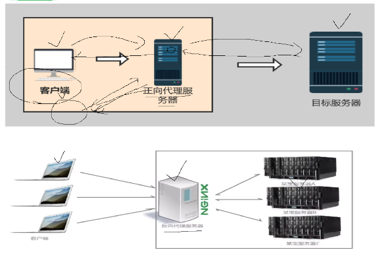
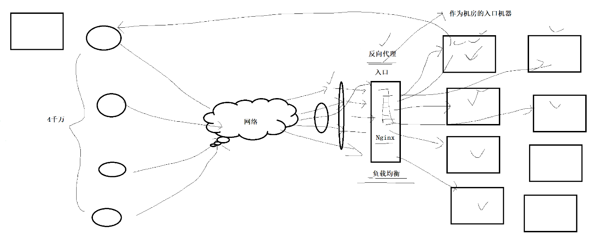
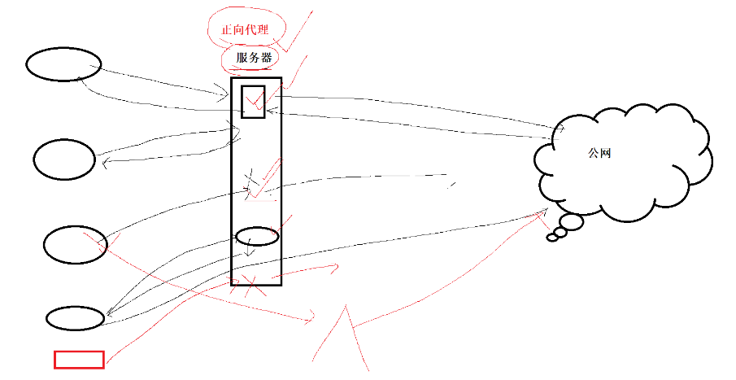
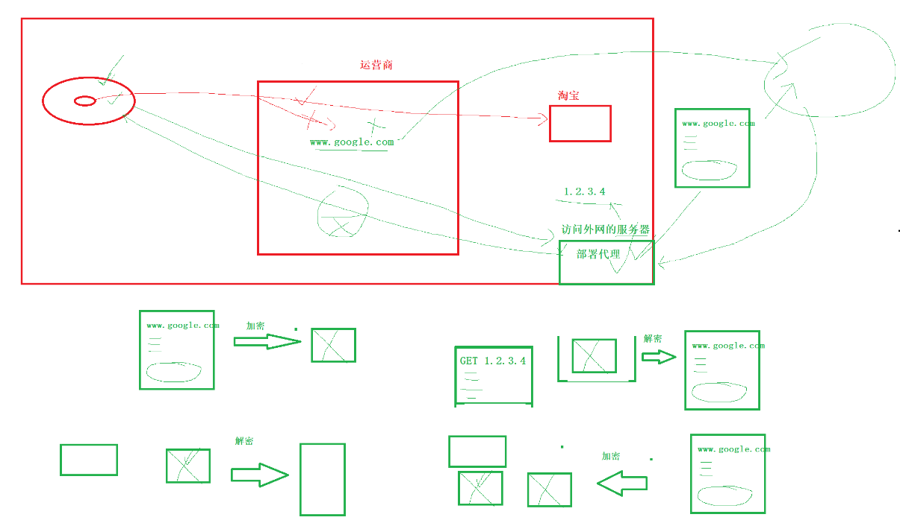

# 一. 系统编程network网络部分

## 1. UDP协议和TCP协议基础 

## 2. TCP协议三次握手抓包原理演示

## 3. TCP四次挥手原理和抓包演示

## 4. TCP协议解决顺序问题和丢包问题

## 5. TCP协议的流量控制和拥塞控制

## 6. 网络编程预备知识和网络系统调用时序介绍

## 7. 网络编程相关系统调用手册理解

## 8. TCP客户端和服务器代码演示

## 9. TCP程序增加错误处理和增加交互式循环输入功能

## 10. TCP程序增加进程并发服务功能

## 11. TCP程序改为多进程并发服务

## 12. UDP服务器和客户端

## 13. TCP服务器增加线程池结构

## 14. TCP服务器实现线程池竞争任务

## 15. TCP服务器实现epoll模型

## 16. web服务器实现


# 二. boost::asio 网络库的使用

文章在 [boostasio-learn/network](https://gitee.com/ax020913/boostasio-learn/tree/master/network) 文件夹中


# 三. network相关的内容

### 3.1 route 命令

```cpp
[x@localhost testSysCall]$ route
Kernel IP routing table
Destination     Gateway(下一跳路由器)     Genmask(子网掩码)    Flags Metric Ref    Use Iface(哪个接口转发)
default         gateway                  0.0.0.0             UG    100    0        0 ens33
192.168.61.0    0.0.0.0                  255.255.255.0       U     100    0        0 ens33
192.168.122.0   0.0.0.0                  255.255.255.0       U     0      0        0 virbr0
```

default 是默认网关

### 3.2 正向代理和反向代理

看下面的两张图，可见正向代理服务器是更加靠近用户的，反向代理服务器是更加靠近目标服务器的。



#### 反向代理服务器

下面的反向代理服务器可见：nginx就是反向代理服务器的典型应用之一；

请求：客户端的请求服务先来nginx服务这里，再由nginx分配每个客户去哪个目标服务器，相当于是在客户端和目标服务器之间隔了一层。缓解目标服务器的请求响应压力。

响应：目标服务器的响应可以通过nginx在返回客户端，也是可以直接不通过中间的nginx的哦。



#### 正向代理服务器

下面的正向代理服务器可见：常见的游戏加速器，百度网盘，校园网，墙......

请求：客户端的请求先经过正向代理服务器，代理服务器代替你去请求服务，再把资源响应给你；1、所以正向服务器是可以缓存用户的请求内容的(像百度网盘，你请求的内容，百度网盘是可以缓存的，别人请求相同的内容时，是可以把之前缓存的内容再传给别人，就快了，相当于是空间换时间吧)；2、正向代理服务器可以对于客户端的请求做鉴权(像校园网就是，可以对用户是否有权限上网，限时上网，充值服务...)；3、进行对客户端的请求拦截，如果客户的请求非法或者请求了一些不能请求的网站等等，可以断开连接的。

响应：响应肯定是得通过正向代理服务器返回的。



#### 翻墙工具的实现思路

肯定得有一个能够访问外网的服务器(一般买云服务器的公网ip就可以了，但是得经过三大运营商，会被墙的)，但是我们可以来个偷天换日，具体的它们的实现可能就是这样的：

1、有一个公网ip(云服务器)

2、我们可以正常的请求我们自己的云服务器，但是请求数据是加密的 ---> 运营商看到请求是没有问题的，扫描内容也是扫描不出来什么的 ---> 到了我们的云服务器，再分用解密数据，去请求具体的外网 ---> 外网返回响应数据data给云服务器，云服务器再对data加密，响应给我们 ---> 运营商自然也是看不出来的 ---> 加密的data到了我们这里，我们这里再解密即可。

3、加密和解密，就是我们在使用vpn时，一般是需要安装一个软件的，再加上云服务器上的代理服务，就可以做到了。

4、上面是一个简单流程描述，具体服务代理一般是不好做的，所以什么常常的vpn用了一段时间就不行了，被运营商发现了......但是也是有稳定的vpn。

5、这个云服务器也相当于是一个正向代理服务器。




# 四. 网络编程中的高级网络IO

多路转接select，poll，epoll

reactor，proactor


上面使用UDP或TCP的基本流程：

```cpp
#pragma once

#include <iostream>
#include <string>
#include <cstdarg>
#include <unistd.h>
#include <sys/types.h>
#include <sys/socket.h>
#include <netinet/in.h>
#include <arpa/inet.h>
#include <strings.h>
#include <string.h>

#include "err.hpp"
#include "log.hpp"

class Sock
{
private:
  const static int backlog = 32;

public:
  // 1. 创建 socket 网络套接字对象
  static int Socket()
  {
    int sock = socket(AF_INET, SOCK_STREAM, 0);
    if (sock == -1)
    {
      perror("socket");
      exit(-1);
    }
    printf("socket create sock success: %d", sock);

    // setsockopt设置套接字地址复用，tcp四次挥手，主动断开连接的一方需要维持一段时间的 TIME_WAIT 状态，再次绑定的时候会短暂的失败
    int opt = 1;
    setsockopt(sock, SOL_SOCKET, SO_REUSEADDR | SO_REUSEPORT, &opt, sizeof(opt));
    return sock;
  }

  // 2. bind绑定自己的网络信息
  static void Bind(int sock, int port)
  {
    struct sockaddr_in local;
    bzero(&local, sizeof(local)); // 使用 memset(&local, 0, sizeof(local)); 也是可以的哦
    local.sin_family = AF_INET;
    local.sin_port = htons(port);
    local.sin_addr.s_addr = INADDR_ANY;
    if (bind(sock, (struct sockaddr *)&local, sizeof(local)) < 0)
    {
      perror("bind");
      exit(-1);
    }
    printf("bind sock success");
  }

  // 3. 设置套接字为监听状态
  static void Listen(int sock)
  {
    if (listen(sock, backlog) < 0)
    {
      perror("listen");
      exit(-1);
    }
    printf("listen sock success");
  }

  // 4. accept从全连接队列获取sock网络套接字
  static int Accept(int listensock, std::string *clientip, uint16_t *clientport)
  {
    struct sockaddr_in peer;
    socklen_t len = sizeof(peer);
    int accept_sock = accept(listensock, (struct sockaddr *)&peer, &len);
    if (accept_sock < 0)
    {
      printf("accept sock error");
      perror("accept");
      exit(-1);
    }
    else
    {
      printf("accept a new link success, get new sock: %d", accept_sock);
      // 外部需要使用到的变量
      *clientip = inet_ntoa(peer.sin_addr);
      *clientport = ntohs(peer.sin_port);
    }

    return accept_sock;
  }
};
```

所以这里的 select，poll，epoll，reactor 我们直接上代码。

selectServer: [./height_io_select_test](https://gitee.com/ax020913/boostasio-learn/tree/master/TinyWebServer-raw_version/testSysCall/height_io_select_test)

pollServer: [./height_io_poll_test](https://gitee.com/ax020913/boostasio-learn/tree/master/TinyWebServer-raw_version/testSysCall/height_io_poll_test)

epollServer: [./height_io_epoll_test](https://gitee.com/ax020913/boostasio-learn/tree/master/TinyWebServer-raw_version/testSysCall/height_io_epoll_test)

reactor: [./reactor](https://gitee.com/ax020913/boostasio-learn/tree/master/TinyWebServer-raw_version/testSysCall/reactor)

大致流程：
- _listensock没有创建Connection，_ioSock有创建
- sock负责监听新连接，epoll负责监听_listensock和所有的_ioSock是否就绪
- _listensock就绪的话，就调用Accepter函数一直监听
- _ioSock就绪的话，就调用reader函数边读取，边sender发送/解析
- 可见，属于单线程，主线程即获取新连接也处理网络io事件；后面可以把io事件交由线程池处理，就像下面的TinyWebServer项目


关于 reactor 和 proactor 的区别和代码比对细节，可见 `../TinyWebServer-raw_version/main.cc`，等代码。


下午的reactor回响服务代码，就因为send发送了一个空字符串返回0，client并没有关闭；所以关于send/write返回0，client一定关闭吗？recv/read返回0，client一定关闭吗？哈哈哈哈

至此网络部分的代码也已搞完，后面还是得注意知识上的细节，代码也是很重要的。


