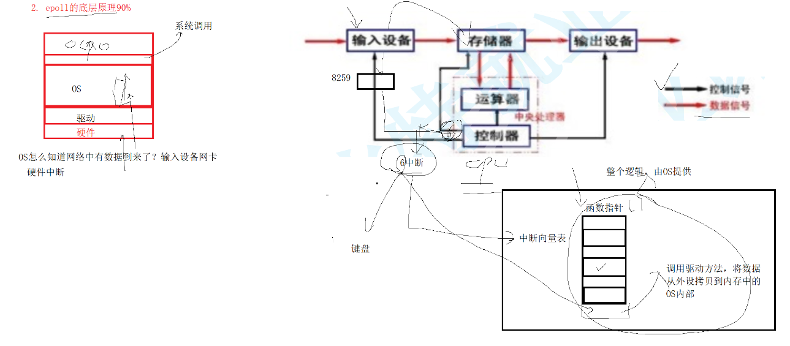
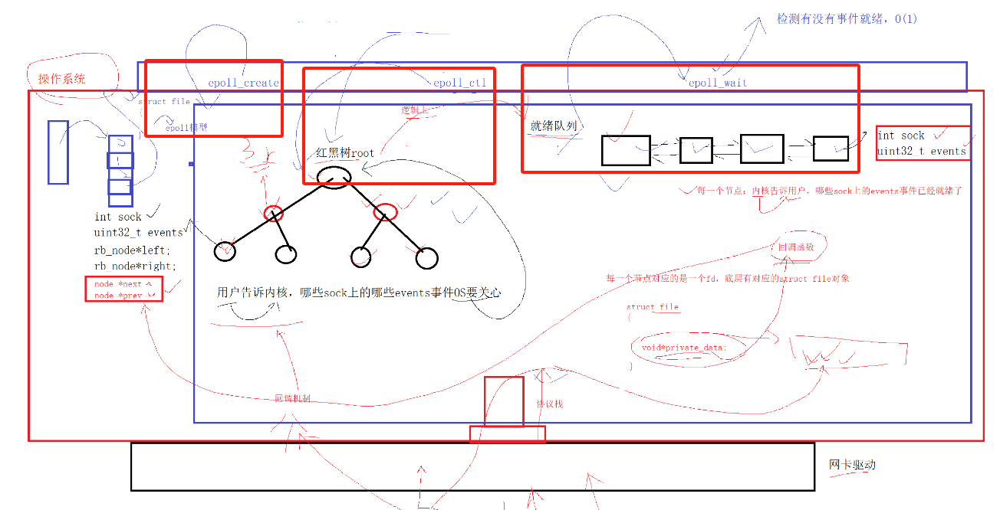

# 高效IO之epoll多路转接

代码上的具体细节得看代码，可以自己敲一敲。


### 1. epoll 多路转接

epoll 和 poll 的作用是相同的，只负责事件描述符的**等**过程

epoll 解决了 poll 的遍历问题 <=== epoll_wait 返回上来的epoll_event都是已经就绪的，不用都遍历一遍了


```cpp
#include <sys/epoll.h>

typedef union epoll_data {
  void        *ptr;
  int          fd; // 需要增删改的描述符
  uint32_t     u32;
  uint64_t     u64;
} epoll_data_t;
struct epoll_event {
  uint32_t     events;      // Epoll events: 主要设置socket描述符需要关心的事件，EPOLLIN，EPOLLOUT......
  epoll_data_t data;        // User data variable: 主要设置需要关系的socket描述符
};

int epoll_create(int size);                                                       // 创建一个 epoll 模型；返回一个 epfd
int epoll_ctl(int epfd, int op, int fd, struct epoll_event *event);               // 用户到内核: 增删改，EPOLL_CTL_ADD，EPOLL_CTL_DEL，EPOLL_CTL_MOD
int epoll_wait(int epfd, struct epoll_event *events, int maxevents, int timeout); // 内核到用户
```

**OS怎么知道网络socket描述符有数据到来了？**

输入设备网卡的硬件中断




**什么叫做事件就绪？**

底层的io条件满足了，可以进行某种io行为了，就叫做事件就绪

select/poll/epoll(IO就绪事件的通知机制) ---> 等待io事件就绪 ---> read/write/send/sendto/recv/recvform进行数据拷贝


**epoll 底层的数据结构：红黑树和就绪队列怎么理解？**

创建 epoll 模型 <=== epoll_create 负责让OS创建一颗红黑树和就绪队列

epoll 的红黑树：维护所有EPOLL_CTL_ADD需要监控的socket描述符 <=== epoll_ctl 负责红黑树的增删改

就绪队列：已经就绪的socket描述符存储的队列 <=== epoll_wait 负责从就绪队列获取就绪的socket描述符




**就绪队列有很多就绪的socket一次性拿不完怎么办？**    

拿不完，即就绪队列的元素个数大于epoll_wait函数的maxevents参数；因为是一个队列，拿不完，下次还可以再来拿


**关于多路转接(io就绪事件通知机制)的LT和ET策略怎么理解？**

LT：水平触发(描述符是阻塞或者非阻塞都可以) 

只要底层有数据没完，epoll就会一直通知用户要读取数据。

===> 会多次通知


ET：边缘触发(描述符必须是非阻塞) 

只要底层有数据没读取完，epoll不在通知用户，除非底层的数据变化的时候(再次增多)，才会再通知你一次。

===> 只会通知一次，必须一次性把数据全部读取到对应的缓冲区 ===> 死循环的读取

**再看，TCP六个标志位中PSH的作用？**

让底层数据就绪事件，再次让上层知道 ===> 这样来达到不断通知上层，催促上层的效果


**LT模式下，可以做到ET模式的效果吗？**

可以的

**ET和LT有什么不同吗？仅仅是通知机制上的不同吗？**

不仅仅体现在通知机制上的不同

尽快让上层把数据读走 ---> TCP 可以给发送方提供一个更大的窗口大小 ---> 让对方更新出更大的滑动窗口 ---> 提供底层数据的发送效率，更好的理由诸如TCP的延迟应答等等策略


### 2. 改写 poll 代码

可见相对 poll 的代码有简洁了一点的哦


### 3. 关于Reactor和Proactor，网络同步异步IO模式

Reactor同步和Proactor异步，是linux网络中最常用，最频繁的一种网络IO设计模式。

实现一个基于ET模式下的Reactor，处理所有的IO。


关于epoll中能不能直接发送数据呢？   

是不能的

因为用户无法保证发送条件的是就绪的！ 谁最清除？ epoll

什么加做发送事件就绪？ ===> 发送缓冲区有空闲(注意udp没有发送缓冲区)

服务器刚开始启动的时候，或者很多情况下，发送事件一直就是就绪的！可以直接发送，只不过，如果我们没有发完怎么办？需要下一次发送，要求每一个socket都配有一个发送缓冲区，同理接收缓冲区也是

就说明socket的EPOLLOUT事件也要有时候注册进epoll，什么时候注册？一般EPOLLIN读事件对于epoll我们要常设。EPOLLOUT写事件对于epoll，我们要按需设置！


### 4. 基于ET模式的Reactor单线程版

`../reactor`


