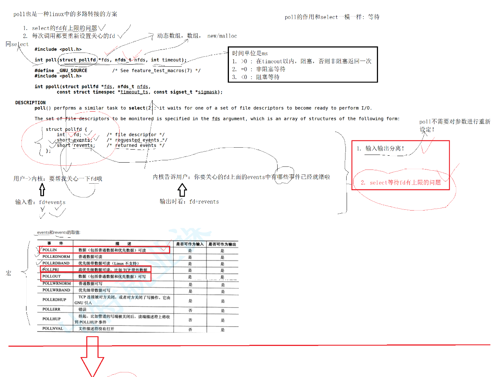

# 高效IO之poll多路转接

代码上的具体细节得看代码，可以自己敲一敲。


### poll 多路转接

poll 和 select 的作用是相同的，只负责事件描述符的**等**过程

poll 解决了 select 的两个问题：
- 描述符个数限制的问题(其实poll也是有限制的，但是poll是让用户自己去开多大的空间，只要用户敢开；类似人有多大胆，地有多大产)
- 描述符数组的拷贝问题


```cpp
#include <poll.h>

struct pollfd {
  int   fd;         /* file descriptor */
  short events;     /* requested events */
  short revents;    /* returned events */
};

int poll(struct pollfd *fds, nfds_t nfds, int timeout);

// 注意上面各个字段的含义：
// int fd：用户需要监听的事件描述符
// events：用户指定fd描述符需要监听的事件，使用宏
// revents：os返回fd描述符哪些事件就绪了，使用宏

// fds：struct pollfd结构体数组的首地址，可以动态开辟的；select是一个静态的数组
// nfds：上面struct pollfd结构体数组的元素个数；和select中的nfds是不一样的意思
// int timeout：单位是ms，设置的时候是给OS设置的定时时间；返回的时候是还有多久的时间没有定时完(类似sleep函数，alarm函数等；和select的结构体输入输出参数不同，但是效果相同)

// 返回值和select是相同的
```

输入时看：fd 和 events

输出时看：fd 和 revents





**poll 主要的问题是遍历的问题：后面的 epoll 解决了 poll 的遍历问题**


### 改写 select 代码

可见 poll 版本的代码相对于 select 版本的代码是简单一些的。
