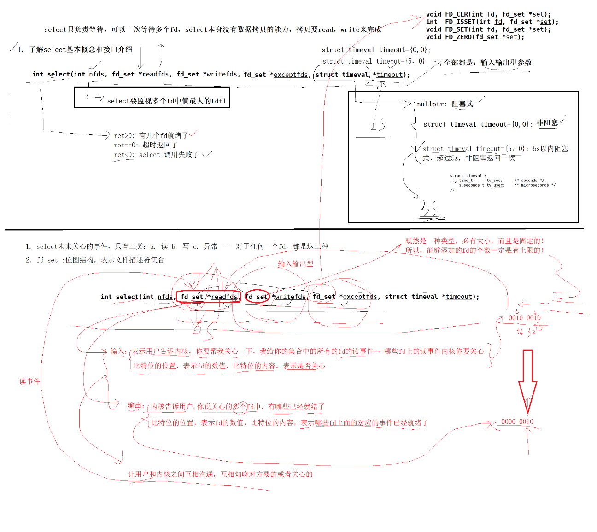

# 五种IO模型

**IO = 等 + 数据拷贝**

**同步IO**：
- 阻塞IO(默认)
- 非阻塞IO(可以通过fcntl，open等设置)
- 信号驱动IO(需要设置SIGIO信号，如果有多个相同SIGIO信号的话，是只会处理前两次的......所以在特定的场景下会使用)
- 多路转接(高效IO，用的比较多；select/poll/epoll默认阻塞也可以设置成非阻塞)。

**异步IO**：
- IO操作的等和数据拷贝，都交由OS去做；我们只要调用一个异步io函数，传递数据需要拷贝在哪里即可(需要操作系统层面的支持，windows做的比linux好)。

1、多路转接为什么高效？ 因为IO过程中，等待时间的比重减少了。

2、阻塞IO、非阻塞IO、信号驱动IO的区别？ 效率上没有太大区别，因为都参与了IO的等待过程，等了相同多的时间；只不过非阻塞和信号驱动可以把等待的时间去做别的事情。

3、四种同步IO，同步怎么理解？ 都参与了IO的两个过程：等 + 数据拷贝

4、异步IO，异步怎么理解？ 没有参与了IO的两个过程：等 + 数据拷贝，交由别人 / OS 去做了

5、感受read的默认阻塞和设置成非阻塞：`./BlockNonblockIo.cc`


参考文章：[linux五种IO模型](https://blog.csdn.net/chenlong_cxy/article/details/126050039)


# 高效IO之select多路转接

代码上的具体细节得看代码，可以自己敲一敲。


### select 多路转接

使用 select 的话，需要自己维护一个保存所有合法 fd 的数组(下面 selectServer.hpp 代码中的 int* _fdarray 数组)

**先了解 select 函数：**

```cpp
#include <sys/select.h>
#include <sys/time.h>
#include <sys/types.h>
#include <unistd.h>

// 
void FD_CLR(int fd, fd_set *set);
int  FD_ISSET(int fd, fd_set *set);
void FD_SET(int fd, fd_set *set);
void FD_ZERO(fd_set *set);

int select(int nfds, fd_set *readfds, fd_set *writefds, fd_set *exceptfds, struct timeval *timeout);
// int nfds: 所有监听的事件描述符中的最大值 + 1
// fd_set *readfds, fd_set *writefds, fd_set *exceptfds: 分别用户需要设置的读、写、异常事件描述符的监听集合，有事件描述符就绪时返回 ===> 输入输出型参数
// struct timeval *timeout: 设置定时返回的，当然有事件就绪时会立马返回的，还没有定时完的时间会返回的 ===> 输入输出型参数
// 返回值：
//        0 表示：超时返回
//        -1 表示：出错返回
//        其它表示：有事件描述就绪 ===> 可以遍历fd数组_fdarray，FD_ISSET判断是哪些事件描述符就绪了
```

**注意：**

- 最开始的时候只有 _listensock 监听描述符，那么它是负责的监听事件的加到readfds还是writefds还是exceptfds呢？ ===> 是加到readfds中，默认_listensock获取新连接的事件是读事件。

- IO过程 = 等 + 数据拷贝，那么select负责干嘛？：select函数是负责**等**的，有事件就绪时会返回，到时候遍历是哪些事件描述符就绪了，就可以直接read/write/accept数据拷贝了；

  最开始肯定是_listensock就绪可以accept新的连接的，accept函数默认是阻塞式的，但是因为select返回的_listensock已经说明_listensock可以accept了，所以accept直接获取全连接队列的新连接，不用等待。（同理recvform，recv，sendto，send，read，write也是不用阻塞等待了）

- select监听的fd_set *readfds事件描述符分为两类事件：_listensock的获取新连接、io事件。

- select监听的多个事件描述符中有事件就绪时，并不是有一个事件描述符就绪了就返回的，那么效率是很低的；并且可见HandlerEvent函数是在遍历fd_set rfds的哦。

- telnet 127.0.0.1 8081 ===> telnet 命令就是tcp做的，是可以测试我们的selectServer.hpp 代码的；telnet连接上的话，会触发_listsock的读事件，ctrl ] 就可以开始输入信息，触发io事件描述符的读写。




**select 的特点：**

```cpp
int select(int nfds, fd_set *readfds, fd_set *writefds, fd_set *exceptfds, struct timeval *timeout);
```

- select 能同时等待的文件描述符fd个数 是有上限的，除非重新改内核，否则无法解决。

- 得借助第三方数组，来维护合法的fd。

- select 的大部分参数是输入输出型参数，调用select前，要重新设置所有的fd；调用之后，我们还要检查更新所有的fd，这带来的就是遍历的成本。

- select 为什么第一个参数nfds是最大 fd + 1 呢？ 确定线性遍历范围；OS使用文件描述符是看最小可用的fd分配给新连接的；STDIN_FILENO,STDOUT_FILENO, STDERR_FILENO等等不是我们_listensock获取上来的fd也得遍历的，属于无用功了(内核层面)。

- select 采用fd_set位图数据结构，用户到内核，内核到用户，来回进行数据拷贝，拷贝成本的问题。


### log.hpp 日志工具

log.hpp 代码是很具有参考意义的，虽然实际的代码中不是这样的写法，但是可以快速实现一个还不错的日志工具：

```cpp
// 使用：logMessage(2, "%s %s", "hello world", "exe");
//      [WARNING][2024-5-2 19-27-53][pid: 92552]hello world exe
void logMessage(int level, const char *format, ...)
{
  // 1. 日志头部信息
#define NUM 1024
  time_t now;
  time(&now);
  char logprefix[NUM];
  snprintf(logprefix, sizeof(logprefix), "[%s][%d-%d-%d %d-%d-%d][pid: %d]",
           to_levelstr(level),
           // 注意 tm_year + 1900，tm_mon + 1
           localtime(&now)->tm_year + 1900, localtime(&now)->tm_mon + 1, localtime(&now)->tm_mday,
           localtime(&now)->tm_hour, localtime(&now)->tm_min, localtime(&now)->tm_sec,
           getpid());

  // 2. 日志内容部分
  char logcontent[NUM];
  va_list arg;
  va_start(arg, format);
  vsnprintf(logcontent, sizeof(logcontent), format, arg);

  std::cout << logprefix << logcontent << std::endl;
}
```


